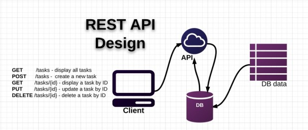
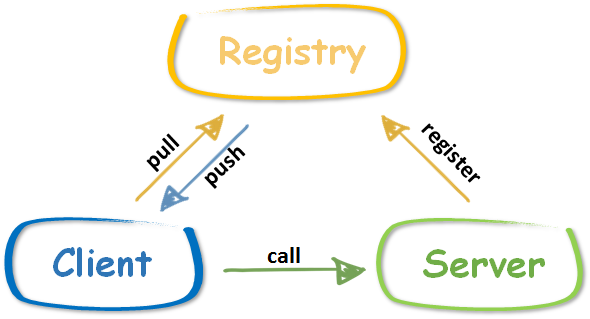
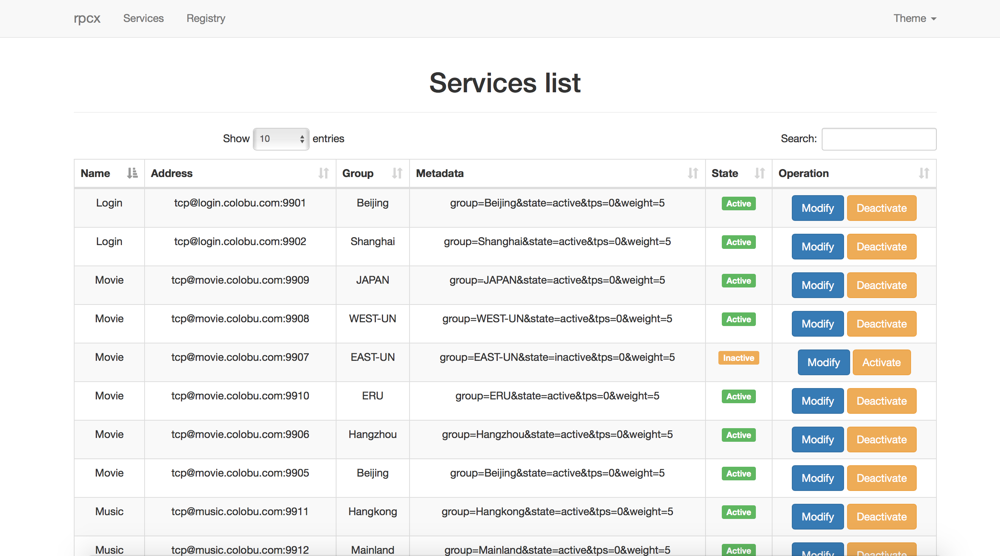
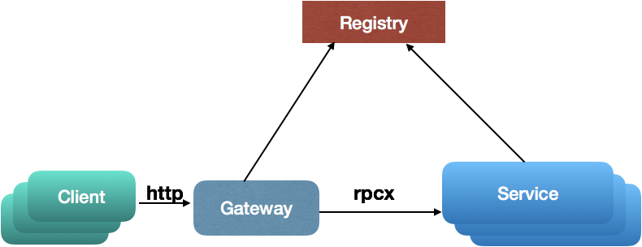
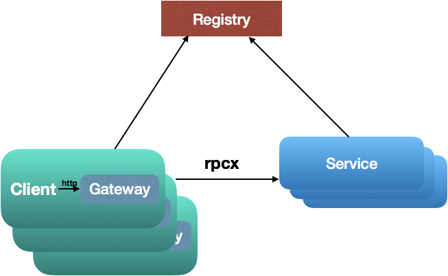
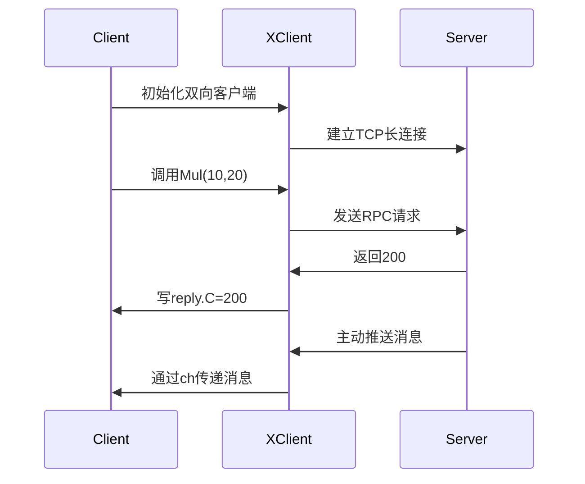

# RPC

## RPC简介

- 远程过程调用（Remote Procedure Call，RPC）是一个计算机通信协议
- 该协议允许运行于一台计算机的程序调用另一台计算机的子程序，而程序员无需额外地为这个交互作用编程
- 如果涉及的软件采用面向对象编程，那么远程过程调用亦可称作远程调用或远程方法调用

## golang中如何实现RPC

- golang中实现RPC非常简单，官方提供了封装好的库，还有一些第三方的库

- golang官方的net/rpc库使用encoding/gob进行编解码，支持tcp和http数据传输方式，由于其他语言不支持gob编解码方式，所以golang的RPC只支持golang开发的服务器与客户端之间的交互

- 官方还提供了net/rpc/jsonrpc库实现RPC方法，jsonrpc采用JSON进行数据编解码，因而支持跨语言调用，目前jsonrpc库是基于tcp协议实现的，暂不支持http传输方式

例题：golang实现RPC程序，实现求矩形面积和周长

*服务端*

```go
package main

import (
    "log"
    "net/http"
    "net/rpc"
)

//    例题：golang实现RPC程序，实现求矩形面积和周长

type Params struct {
    Width, Height int
}

type Rect struct{}

// RPC服务端方法，求矩形面积
func (r *Rect) Area(p Params, ret *int) error {
    *ret = p.Height * p.Width
    return nil
}

// 周长
func (r *Rect) Perimeter(p Params, ret *int) error {
    *ret = (p.Height + p.Width) * 2
    return nil
}

// 主函数
func main() {
    // 1.注册服务
    rect := new(Rect)
    // 注册一个rect的服务
    rpc.Register(rect)
    // 2.服务处理绑定到http协议上
    rpc.HandleHTTP()
    // 3.监听服务
    err := http.ListenAndServe(":8000", nil)
    if err != nil {
        log.Panicln(err)
    }
}
```


*客户端*

```go
package main

import (
    "fmt"
    "log"
    "net/rpc"
)

// 传的参数
type Params struct {
    Width, Height int
}

// 主函数
func main() {
    // 1.连接远程rpc服务
    conn, err := rpc.DialHTTP("tcp", ":8000")
    if err != nil {
        log.Fatal(err)
    }
    // 2.调用方法
    // 面积
    ret := 0
    err2 := conn.Call("Rect.Area", Params{50, 100}, &ret)
    if err2 != nil {
        log.Fatal(err2)
    }
    fmt.Println("面积：", ret)
    // 周长
    err3 := conn.Call("Rect.Perimeter", Params{50, 100}, &ret)
    if err3 != nil {
        log.Fatal(err3)
    }
    fmt.Println("周长：", ret)
}
```

golang写RPC程序，必须符合4个基本条件，不然RPC用不了

- 结构体字段首字母要大写，可以别人调用

- 函数名必须首字母大写

- 函数第一参数是接收参数，第二个参数是返回给客户端的参数，必须是指针类型

- 函数还必须有一个返回值error

练习：模仿前面例题，自己实现RPC程序，服务端接收2个参数，可以做乘法运算，也可以做商和余数的运算，客户端进行传参和访问，得到结果如下：


*服务端*

```go
package main

import (
   "errors"
   "log"
   "net/http"
   "net/rpc"
)

// 结构体，用于注册的
type Arith struct{}

// 声明参数结构体
type ArithRequest struct {
   A, B int
}

// 返回给客户端的结果
type ArithResponse struct {
   // 乘积
   Pro int
   // 商
   Quo int
   // 余数
   Rem int
}

// 乘法
func (this *Arith) Multiply(req ArithRequest, res *ArithResponse) error {
   res.Pro = req.A * req.B
   return nil
}

// 商和余数
func (this *Arith) Divide(req ArithRequest, res *ArithResponse) error {
   if req.B == 0 {
      return errors.New("除数不能为0")
   }
   // 除
   res.Quo = req.A / req.B
   // 取模
   res.Rem = req.A % req.B
   return nil
}

// 主函数
func main() {
   // 1.注册服务
   rect := new(Arith)
   // 注册一个rect的服务
   rpc.Register(rect)
   // 2.服务处理绑定到http协议上
   rpc.HandleHTTP()
   // 3.监听服务
   err := http.ListenAndServe(":8000", nil)
   if err != nil {
      log.Fatal(err)
   }
}
```

*客户端*

```go
package main

import (
   "fmt"
   "log"
   "net/rpc"
)

type ArithRequest struct {
   A, B int
}

// 返回给客户端的结果
type ArithResponse struct {
   // 乘积
   Pro int
   // 商
   Quo int
   // 余数
   Rem int
}

func main() {
   conn, err := rpc.DialHTTP("tcp", ":8000")
   if err != nil {
      log.Fatal(err)
   }
   req := ArithRequest{9, 2}
   var res ArithResponse
   err2 := conn.Call("Arith.Multiply", req, &res)
   if err2 != nil {
      log.Fatal(err2)
   }
   fmt.Printf("%d * %d = %d\n", req.A, req.B, res.Pro)
   err3 := conn.Call("Arith.Divide", req, &res)
   if err3 != nil {
      log.Fatal(err3)
   }
   fmt.Printf("%d / %d 商 %d，余数 = %d\n", req.A, req.B, res.Quo, res.Rem)
}
```

## RPC调用流程

- 微服务架构下数据交互一般是对内 RPC，对外 REST
- 将业务按功能模块拆分到各个微服务，具有提高项目协作效率、降低模块耦合度、提高系统可用性等优点，但是开发门槛比较高，比如 RPC 框架的使用、后期的服务监控等工作
- 一般情况下，我们会将功能代码在本地直接调用，微服务架构下，我们需要将这个函数作为单独的服务运行，客户端通过网络调用

## 网络传输数据格式

- 两端要约定好数据包的格式
- 成熟的RPC框架会有自定义传输协议，这里网络传输格式定义如下，前面是固定长度消息头，后面是变长消息体


自己定义数据格式的读写

```go
package rpc

import (
    "encoding/binary"
    "io"
    "net"
)

// 测试网络中读写数据的情况

// 会话连接的结构体
type Session struct {
    conn net.Conn
}

// 构造方法
func NewSession(conn net.Conn) *Session {
    return &Session{conn: conn}
}

// 向连接中去写数据
func (s *Session) Write(data []byte) error {
    // 定义写数据的格式
    // 4字节头部 + 可变体的长度
    buf := make([]byte, 4+len(data))
    // 写入头部，记录数据长度
    binary.BigEndian.PutUint32(buf[:4], uint32(len(data)))
    // 将整个数据，放到4后边
    copy(buf[4:], data)
    _, err := s.conn.Write(buf)
    if err != nil {
        return err
    }
    return nil
}

// 从连接读数据
func (s *Session) Read() ([]byte, error) {
    // 读取头部记录的长度
    header := make([]byte, 4)
    // 按长度读取消息
    _, err := io.ReadFull(s.conn, header)
    if err != nil {
        return nil, err
    }
    // 读取数据
    dataLen := binary.BigEndian.Uint32(header)
    data := make([]byte, dataLen)
    _, err = io.ReadFull(s.conn, data)
    if err != nil {
        return nil, err
    }
    return data, nil
}
```

这段代码实现了一个基于TCP连接的RPC会话管理模块，主要用于解决网络通信中的"粘包"问题。以下从代码结构、设计原理和实现细节三个维度进行详细解析：

### 一、代码结构解析
1. **Session结构体**  
   `Session`结构体封装了`net.Conn`类型的网络连接。通过面向对象的方式，将网络连接的读写操作与协议封装解耦，这是Go语言网络编程的典型设计模式。

2. **Write方法**  
   实现了带长度头的消息发送逻辑：
   ```go
   binary.BigEndian.PutUint32(buf[:4], uint32(len(data))) // 写入4字节大端序长度头
   copy(buf[4:], data) // 写入实际数据
   ```
   这种"长度前缀"的协议设计可有效解决TCP的粘包问题。

3. **Read方法**  
   采用两阶段读取：
   ```go
   io.ReadFull(s.conn, header) // 先读4字节长度头
   io.ReadFull(s.conn, data)  // 按长度读取完整数据
   ```
   使用`io.ReadFull`确保读取完整数据块，避免半包问题。

### 二、协议设计原理
1. **消息格式规范**  
   采用`4字节长度头 + N字节消息体`的结构，这是二进制协议设计的典型方案。相比文本协议（如HTTP），具有更高的传输效率和更小的协议开销。

2. **字节序处理**  
   使用`binary.BigEndian`进行网络字节序转换，确保不同硬件架构设备间的兼容性。这是RFC标准推荐的网络字节序处理方式。

3. **错误处理机制**  
   每个IO操作都进行错误检查并返回，符合Go语言的显式错误处理哲学。开发时建议通过`errors.Wrap`添加上下文信息。

### 三、关键实现细节
1. **缓冲区管理**  
   Write方法中`make([]byte, 4+len(data))`预分配精确大小的缓冲区，避免动态扩容带来的性能损耗。这种零拷贝设计能显著提升高并发场景下的吞吐量。

2. **可靠读取**  
   `io.ReadFull`的使用是关键，它会持续读取直到填满目标缓冲区。相较于普通的`Read`方法，能正确处理以下情况：
    - 网络延迟导致的多次读取
    - 内核缓冲区数据不完整
    - 连接意外中断

3. **并发安全性**  
   虽然代码中没有显式锁，但通过每个Session绑定独立连接的设计，天然支持并发读写。实际使用时建议配合连接池管理。

### 四、扩展应用场景
该模块可作为以下系统的基础组件：
1. **RPC框架**：配合编码层实现完整的远程调用
2. **消息队列**：实现可靠的消息传输
3. **游戏服务器**：处理高频小数据包
4. **IoT设备通信**：保证数据完整性

### 五、优化建议
1. **增加超时控制**
   ```go
   s.conn.SetDeadline(time.Now().Add(5 * time.Second))
   ```
2. **支持压缩**  
   在长度头后添加1字节的压缩标志位
3. **连接复用**  
   实现`sync.Pool`管理Session对象

该代码展示了Go语言网络编程的核心思想：通过简洁的接口抽象和严谨的错误处理，构建高性能的网络通信基础组件。这种设计模式在云原生基础设施开发中被广泛采用。


*io.ReadFull*

这段代码是Go语言中处理网络数据读取的关键代码片段，其作用是**精确读取指定长度的字节数据**，主要用于解决TCP流式传输中的粘包问题。具体分析如下：

---

### 一、代码功能解析
```go
data := make([]byte, dataLen)
_, err = io.ReadFull(s.conn, data)
```

1. **创建缓冲区**  
   `data := make([]byte, dataLen)` 创建了一个长度为`dataLen`的字节切片。这里的`dataLen`通常是通过协议头部解析得到的（例如前4字节表示数据长度），用于预分配精确的内存空间存储待读取的数据。

2. **精确读取数据**  
   `io.ReadFull(s.conn, data)` 是核心操作，它会：
    - 持续从`s.conn`（网络连接）读取数据，直到`data`缓冲区被完全填满
    - 若读取的字节数不足`dataLen`，返回`io.ErrUnexpectedEOF`错误
    - 若连接中断或超时，返回相应的网络错误

---

### 二、底层实现原理
1. **与普通`Read`的区别**  
   普通`Read`方法可能只读取部分数据（如返回`n < len(data)`但无错误），而`io.ReadFull`通过内部循环调用`Read`，确保读取完整数据：
   ```go
   // 伪代码逻辑
   for len(buf) > 0 {
       n, err := r.Read(buf)
       buf = buf[n:]
       if err != nil {
           return total, err
       }
   }
   ```
   这种设计能避免开发者手动处理不完整读取的情况。

2. **网络协议适配性**
    - 适用于**固定长度协议**（如头部声明数据长度）
    - 兼容**二进制协议**（如Protobuf、Thrift）和**文本协议**（如JSON行分隔格式）
    - 配合`binary.Read`可实现结构化数据的解码

---

### 三、典型应用场景
| 场景 | 说明 | 相关引用 |
|------|------|---------|
| RPC框架 | 读取完整RPC请求/响应体 |  |
| 文件传输 | 分块读取大文件数据 |  |
| 消息队列 | 确保消息完整消费 |  |
| 数据库驱动 | 解析数据库返回的二进制协议 |  |

---

### 四、错误处理建议
```go
if err != nil {
    if err == io.ErrUnexpectedEOF {
        // 处理数据不完整（如网络中断）
    } else if netErr, ok := err.(net.Error); ok && netErr.Timeout() {
        // 处理超时
    } else {
        // 其他错误（如连接关闭）
    }
}
```
需结合具体业务场景处理`io.EOF`（正常结束）和`io.ErrUnexpectedEOF`（异常中断）。

---

### 五、性能优化方案
1. **复用缓冲区**  
   使用`sync.Pool`管理`[]byte`切片，减少GC压力：
   ```go
   var bufPool = sync.Pool{
       New: func() interface{} { return make([]byte, 4096) },
   }
   data := bufPool.Get().([]byte)
   defer bufPool.Put(data)
   ```

2. **结合缓冲读取**  
   对高频小数据包场景，包装`bufio.Reader`：
   ```go
   bufferedConn := bufio.NewReader(s.conn)
   io.ReadFull(bufferedConn, data)
   ```
   可减少系统调用次数。

---

通过这种设计，Go语言能够以简洁的代码实现可靠的网络数据传输，体现了其“通过接口抽象复杂逻辑”的核心哲学。

---


*测试类*

```go
package rpc

import (
    "fmt"
    "net"
    "sync"
    "testing"
)

func TestSession_ReadWriter(t *testing.T) {
    // 定义地址
    addr := "127.0.0.1:8000"
    my_data := "hello"
    // 等待组定义
    wg := sync.WaitGroup{}
    wg.Add(2)
    // 写数据的协程
    go func() {
        defer wg.Done()
        lis, err := net.Listen("tcp", addr)
        if err != nil {
            t.Fatal(err)
        }
        conn, _ := lis.Accept()
        s := Session{conn: conn}
        err = s.Write([]byte(my_data))
        if err != nil {
            t.Fatal(err)
        }
    }()

    // 读数据的协程
    go func() {
        defer wg.Done()
        conn, err := net.Dial("tcp", addr)
        if err != nil {
            t.Fatal(err)
        }
        s := Session{conn: conn}
        data, err := s.Read()
        if err != nil {
            t.Fatal(err)
        }
        // 最后一层校验
        if string(data) != my_data {
            t.Fatal(err)
        }
        fmt.Println(string(data))
    }()
    wg.Wait()
}
```


以下是对这段Go语言测试代码的详细解释，结合网络通信原理和测试设计模式进行多维度分析：

### 一、代码结构总览
这段代码是使用Go语言编写的单元测试，主要验证`Session`类型在网络连接中的读写功能。代码结构可分为三个主体部分：
1. **测试环境初始化**：定义本地回环地址和测试数据
2. **双协程并发模型**：使用`sync.WaitGroup`协调读写协程
3. **功能验证层**：通过数据比对确认功能正确性

### 二、核心组件解析
#### 1. 网络通信架构
```go
addr := "127.0.0.1:8000"  // 本地回环地址
lis, _ := net.Listen("tcp", addr) // 创建TCP监听器
conn, _ := net.Dial("tcp", addr) // 建立TCP连接
```
- 采用`127.0.0.1:8000`实现本机网络通信，避免外部依赖
- 服务端/客户端模式验证网络层与业务层的协同工作

#### 2. 并发控制机制
```go
wg := sync.WaitGroup{}
wg.Add(2)
go func() { /* 写协程 */ }()
go func() { /* 读协程 */ }()
wg.Wait()
```
- 使用WaitGroup实现并发协调，确保两个goroutine都执行完毕
- 读写分离的设计模拟真实网络传输场景

#### 3. 业务功能验证
```go
s.Write([]byte(my_data))  // 写入测试数据
data, _ := s.Read()       // 读取数据
if string(data) != my_data // 数据一致性校验
```
- 通过字符串比对验证数据完整性
- 使用`t.Fatal`实现快速失败机制，符合Go测试最佳实践

### 三、执行流程详解
| 阶段 | 写协程 | 读协程 | 通信过程 |
|------|--------|--------|----------|
| 初始化 | 创建监听端口 | 等待连接 | TCP三次握手完成 |
| 数据传输 | 通过Session.Write发送"hello" | 通过Session.Read接收数据 | 经过网络协议栈封包/解包 |
| 验证 | 关闭连接 | 比对接收数据与原始数据 | 校验数据完整性 |

### 四、测试设计亮点
1. **边界条件覆盖**：通过字符串比对验证精确数据长度和内容
2. **异常处理机制**：所有网络操作都包含错误检查（如`t.Fatal(err)`）
3. **并发安全验证**：验证goroutine间的数据同步正确性
4. **资源管理**：通过`defer wg.Done()`确保资源释放

### 五、潜在优化方向
1. **增加超时控制**：在`Dial`和`Accept`中加入超时参数，避免测试阻塞
2. **压力测试扩展**：可改造为多连接并发测试，验证高负载表现
3. **错误注入测试**：模拟网络丢包、延迟等异常场景
4. **性能指标采集**：添加带宽、延迟等指标的统计输出

### 六、行业应用场景
该测试模式适用于：
1. 网络协议栈开发验证
2. 分布式系统通信层测试
3. RPC框架的核心功能测试
4. 物联网设备通信可靠性验证

该代码通过简洁的实现验证了网络通信的核心要素，体现了Go语言在并发编程和网络开发方面的优势。测试用例设计符合等价类划分和边界值分析原则，可作为网络通信组件测试的基准模板。


*编码解码*

```go
package rpc

import (
    "bytes"
    "encoding/gob"
)

// 定义RPC交互的数据结构
type RPCData struct {
    // 访问的函数
    Name string
    // 访问时的参数
    Args []interface{}
}

// 编码
func encode(data RPCData) ([]byte, error) {
    //得到字节数组的编码器
    var buf bytes.Buffer
    bufEnc := gob.NewEncoder(&buf)
    // 编码器对数据编码
    if err := bufEnc.Encode(data); err != nil {
        return nil, err
    }
    return buf.Bytes(), nil
}

// 解码
func decode(b []byte) (RPCData, error) {
    buf := bytes.NewBuffer(b)
    // 得到字节数组解码器
    bufDec := gob.NewDecoder(buf)
    // 解码器对数据节码
    var data RPCData
    if err := bufDec.Decode(&data); err != nil {
        return data, err
    }
    return data, nil
}
```

以下是对这段Go语言RPC编解码代码的详细解析，结合Gob特性及RPC设计原理进行多维度分析：

### 一、代码结构解析
#### 1. 数据结构定义
```go
type RPCData struct {
    Name string          // 远程方法名称
    Args []interface{}   // 方法参数集合（支持多类型）
}
```
- **设计理念**：采用"命令模式"封装RPC请求，是典型的RPC协议设计范式
- **字段特性**：
   - `Name`字段对应远程方法标识符，需与服务端注册方法一致
   - `Args`使用空接口切片实现多类型参数支持，需注意类型注册问题

#### 2. 编码流程
```go
func encode(data RPCData) ([]byte, error) {
    var buf bytes.Buffer
    bufEnc := gob.NewEncoder(&buf)  // 创建Gob编码器
    if err := bufEnc.Encode(data); err != nil { // 序列化结构体
        return nil, err
    }
    return buf.Bytes(), nil
}
```
- **内存优化**：使用bytes.Buffer作为二进制数据容器，避免频繁内存分配
- **编码过程**：
   1. 创建Gob编码器绑定内存缓冲区
   2. 对结构体进行深度序列化（包含嵌套类型描述）
   3. 输出紧凑二进制格式（平均比JSON小2-5倍）

#### 3. 解码流程
```go
func decode(b []byte) (RPCData, error) {
    buf := bytes.NewBuffer(b)
    bufDec := gob.NewDecoder(buf)  // 创建Gob解码器
    var data RPCData
    if err := bufDec.Decode(&data); err != nil { // 反序列化
        return data, err
    }
    return data, nil
}
```
- **解码特性**：
   - 自动重建类型系统（包含方法接收者的类型信息）
   - 支持渐进式解码，处理大尺寸数据时内存效率高

### 二、核心设计原理
#### 1. Gob协议特性
- **自描述二进制格式**：编码流包含类型描述信息，无需预定义Schema
- **类型兼容规则**：
   - 字段名称和类型需匹配（顺序无关）
   - 接口类型需预先注册具体实现类型
- **高效编码机制**：
   - 使用反射生成编解码器（首次编译后缓存）
   - 对整型采用变长编码（ZigZag压缩）

#### 2. RPC通信层设计
- **网络协议无关性**：编码后的[]byte可通过任意传输层协议发送（TCP/HTTP等）
- **错误处理机制**：
   - 编解码过程严格校验类型一致性
   - 空接口参数需通过`gob.Register()`注册具体类型

### 三、性能优化建议
1. **类型预注册**（提升20-30%性能）：
```go
func init() {
    gob.Register(YourConcreteType{})  // 注册Args可能包含的具体类型
}
```

2. **连接池复用**：
```go
var encoderPool = sync.Pool{
    New: func() interface{} {
        return gob.NewEncoder(new(bytes.Buffer)) 
    },
}  // 减少编码器创建开销
```

3. **批量处理优化**：
```go
// 对多个RPCData使用同一个编码器
enc := gob.NewEncoder(conn)
for _, data := range batchData {
    enc.Encode(data)  // 复用类型描述信息
}
```

### 四、典型应用场景
1. **微服务间通信**：服务网格内部的高效数据传输
2. **分布式计算**：跨节点任务参数传递
3. **游戏服务器**：高频状态同步场景
4. **物联网网关**：设备数据采集与指令下发

### 五、潜在问题与解决方案
| 问题现象 | 原因分析 | 解决方案 |
|---------|---------|---------|
| 解码时panic | 未注册具体类型 | 使用`gob.Register()`预注册 |
| 空字段丢失 | Gob自动忽略零值 | 使用指针类型字段 |
| 版本兼容问题 | 结构体字段变更 | 添加版本号字段控制 |
| 性能瓶颈 | 频繁创建编码器 | 使用对象池技术 |

该代码实现展示了Go语言在RPC通信层的核心设计哲学：通过标准库提供高效基础组件，结合接口抽象实现灵活扩展。开发者在实际使用中需特别注意类型系统的完整性和编解码性能优化。


## 实现RPC服务端


- 服务端接收到的数据需要包括什么？
  - 调用的函数名、参数列表，还有一个返回值error类型
- 服务端需要解决的问题是什么？
  - Map维护客户端传来调用函数，服务端知道去调谁
- 服务端的核心功能有哪些？
  - 维护函数map
  - 客户端传来的东西进行解析
  - 函数的返回值打包，传给客户端


```go
package rpc

import (
    "fmt"
    "net"
    "reflect"
)

// 声明服务端
type Server struct {
    // 地址
    addr string
    // map 用于维护关系的
    funcs map[string]reflect.Value
}

// 构造方法
func NewServer(addr string) *Server {
    return &Server{addr: addr, funcs: make(map[string]reflect.Value)}
}

// 服务端需要一个注册Register
// 第一个参数函数名，第二个传入真正的函数
func (s *Server) Register(rpcName string, f interface{}) {
    // 维护一个map
    // 若map已经有键了
    if _, ok := s.funcs[rpcName]; ok {
        return
    }
    // 若map中没值，则将映射加入map，用于调用
    fVal := reflect.ValueOf(f)
    s.funcs[rpcName] = fVal
}

// 服务端等待调用的方法
func (s *Server) Run() {
    // 监听
    lis, err := net.Listen("tcp", s.addr)
    if err != nil {
        fmt.Printf("监听 %s err :%v", s.addr, err)
        return
    }
    for {
        // 服务端循环等待调用
        conn, err := lis.Accept()
        if err != nil {
            return
        }
        serSession := NewSession(conn)
        // 使用RPC方式读取数据
        b, err := serSession.Read()
        if err != nil {
            return
        }
        // 数据解码
        rpcData, err := decode(b)
        if err != nil {
            return
        }
        // 根据读到的name，得到要调用的函数
        f, ok := s.funcs[rpcData.Name]
        if !ok {
            fmt.Printf("函数 %s 不存在", rpcData.Name)
            return
        }
        // 遍历解析客户端传来的参数,放切片里
        inArgs := make([]reflect.Value, 0, len(rpcData.Args))
        for _, arg := range rpcData.Args {
            inArgs = append(inArgs, reflect.ValueOf(arg))
        }
        // 反射调用方法
        // 返回Value类型，用于给客户端传递返回结果,out是所有的返回结果
        out := f.Call(inArgs)
        // 遍历out ，用于返回给客户端，存到一个切片里
        outArgs := make([]interface{}, 0, len(out))
        for _, o := range out {
            outArgs = append(outArgs, o.Interface())
        }
        // 数据编码，返回给客户端
        respRPCData := RPCData{rpcData.Name, outArgs}
        bytes, err := encode(respRPCData)
        if err != nil {
            return
        }
        // 将服务端编码后的数据，写出到客户端
        err = serSession.Write(bytes)
        if err != nil {
            return
        }
    }
}
```

## 实现RPC客户端

- 客户端只有函数原型，使用reflect.MakeFunc() 可以完成原型到函数的调用

- reflect.MakeFunc()是Client从函数原型到网络调用的关键

```go
package rpc

import (
    "net"
    "reflect"
)

// 声明服务端
type Client struct {
    conn net.Conn
}

// 构造方法
func NewClient(conn net.Conn) *Client {
    return &Client{conn: conn}
}

// 实现通用的RPC客户端
// 传入访问的函数名
// fPtr指向的是函数原型
//var select fun xx(User)
//cli.callRPC("selectUser",&select)
func (c *Client) callRPC(rpcName string, fPtr interface{}) {
    // 通过反射，获取fPtr未初始化的函数原型
    fn := reflect.ValueOf(fPtr).Elem()
    // 需要另一个函数，作用是对第一个函数参数操作
    f := func(args []reflect.Value) []reflect.Value {
        // 处理参数
        inArgs := make([]interface{}, 0, len(args))
        for _, arg := range args {
            inArgs = append(inArgs, arg.Interface())
        }
        // 连接
        cliSession := NewSession(c.conn)
        // 编码数据
        reqRPC := RPCData{Name: rpcName, Args: inArgs}
        b, err := encode(reqRPC)
        if err != nil {
            panic(err)
        }
        // 写数据
        err = cliSession.Write(b)
        if err != nil {
            panic(err)
        }
        // 服务端发过来返回值，此时应该读取和解析
        respBytes, err := cliSession.Read()
        if err != nil {
            panic(err)
        }
        // 解码
        respRPC, err := decode(respBytes)
        if err != nil {
            panic(err)
        }
        // 处理服务端返回的数据
        outArgs := make([]reflect.Value, 0, len(respRPC.Args))
        for i, arg := range respRPC.Args {
            // 必须进行nil转换
            if arg == nil {
                // reflect.Zero()会返回类型的零值的value
                // .out()会返回函数输出的参数类型
                outArgs = append(outArgs, reflect.Zero(fn.Type().Out(i)))
                continue
            }
            outArgs = append(outArgs, reflect.ValueOf(arg))
        }
        return outArgs
    }
    // 完成原型到函数调用的内部转换
    // 参数1是reflect.Type
    // 参数2 f是函数类型，是对于参数1 fn函数的操作
    // fn是定义，f是具体操作
    v := reflect.MakeFunc(fn.Type(), f)
    // 为函数fPtr赋值，过程
    fn.Set(v)
}
```


## 实现RPC通信测试

- 给服务端注册一个查询用户的方法，客户端使用RPC方式调用

```go
package rpc

import (
    "encoding/gob"
    "fmt"
    "net"
    "testing"
)

//    给服务端注册一个查询用户的方法，客户端使用RPC方式调用

// 定义用户对象
type User struct {
    Name string
    Age  int
}

// 用于测试用户查询的方法
func queryUser(uid int) (User, error) {
    user := make(map[int]User)
    // 假数据
    user[0] = User{"zs", 20}
    user[1] = User{"ls", 21}
    user[2] = User{"ww", 22}
    // 模拟查询用户
    if u, ok := user[uid]; ok {
        return u, nil
    }
    return User{}, fmt.Errorf("%d err", uid)
}

func TestRPC(t *testing.T) {
    // 编码中有一个字段是interface{}时，要注册一下
    gob.Register(User{})
    addr := "127.0.0.1:8000"
    // 创建服务端
    srv := NewServer(addr)
    // 将服务端方法，注册一下
    srv.Register("queryUser", queryUser)
    // 服务端等待调用
    go srv.Run()
    // 客户端获取连接
    conn, err := net.Dial("tcp", addr)
    if err != nil {
        fmt.Println("err")
    }
    // 创建客户端对象
    cli := NewClient(conn)
    // 需要声明函数原型
    var query func(int) (User, error)
    cli.callRPC("queryUser", &query)
    // 得到查询结果
    u, err := query(1)
    if err != nil {
        fmt.Println("err")
    }
    fmt.Println(u)
}

```


# Go RPC 开发指南

本书首先介绍了使用Go官方库开发RPC服务的方法，然后介绍流行gRPC库以及其它一些RPC框架如Thrift等，后面重点介绍高性能的分布式全功能的RPC框架 rpcx。读者通过阅读本书，可以快速学习和了解Go生态圈的RPC开发技术，并且应用到产品的开发中。

## RPC介绍

远程过程调用（Remote Procedure Call，缩写为 RPC）是一个计算机通信协议。
该协议允许运行于一台计算机的程序调用另一台计算机的子程序，而程序员无需额外地为这个交互作用编程。
如果涉及的软件采用面向对象编程，那么远程过程调用亦可称作远程调用或远程方法调用，比如 Java RMI。

有关RPC的想法至少可以追溯到1976年以“信使报”（Courier）的名义使用。RPC首次在UNIX平台上普及的执行工具程序是SUN公司的RPC（现在叫ONC RPC）。它被用作SUN的NFC的主要部件。ONC RPC今天仍在服务器上被广泛使用。
另一个早期UNIX平台的工具是“阿波罗”计算机网络计算系统（NCS），它很快就用做OSF的分布计算环境（DCE）中的DCE/RPC的基础，并补充了DCOM。

远程过程调用是一个分布式计算的客户端-服务器（Client/Server）的例子，它简单而又广受欢迎。
远程过程调用总是由客户端对服务器发出一个执行若干过程请求，并用客户端提供的参数。执行结果将返回给客户端。
由于存在各式各样的变体和细节差异，对应地派生了各式远程过程调用协议，而且它们并不互相兼容。

为了允许不同的客户端均能访问服务器，许多标准化的 RPC 系统应运而生了。其中大部分采用接口描述语言（Interface Description Language，IDL），方便跨平台的远程过程调用。


从上图可以看出, RPC 本身是 client-server模型,也是一种 request-response 协议。

有些实现扩展了远程调用的模型，实现了双向的服务调用，但是不管怎样，调用过程还是由一个客户端发起，服务器端提供响应，基本模型没有变化。

服务的调用过程为：

1. client调用client stub，这是一次本地过程调用
2. client stub将参数打包成一个消息，然后发送这个消息。打包过程也叫做 marshalling
3. client所在的系统将消息发送给server
4. server的的系统将收到的包传给server stub
5. server stub解包得到参数。 解包也被称作 unmarshalling
6. 最后server stub调用服务过程. 返回结果按照相反的步骤传给client

## 国内外知名的RPC框架

RPC只是描绘了 Client 与 Server 之间的点对点调用流程，包括 stub、通信、RPC 消息解析等部分，在实际应用中，还需要考虑服务的高可用、负载均衡等问题，所以产品级的 RPC 框架除了点对点的 RPC 协议的具体实现外，还应包括服务的发现与注销、提供服务的多台 Server 的负载均衡、服务的高可用等更多的功能。
目前的 RPC 框架大致有两种不同的侧重方向，一种偏重于服务治理，另一种偏重于跨语言调用。

服务治理型的 RPC 框架有Alibab Dubbo、Motan 等，这类的 RPC 框架的特点是功能丰富，提供高性能的远程调用以及服务发现和治理功能，适用于大型服务的微服务化拆分以及管理，对于特定语言（Java）的项目可以十分友好的透明化接入。但缺点是语言耦合度较高，跨语言支持难度较大。

跨语言调用型的 RPC 框架有 Thrift、gRPC、Hessian、Finagle 等，这一类的 RPC 框架重点关注于服务的跨语言调用，能够支持大部分的语言进行语言无关的调用，非常适合于为不同语言提供通用远程服务的场景。但这类框架没有服务发现相关机制，实际使用时一般需要代理层进行请求转发和负载均衡策略控制。

Dubbo 是阿里巴巴公司开源的一个Java高性能优秀的服务框架，使得应用可通过高性能的 RPC 实现服务的输出和输入功能，可以和 Spring框架无缝集成。
不过，遗憾的是，据说在淘宝内部，dubbo由于跟淘宝另一个类似的框架HSF（非开源）有竞争关系，导致dubbo团队已经解散（参见http://www.oschina.net/news/55059/druid-1-0-9 中的评论）。
不过反倒是墙内开花墙外香，其它的一些知名电商如当当 (dubbox)、京东、国美维护了自己的分支或者在dubbo的基础开发，
但是官方的实现缺乏维护，其它电商虽然维护了自己的版本，但是还是不能做大的架构的改动和提升，相关的依赖类比如Spring，Netty还是很老的版本(Spring 3.2.16.RELEASE, netty 3.2.5.Final)，
而且现在看来，Dubbo的代码结构也过于复杂了。

所以，尽管Dubbo在电商的开发圈比较流行的时候，国内一些的互联网公司也在开发自己的RPC框架，比如Motan。
Motan是新浪微博开源的一个Java 框架。它诞生的比较晚，起于2013年，2016年5月开源。
Motan 在微博平台中已经广泛应用，每天为数百个服务完成近千亿次的调用。Motan的架构相对简单，功能也能满足微博内部架构的要求,
虽然Motan的架构的目的主要不是跨语言，但是目前也在开发支持php client和C server特性。

gRPC是Google开发的高性能、通用的开源RPC框架，其由Google主要面向移动应用开发并基于HTTP/2协议标准而设计，基于ProtoBuf(Protocol Buffers)序列化协议开发，且支持众多开发语言。
它的目标的跨语言开发，支持多种语言， 服务治理方面需要自己去实现，所以要实现一个综合的产品级的分布式RPC平台还需要扩展开发。Google内部使用的也不是gRPC,而是Stubby。

thrift是Apache的一个跨语言的高性能的服务框架，也得到了广泛的应用。它的功能类似 gRPC, 支持跨语言，不支持服务治理。

rpcx 是一个分布式的Go语言的 RPC 框架，支持Zookepper、etcd、consul多种服务发现方式，多种服务路由方式， 是目前性能最好的 RPC 框架之一。


## RPC vs RESTful

RPC 的消息传输可以通过 TCP、UDP 或者 HTTP等，所以有时候我们称之为 RPC over TCP、 RPC over HTTP。RPC 通过 HTTP 传输消息的时候和 RESTful的架构是类似的，但是也有不同。

首先我们比较 RPC over HTTP 和 RESTful。

首先 RPC 的客户端和服务器端是紧耦合的，客户端需要知道调用的过程的名字，过程的参数以及它们的类型、顺序等。一旦服务器更改了过程的实现，
客户端的实现很容易出问题。RESTful基于 http的语义操作资源，参数的顺序一般没有关系，也很容易的通过代理转换链接和资源位置，从这一点上来说，RESTful 更灵活。

其次，它们操作的对象不一样。 RPC 操作的是方法和过程，它要操作的是方法对象。 RESTful 操作的是资源(resource)，而不是方法。

第三，RESTful执行的是对资源的操作，增加、查找、修改和删除等,主要是CURD，所以如果你要实现一个特定目的的操作，比如为名字姓张的学生的数学成绩都加上10这样的操作，
RESTful的API设计起来就不是那么直观或者有意义。在这种情况下, RPC的实现更有意义，它可以实现一个 `Student.Increment(Name, Score)` 的方法供客户端调用。



我们再来比较一下 RPC over TCP 和 RESTful。
如果我们直接使用socket实现 RPC，除了上面的不同外，我们可以获得性能上的优势。

RPC over TCP可以通过长连接减少连接的建立所产生的花费，在调用次数非常巨大的时候(这是目前互联网公司经常遇到的情况,大并发的情况下)，这个花费影响是非常巨大的。
当然 RESTful 也可以通过 keep-alive 实现长连接， 但是它最大的一个问题是它的request-response模型是阻塞的 (http1.0和 http1.1, http 2.0没这个问题)，
发送一个请求后只有等到response返回才能发送第二个请求 (有些http server实现了pipeling的功能，但不是标配)， RPC的实现没有这个限制。

在当今用户和资源都是大数据大并发的趋势下，一个大规模的公司不可能使用一个单体程序提供所有的功能，微服务的架构模式越来越多的被应用到产品的设计和开发中，
服务和服务之间的通讯也越发的重要， 所以 RPC 不失是一个解决服务之间通讯的好办法， 本书给大家介绍 Go 语言的 RPC的开发实践。


# PRCX

RPCX 是一款基于 Go 语言开发的高性能分布式远程过程调用（RPC）框架，其设计理念和功能特性使其成为微服务架构中的核心工具。以下是其核心要点：

### 1. **框架定位与起源**
- RPCX 对标阿里巴巴的 **Dubbo** 和微博的 **Motan**，但专注于 Go 生态，通过轻量级设计和模块化架构实现高效服务治理。它结合了 Go 语言的并发优势（如 goroutine）和分布式系统的需求，支持跨语言通信和复杂服务治理功能。
- 最初于 2015 年发布，经过持续迭代，现已成为 Go 生态中性能领先的 RPC 框架之一，官方测试显示其性能可达 gRPC 的两倍。

### 2. **核心特性**
- **高性能**：通过 TCP 长连接、非阻塞 I/O 及高效的序列化协议（如 Gob、JSON、Protobuf）优化，吞吐量和延迟表现优于 Dubbo、gRPC 等框架。
- **插件化设计**：支持按需扩展服务发现、日志、负载均衡等插件，例如可集成 **Zookeeper**、**Etcd**、**Consul** 作为注册中心。
- **服务治理**：
    - **负载均衡**：提供随机、轮询、一致性哈希等算法。
    - **容错机制**：支持 Failover（故障转移）、Failfast（快速失败）等策略。
    - **动态服务发现**：自动感知服务节点状态变化，支持被动监听（如 Zookeeper）或主动拉取更新。
- **跨语言支持**：通过 HTTP 网关或原生协议（如 Java 客户端）实现多语言服务调用。

### 3. **架构组成**
- **三大角色**：
    1. **服务提供者（Server）**：注册服务到注册中心，并定期汇报状态。
    2. **服务消费者（Client）**：从注册中心获取服务列表，按策略调用。
    3. **注册中心（Registry）**：管理服务元数据，如 Etcd 或 Consul。
- **通信流程**：基于 TCP 协议传输，通过序列化协议封装请求/响应，头部信息精简以降低开销。

### 4. **典型应用场景**
- **微服务架构**：适用于服务拆分后的跨模块通信，例如电商系统的订单与库存服务交互。
- **高并发系统**：利用 Go 的并发模型处理海量请求，如实时数据处理或即时通讯服务。
- **混合技术栈环境**：通过 HTTP 网关集成非 Go 语言服务（如 Python 数据分析模块）。

### 5. **快速入门示例**
- **服务端**：
  ```go
  s := server.NewServer()
  s.RegisterName("Arith", new(example.Arith), "") // 注册服务
  s.Serve("tcp", "localhost:8972") // 启动监听
  ```
- **客户端**：
  ```go
  d := client.NewPeer2PeerDiscovery("tcp@localhost:8972", "") // 直连模式
  xclient := client.NewXClient("Arith", client.Failtry, client.RandomSelect, d, client.DefaultOption)
  err := xclient.Call(context.Background(), "Mul", args, reply) // 调用远程方法
  ```
  此示例展示了点对点调用，实际生产环境通常结合注册中心实现动态发现。

### 6. **生态与扩展**
- **多语言支持**：除了 Go，社区还提供 **rpcx-rs**（Rust 实现）等衍生项目，支持跨语言服务网格。
- **工具链**：内置类似 tcpdump 的调试工具，用于分析 RPC 通信流量。

### 总结
RPCX 凭借其高性能、灵活的插件体系和完备的服务治理功能，成为构建现代分布式系统的优选框架。其设计充分体现了 Go 语言“简洁高效”的哲学，尤其适合需要高并发和低延迟的微服务场景。开发者可通过其丰富的文档和社区资源快速上手，应对复杂业务需求。


# 开发起步

## 快速起步

### 安装

首先，你需要安装 rpcx:

```bash
go get -u -v github.com/smallnest/rpcx/...
```

这一步只会安装 rpcx 的基础功能。如果你想要使用 etcd 作为注册中心，你需要加上`etcd`这个标签。

```go
go get -u -v -tags "etcd" github.com/smallnest/rpcx/...
```

如果你想要使用 quic ，你也需要加上`quic`这个标签。


```go
go get -u -v -tags "quic etcd" github.com/smallnest/rpcx/...

```

方便起见，我推荐你安装所有的tags，即使你现在并不需要他们：

```go
go get -u -v -tags "reuseport quic kcp zookeeper etcd consul ping" github.com/smallnest/rpcx/...

```


*tags* 对应:

- *quic*: 支持 quic 协议
- *kcp*: 支持 kcp 协议
- *zookeeper*: 支持 zookeeper 注册中心
- *etcd*: 支持 etcd 注册中心
- *consul*: 支持 consul 注册中心
- *ping*: 支持 网络质量负载均衡
- *reuseport*: 支持 reuseport

### 实现Service

实现一个 Sevice 就像写一个单纯的 Go 结构体:

```go
import "context"

type Args struct {
    A int
    B int
}

type Reply struct {
    C int
}

type Arith int

func (t *Arith) Mul(ctx context.Context, args *Args, reply *Reply) error {
    reply.C = args.A * args.B
    return nil
}
```

`Arith` 是一个 Go 类型，并且它有一个方法 `Mul`。
方法 `Mul` 的 第 1 个参数是 `context.Context`。
方法 `Mul` 的 第 2 个参数是 `args`， `args` 包含了请求的数据 `A`和`B`。
方法 `Mul` 的 第 3 个参数是 `reply`， `reply` 是一个指向了 `Reply` 结构体的指针。
方法 `Mul` 的 返回类型是 error (可以为 nil)。
方法 `Mul` 把 `A * B` 的结果 赋值到 `Reply.C`

现在你已经定义了一个叫做 `Arith` 的 service， 并且为它实现了 `Mul` 方法。 下一步骤中， 我们将会继续介绍如何把这个服务注册给服务器，并且如何用 client 调用它。

### 实现Server

三行代码就可以注册一个服务：

```go
    s := server.NewServer()
    s.RegisterName("Arith", new(Arith), "")
    s.Serve("tcp", ":8972")
```
这里你把你的服务命名 `Arith`。

你可以按照如下的代码注册服务。

```go
s.Register(new(example.Arith), "")
```

这里简单使用了服务的 类型名称 作为 服务名。


### 实现Client

```go
    // #1
    d := client.NewPeer2PeerDiscovery("tcp@"+*addr, "")
    // #2
    xclient := client.NewXClient("Arith", client.Failtry, client.RandomSelect, d, client.DefaultOption)
    defer xclient.Close()

    // #3
    args := &example.Args{
        A: 10,
        B: 20,
    }

    // #4
    reply := &example.Reply{}

    // #5
    err := xclient.Call(context.Background(), "Mul", args, reply)
    if err != nil {
        log.Fatalf("failed to call: %v", err)
    }

    log.Printf("%d * %d = %d", args.A, args.B, reply.C)
```

`#1` 定义了使用什么方式来实现服务发现。 在这里我们使用最简单的 `Peer2PeerDiscovery`（点对点）。客户端直连服务器来获取服务地址。

`#2` 创建了 `XClient`， 并且传进去了 `FailMode`、 `SelectMode` 和默认选项。
FailMode 告诉客户端如何处理调用失败：重试、快速返回，或者 尝试另一台服务器。
SelectMode 告诉客户端如何在有多台服务器提供了同一服务的情况下选择服务器。

`#3` 定义了请求：这里我们想获得 `10 * 20` 的结果。 当然我们可以自己算出结果是 `200`，但是我们仍然想确认这与服务器的返回结果是否一致。

`#4` 定义了响应对象， 默认值是0值， 事实上 rpcx 会通过它来知晓返回结果的类型，然后把结果反序列化到这个对象。

`#5` 调用了远程服务并且同步获取结果。


### 异步调用Service

以下的代码可以异步调用服务：

```go
d := client.NewPeer2PeerDiscovery("tcp@"+*addr2, "")
    xclient := client.NewXClient("Arith", client.Failtry, client.RandomSelect, d, client.DefaultOption)
    defer xclient.Close()

    args := &example.Args{
        A: 10,
        B: 20,
    }

    reply := &example.Reply{}
    call, err := xclient.Go(context.Background(), "Mul", args, reply, nil)
    if err != nil {
        log.Fatalf("failed to call: %v", err)
    }

    replyCall := <-call.Done
    if replyCall.Error != nil {
        log.Fatalf("failed to call: %v", replyCall.Error)
    } else {
        log.Printf("%d * %d = %d", args.A, args.B, reply.C)
    }
```

你必须使用 `xclient.Go` 来替换 `xclient.Call`， 然后把结果返回到一个channel里。你可以从chnanel里监听调用结果。


## 服务端开发示例

### Server

你可以在服务端实现Service。

Service的类型并不重要。你可以使用自定义类型来保持状态，或者直接使用 `struct{}`、 `int`。

你需要启动一个TCP或UDP服务器来暴露Service。

你也可以添加一些plugin来为服务器增加新特性。


#### Service

作为服务提供者，首先你需要定义服务。
当前rpcx仅支持 可导出的 `methods` （方法） 作为服务的函数。 
并且这个可导出的方法必须满足以下的要求：

- 必须是可导出类型的方法
- 接受3个参数，第一个是 `context.Context`类型，其他2个都是可导出（或内置）的类型。
- 第3个参数是一个指针
- 有一个 error 类型的返回值

这段话描述了在rpcx框架中作为服务提供者定义RPC方法时需要遵守的规范，具体可分为以下四个核心要求，其技术背景和实现逻辑如下：

---

### 一、方法必须是可导出类型的方法
- **实现要求**：方法所属的类型（结构体）和方法名本身都需首字母大写（Go语言的可导出规则）。
- **技术背景**：rpcx通过反射机制构建服务映射表（serviceMap），只有可导出方法才能被框架识别并注册到服务发现中心。例如网页1中的`Hello`结构体的`Test1`和`Test2`方法均以大写字母开头。

---

### 二、方法参数的三段式结构
1. **第一个参数：`context.Context`**
    - **作用**：传递请求上下文信息（如超时控制、元数据等），实现链路追踪或跨服务参数传递。
    - **示例**：如网页1中的`func (this *Hello) Test1(ctx context.Context, in *CmdIn, out *CmdOut)`，第一个参数固定为`context.Context`。

2. **第二、三个参数类型要求**
    - **第二个参数**：需为可导出（自定义结构体需首字母大写）或内置类型（如`string`、`int`等），用于接收客户端传入的请求数据。例如网页4中`args *Args`是自定义的可导出结构体。
    - **第三个参数**：必须为指针类型（如`*CmdOut`），用于服务端向客户端返回处理结果。指针允许直接修改内存数据，避免值拷贝，提升性能。

---

### 三、返回值必须为`error`类型
- **功能目的**：通过错误返回值明确反馈方法执行状态（如参数校验失败、业务逻辑异常等），例如网页4中的除零错误`errors.New("divide by 0")`。
- **框架处理**：rpcx会将非`nil`的`error`封装为RPC响应错误，客户端可通过判断错误进行重试或熔断。

---

### 四、规范背后的设计逻辑
1. **服务发现与反射**  
   rpcx通过反射动态构建服务方法表（如网页1的`serviceMap`），只有符合签名的方法才能被正确注册到注册中心（如ZooKeeper），供消费方查询调用。

2. **参数设计的合理性**
    - **上下文隔离**：`context.Context`实现请求级数据隔离，避免并发问题。
    - **输入输出分离**：第二个参数为纯输入，第三个指针参数专用于输出结果，符合RPC的请求-响应模型。

3. **错误处理标准化**  
   强制`error`返回确保服务端异常能透传到客户端，结合rpcx的失败重试（Failover）、熔断等治理策略，提升系统可靠性。

---

### 五、实际代码示例（结合规范）
```go
// 定义可导出结构体（服务提供者）
type MathService struct{}

// 可导出方法：参数1为context.Context，参数2为内置类型，参数3为指针，返回error
func (s *MathService) Add(ctx context.Context, a int, b int, result *int) error {
    *result = a + b // 通过指针修改返回值
    return nil      // 成功返回nil
}
```

通过遵循上述规范，rpcx能自动将服务注册到注册中心，并实现高效的远程调用

---

你可以使用 `RegisterName` 来注册 `rcvr` 的方法，这里这个服务的名字叫做 `name`。
如果你使用 `Register`， 生成的服务的名字就是 `rcvr`的类型名。
你可以在注册中心添加一些元数据供客户端或者服务管理者使用。例如 `weight`、`geolocation`、`metrics`。


```go
func (s *Server) Register(rcvr interface{}, metadata string) error
func (s *Server) RegisterName(name string, rcvr interface{}, metadata string) error
```

这里是一个实现了 `Mul` 方法的例子：

```go
import "context"

type Args struct {
    A int
    B int
}

type Reply struct {
    C int
}

type Arith int

func (t *Arith) Mul(ctx context.Context, args *Args, reply *Reply) error {
    reply.C = args.A * args.B
    return nil
}
```

在这个例子中，你可以定义 `Arith` 为 `struct{}` 类型， 它不会影响到这个服务。
你也可以定义 `args` 为 `Args`， 也不会产生影响。

#### Server

在你定义完服务后，你会想将它暴露出去来使用。你应该通过启动一个TCP或UDP服务器来监听请求。

服务器支持以如下这些方式启动，监听请求和关闭：

```go
    func NewServer(options ...OptionFn) *Server
    func (s *Server) Close() error
    func (s *Server) RegisterOnShutdown(f func())
    func (s *Server) Serve(network, address string) (err error)
    func (s *Server) ServeHTTP(w http.ResponseWriter, req *http.Request)
```

首先你应使用 `NewServer` 来创建一个服务器实例。其次你可以调用 `Serve` 或者 `ServeHTTP` 来监听请求。

服务器包含一些字段（有一些是不可导出的）：

```go
type Server struct {
    Plugins PluginContainer
    // AuthFunc 可以用来鉴权
    AuthFunc func(ctx context.Context, req *protocol.Message, token string) error
    // 包含过滤后或者不可导出的字段
}
```

`Plugins` 包含了服务器上所有的插件。我们会在之后的章节介绍它。

`AuthFunc` 是一个可以检查客户端是否被授权了的鉴权函数。我们也会在之后的章节介绍它。

rpcx 提供了 3个 `OptionFn` 来设置启动选项：

```go
    func WithReadTimeout(readTimeout time.Duration) OptionFn
    func WithTLSConfig(cfg *tls.Config) OptionFn
    func WithWriteTimeout(writeTimeout time.Duration) OptionFn
```

可以设置 读超时、写超时和tls证书。

`ServeHTTP` 将服务通过HTTP暴露出去。

`Serve` 通过TCP或UDP协议与客户端通信。

rpcx支持如下的网络类型:

- tcp: 推荐使用
- http: 通过劫持http连接实现
- unix: unix domain sockets
- reuseport: 要求 `SO_REUSEPORT` socket 选项, 仅支持 Linux kernel 3.9+
- quic: support   [quic protocol](https://en.wikipedia.org/wiki/QUIC)
- kcp: sopport  [kcp protocol](https://github.com/skywind3000/kcp)


下面是一个服务器的示例代码：

```go
package main

import (
    "flag"

    example "github.com/rpcx-ecosystem/rpcx-examples3"
    "github.com/smallnest/rpcx/server"
)

var (
    addr = flag.String("addr", "localhost:8972", "server address")
)

func main() {
    flag.Parse()

    s := server.NewServer()
    //s.RegisterName("Arith", new(example.Arith), "")
    s.Register(new(example.Arith), "")
    s.Serve("tcp", *addr)
}
```

这段代码是一个基于Go语言和RPCX框架实现的RPC服务器示例。以下是逐段解析：

---

### **1. 包导入与初始化**
```go
package main
import (
    "flag"
    example "github.com/rpcx-ecosystem/rpcx-examples3"
    "github.com/smallnest/rpcx/server"
)
```
- **`flag`包**：用于解析命令行参数，例如指定服务器监听地址（参考Go标准库用法）。
- **`example`包**：从`rpcx-examples3`导入，包含预定义的RPC服务接口（如`Arith`类型及其方法）。
- **`rpcx/server`**：RPCX框架的核心库，用于创建高性能RPC服务器（特性见）。

---

### **2. 命令行参数定义**
```go
var (
    addr = flag.String("addr", "localhost:8972", "server address")
)
```
- 通过`flag.String`定义服务器监听地址参数，默认值为`localhost:8972`。
- 用户启动服务时可通过`-addr`选项自定义端口，例如：`-addr=0.0.0.0:8080`（命令行参数用法）。

---

### **3. 主函数逻辑**
```go
func main() {
    flag.Parse()  // 解析命令行参数
    s := server.NewServer()  // 创建RPC服务器实例
    s.Register(new(example.Arith), "")  // 注册服务
    s.Serve("tcp", *addr)  // 启动TCP监听
}
```

#### **关键步骤解析：**
1. **`flag.Parse()`**  
   解析命令行参数并赋值给`addr`变量，支持动态配置服务器地址。

2. **`server.NewServer()`**  
   初始化RPCX服务器实例。RPCX支持多种协议（如TCP、HTTP、QUIC等），此处选择TCP协议。

3. **`s.Register(new(example.Arith), "")`**
    - **服务注册**：将`example.Arith`类型注册为RPC服务。
    - **服务名称**：若使用空字符串，默认以类型名`Arith`作为服务标识。
    - **方法要求**：`Arith`需实现符合RPCX规范的方法（如`Mul`和`Div`），方法需包含`context.Context`参数、请求/响应结构体，并返回`error`。  
      示例方法定义：
      ```go
      func (t *Arith) Mul(ctx context.Context, args *Args, reply *int) error {
          *reply = args.A * args.B
          return nil
      }
      ```

4. **`s.Serve("tcp", *addr)`**  
   启动TCP服务并监听指定地址。RPCX在此处处理连接池、序列化（默认GOB）和网络通信。

---

### **4. 扩展功能与特性**
- **高性能**：RPCX性能远超gRPC等框架，支持多种序列化协议（如JSON、Protobuf）。
- **服务治理**：可集成服务发现（Zookeeper、Etcd）、负载均衡（随机、轮询、一致性哈希）等插件（代码未展示，但框架支持）。
- **多协议支持**：若需切换协议（如HTTP），仅需修改`Serve`参数为`"http"`。

---

### **总结**
此代码实现了一个基础的RPC服务器，通过RPCX框架注册`Arith`服务并监听TCP请求。用户可通过命令行调整监听地址，且框架支持扩展为复杂的微服务架构（需添加服务发现、熔断等配置）


## 客户端开发示例

### Client

客户端使用和服务同样的通信协议来发送请求和获取响应。

```go
type Client struct {
    Conn net.Conn

    Plugins PluginContainer
    // 包含过滤后的或者不可导出的字段
}
```


`Conn` 代表客户端与服务器之前的连接。 `Plugins` 包含了客户端启用的插件。

他有这些方法：

```go
    func (client *Client) Call(ctx context.Context, servicePath, serviceMethod string, args interface{}, reply interface{}) error
    func (client *Client) Close() error
    func (c *Client) Connect(network, address string) error
    func (client *Client) Go(ctx context.Context, servicePath, serviceMethod string, args interface{}, reply interface{}, done chan *Call) *Call
    func (client *Client) IsClosing() bool
    func (client *Client) IsShutdown() bool
```

`Call` 代表对服务同步调用。客户端在收到响应或错误前一直是阻塞的。 然而 `Go` 是异步调用。它返回一个指向 Call 的指针， 你可以检查 `*Call` 的值来获取返回的结果或错误。

`Close` 会关闭所有与服务的连接。他会立刻关闭连接，不会等待未完成的请求结束。

`IsClosing` 表示客户端是关闭着的并且不会接受新的调用。
`IsShutdown` 表示客户端不会接受服务返回的响应。

`Client` uses the default [CircuitBreaker (circuit.NewRateBreaker(0.95, 100))](https://pkg.go.dev/github.com/rubyist/circuitbreaker#NewRateBreaker) to handle errors. This is a poplular rpc error handling style. When the error rate hits the threshold, this service is marked unavailable in 10 second window. You can implement your customzied CircuitBreaker.
`Client` 使用默认的   [CircuitBreaker (circuit.NewRateBreaker(0.95, 100))](https://pkg.go.dev/github.com/rubyist/circuitbreaker#NewRateBreaker) 来处理错误。这是rpc处理错误的普遍做法。当出错率达到阈值， 这个服务就会在接下来的10秒内被标记为不可用。你也可以实现你自己的 CircuitBreaker。


下面是客户端的例子：

```go
    client := &Client{
        option: DefaultOption,
    }

    err := client.Connect("tcp", addr)
    if err != nil {
        t.Fatalf("failed to connect: %v", err)
    }
    defer client.Close()

    args := &Args{
        A: 10,
        B: 20,
    }

    reply := &Reply{}
    err = client.Call(context.Background(), "Arith", "Mul", args, reply)
    if err != nil {
        t.Fatalf("failed to call: %v", err)
    }

    if reply.C != 200 {
        t.Fatalf("expect 200 but got %d", reply.C)
    }
```

### XClient

`XClient` 是对客户端的封装，增加了一些服务发现和服务治理的特性。

```go
type XClient interface {
    SetPlugins(plugins PluginContainer)
    ConfigGeoSelector(latitude, longitude float64)
    Auth(auth string)

    Go(ctx context.Context, serviceMethod string, args interface{}, reply interface{}, done chan *Call) (*Call, error)
    Call(ctx context.Context, serviceMethod string, args interface{}, reply interface{}) error
    Broadcast(ctx context.Context, serviceMethod string, args interface{}, reply interface{}) error
    Fork(ctx context.Context, serviceMethod string, args interface{}, reply interface{}) error
    Close() error
}
```

`SetPlugins` 方法可以用来设置 Plugin 容器，`Auth` 可以用来设置鉴权token。

`ConfigGeoSelector` 是一个可以通过地址位置选择器来设置客户端的经纬度的特别方法。

一个XCLinet只对一个服务负责，它可以通过`serviceMethod`参数来调用这个服务的所有方法。如果你想调用多个服务，你必须为每个服务创建一个XClient。

一个应用中，一个服务只需要一个共享的XClient。它可以被通过goroutine共享，并且是协程安全的。

`Go` 代表异步调用， `Call` 代表同步调用。

XClient对于一个服务节点使用单一的连接，并且它会缓存这个连接直到失效或异常。


#### 服务发现

rpcx 支持许多服务发现机制，你也可以实现自己的服务发现。

- Peer to Peer: 客户端直连每个服务节点。 the client connects the single service directly. It acts like the `client` type.
- Peer to Multiple: 客户端可以连接多个服务。服务可以被编程式配置。
- Zookeeper: 通过 zookeeper 寻找服务。
- Etcd: 通过 etcd 寻找服务。
- Consul: 通过 consul 寻找服务。
- mDNS: 通过 mDNS 寻找服务（支持本地服务发现）。
- In process: 在同一进程寻找服务。客户端通过进程调用服务，不走TCP或UDP，方便调试使用。


下面是一个同步的 rpcx 例子：

```go
package main

import (
    "context"
    "flag"
    "log"

    example "github.com/rpcx-ecosystem/rpcx-examples3"
    "github.com/smallnest/rpcx/client"
)

var (
    addr = flag.String("addr", "localhost:8972", "server address")
)

func main() {
    flag.Parse()

    d := client.NewPeer2PeerDiscovery("tcp@"+*addr, "")
    xclient := client.NewXClient("Arith", client.Failtry, client.RandomSelect, d, client.DefaultOption)
    defer xclient.Close()

    args := &example.Args{
        A: 10,
        B: 20,
    }

    reply := &example.Reply{}
    err := xclient.Call(context.Background(), "Mul", args, reply)
    if err != nil {
        log.Fatalf("failed to call: %v", err)
    }

    log.Printf("%d * %d = %d", args.A, args.B, reply.C)

}
```

以下是对该RPCX客户端代码的逐段解析（基于2025年04月02日最新框架特性）：

---

### **一、包导入与参数定义**
```go
import (
    "context"      // 用于传递调用上下文
    "flag"         // 解析命令行参数
    "log"          // 日志记录
    
    example "github.com/rpcx-ecosystem/rpcx-examples3"  // 预定义的服务接口
    "github.com/smallnest/rpcx/client"  // RPCX客户端核心库
)

var addr = flag.String("addr", "localhost:8972", "server address")
```
- **`example`包**：包含预定义的`Args`和`Reply`结构体，以及`Arith`服务接口（含`Mul`方法）
- **`client`包**：提供RPCX客户端核心功能，支持多种服务发现模式与协议
- **`addr`参数**：通过命令行参数动态配置服务端地址，默认使用TCP协议端口8972

---

### **二、主函数逻辑**
#### **1. 初始化客户端连接**
```go
d := client.NewPeer2PeerDiscovery("tcp@"+*addr, "")
xclient := client.NewXClient("Arith", client.Failtry, client.RandomSelect, d, client.DefaultOption)
defer xclient.Close()
```
- **服务发现**：`NewPeer2PeerDiscovery`使用直连模式，参数格式为`协议@地址`（TCP协议）
- **客户端配置**：
    - `"Arith"`：目标服务名称，需与服务端注册名一致
    - `Failtry`：失败模式，首次调用失败后立即返回错误（其他模式如`Failover`会重试其他节点）
    - `RandomSelect`：节点选择策略，从可用节点中随机选取
    - `defer`确保连接关闭，防止资源泄漏

#### **2. 构造请求参数**
```go
args := &example.Args{A: 10, B: 20}
reply := &example.Reply{}
```
- **`Args`结构体**：包含两个整型字段`A`和`B`，作为乘法运算的输入
- **`Reply`结构体**：含整型字段`C`，用于存储计算结果

#### **3. 发起远程调用**
```go
err := xclient.Call(context.Background(), "Mul", args, reply)
```
- **方法签名**：`Call(ctx, methodName, args, reply)`
    - `context.Background()`：创建空上下文（可扩展为含超时或跟踪ID的上下文）
    - `"Mul"`：调用的远程方法名，需与服务端方法名完全匹配
    - 参数和返回值通过指针传递，框架自动处理序列化

#### **4. 错误处理与结果输出**
```go
if err != nil {
    log.Fatalf("failed to call: %v", err)
}
log.Printf("%d * %d = %d", args.A, args.B, reply.C)
```
- 错误类型可能包括：网络中断、服务未找到、序列化失败等
- 成功时输出`10 * 20 = 200`，与服务端计算结果一致

---

### **三、技术特性与扩展**
#### **1. 协议支持**
- 支持TCP/HTTP/QUIC/KCP等多种协议（本示例使用TCP）
- 切换协议只需修改`tcp@`为`quic@`或`kcp@`，并添加对应依赖标签

#### **2. 高级功能**
- **服务治理**：集成注册中心（ZooKeeper/Etcd）后可实现动态服务发现
- **负载均衡**：支持权重分配、一致性哈希等策略（需替换`RandomSelect`）
- **跨语言调用**：通过HTTP网关或Java客户端实现多语言交互

---

### **四、典型应用场景**
1. **微服务间通信**：电商系统中订单服务调用库存服务
2. **高并发计算**：分布式矩阵乘法运算
3. **物联网设备控制**：通过QUIC协议实现低延迟指令下发

---

该代码展示了RPCX客户端最简实现，实际生产环境需结合服务注册中心、TLS加密和熔断机制等扩展功能。框架性能可达gRPC的两倍，适合需要高吞吐量的分布式系统。


#### 服务治理 (失败模式与负载均衡)

在一个大规模的rpc系统中，有许多服务节点提供同一个服务。客户端如何选择最合适的节点来调用呢？如果调用失败，客户端应该选择另一个节点或者立即返回错误？这里就有了故障模式和负载均衡的问题。

rpcx 支持 故障模式：

- Failfast：如果调用失败，立即返回错误
- Failover：选择其他节点，直到达到最大重试次数
- Failtry：选择相同节点并重试，直到达到最大重试次数

对于负载均衡，rpcx 提供了许多选择器：

- Random： 随机选择节点
- Roundrobin： 使用 roundrobin 算法选择节点
- Consistent hashing: 如果服务路径、方法和参数一致，就选择同一个节点。使用了非常快的jump consistent hash算法。
- Weighted: 根据元数据里配置好的权重`(weight=xxx)`来选择节点。类似于nginx里的实现(smooth weighted algorithm)
- Network quality: 根据`ping`的结果来选择节点。网络质量越好，该节点被选择的几率越大。
- Geography: 如果有多个数据中心，客户端趋向于连接同一个数据机房的节点。
- Customized Selector: 如果以上的选择器都不适合你，你可以自己定制选择器。例如一个rpcx用户写过它自己的选择器，他有2个数据中心，但是这些数据中心彼此有限制，不能使用 `Network quality` 来检测连接质量。


下面是一个异步的 rpcx 例子：

```go
package main

import (
    "context"
    "flag"
    "log"

    example "github.com/rpcx-ecosystem/rpcx-examples3"
    "github.com/smallnest/rpcx/client"
)

var (
    addr2 = flag.String("addr", "localhost:8972", "server address")
)

func main() {
    flag.Parse()

    d := client.NewPeer2PeerDiscovery("tcp@"+*addr2, "")
    xclient := client.NewXClient("Arith", client.Failtry, client.RandomSelect, d, client.DefaultOption)
    defer xclient.Close()

    args := &example.Args{
        A: 10,
        B: 20,
    }

    reply := &example.Reply{}
    call, err := xclient.Go(context.Background(), "Mul", args, reply, nil)
    if err != nil {
        log.Fatalf("failed to call: %v", err)
    }

    replyCall := <-call.Done
    if replyCall.Error != nil {
        log.Fatalf("failed to call: %v", replyCall.Error)
    } else {
        log.Printf("%d * %d = %d", args.A, args.B, reply.C)
    }
}
```

客户端使用了 `Failtry` 模式并且随机选择节点。

#### 广播与群发

特殊情况下，你可以使用 XClient 的 `Broadcast` 和 `Fork` 方法。

```go
Broadcast(ctx context.Context, serviceMethod string, args interface{}, reply interface{}) error
Fork(ctx context.Context, serviceMethod string, args interface{}, reply interface{}) error
```

`Broadcast` 表示向所有服务器发送请求，只有所有服务器正确返回时才会成功。此时FailMode 和 SelectMode的设置是无效的。请设置超时来避免阻塞。

`Fork` 表示向所有服务器发送请求，只要任意一台服务器正确返回就成功。此时FailMode 和 SelectMode的设置是无效的。

你可以使用 `NewXClient` 来获取一个 XClient 实例。


```go
func NewXClient(servicePath string, failMode FailMode, selectMode SelectMode, discovery ServiceDiscovery, option Option) XClient
```

`NewXClient` 必须使用服务名称作为第一个参数， 然后是 failmode、 selector、 discovery等其他选项。


## 传输

### Transport

rpcx 可以通过 TCP、HTTP、UnixDomain、QUIC和KCP通信。你也可以使用http客户端通过网关或者http调用来访问rpcx服务。


#### TCP

这是最常用的通信方式。高性能易上手。你可以使用TLS加密TCP流量。

服务端使用 `tcp` 做为网络名并且在注册中心注册了名为 `serviceName/tcp@ipaddress:port` 的服务。


```go
s.Serve("tcp", *addr)
```

客户端可以这样访问服务：

```go
d := client.NewPeer2PeerDiscovery("tcp@"+*addr, "")
xclient := client.NewXClient("Arith", client.Failtry, client.RandomSelect, d, client.DefaultOption)
defer xclient.Close()
```

### HTTP Connect

你可以发送 `HTTP CONNECT` 方法给 rpcx 服务器。 Rpcx 服务器会劫持这个连接然后将它作为TCP连接来使用。
需要注意，客户端和服务端并不使用http请求/响应模型来通信，他们仍然使用二进制协议。

网络名称是 `http`， 它注册的格式是 `serviceName/http@ipaddress:port`。

HTTP Connect并不被推荐。 TCP是第一选择。

如果你想使用http 请求/响应 模型来访问服务，你应该使用网关或者http_invoke。


### Unixdomain

网络名称是`unix`

*Example*: [unix](https://github.com/rpcxio/rpcx-examples/tree/master/unixdomain)

### QUIC

网络名称是`quic`

*Example*: [quic](https://github.com/rpcxio/rpcx-examples/tree/master/quic)


### KCP

[KCP](https://github.com/skywind3000/kcp) 是一个快速并且可靠的ARQ协议。

网络名称是 `kcp`。

当你使用`kcp`的时候，你必须设置`Timeout`，利用timeout保持连接的检测。因为kcp-go本身不提供keepalive/heartbeat的功能，当服务器宕机重启的时候，原有的连接没有任何异常，只会hang住，我们只能依靠`Timeout`避免hang住。

*Example*: [kcp](https://github.com/rpcxio/rpcx-examples/tree/master/kcp)

### reuseport

网络名称是 `reuseport`。

Example:  [reuseport](https://github.com/rpcxio/rpcx-examples/tree/master/reuseport)

它使用tcp协议并且在linux/uxix服务器上开启 SO_REUSEPORT socket 选项。


它使用`tcp`协议并且在linux/uxix服务器上开启  [SO_REUSEPORT](https://lwn.net/Articles/542629/)  socket 选项。

### TLS

*Example*: [TLS](https://github.com/rpcxio/rpcx-examples/tree/master/tls)

你可以在服务端配置 TLS：

```go
func main() {
    flag.Parse()

    cert, err := tls.LoadX509KeyPair("server.pem", "server.key")
    if err != nil {
        log.Print(err)
        return
    }

    config := &tls.Config{Certificates: []tls.Certificate{cert}}

    s := server.NewServer(server.WithTLSConfig(config))
    s.RegisterName("Arith", new(example.Arith), "")
    s.Serve("tcp", *addr)
}
```

这段代码实现了一个基于TLS加密的RPC服务器（或类似服务），其核心功能是加载证书、配置TLS并启动安全通信服务。以下是对代码的逐段解析及原理说明：

---

### **1. 命令行参数解析**
```go
flag.Parse()
```
- **作用**：解析命令行参数。例如，`addr`变量可能通过`flag.String`定义，用于指定服务器监听地址（如`:443`）。
- **相关参数**：代码中未显式展示，但`*addr`暗示存在类似`var addr = flag.String("addr", ":443", "服务地址")`的定义。

---

### **2. 加载X.509证书与私钥**
```go
cert, err := tls.LoadX509KeyPair("server.pem", "server.key")
if err != nil {
    log.Print(err)
    return
}
```
- **功能**：从文件加载TLS证书和私钥。`server.pem`是PEM格式的证书文件，`server.key`是私钥文件。
- **关键点**：
    - `LoadX509KeyPair`是Go标准库`crypto/tls`提供的函数，用于解析证书和私钥。
    - 证书需为X.509格式，常见于HTTPS服务，确保服务端身份认证。
    - 若文件路径错误或格式无效，会触发错误并终止启动。

---

### **3. 配置TLS参数**
```go
config := &tls.Config{Certificates: []tls.Certificate{cert}}
```
- **结构体说明**：`tls.Config`定义TLS连接的配置，此处通过`Certificates`字段指定服务端使用的证书列表。
- **扩展配置**（未在代码中体现但常见选项）：
    - `MinVersion`：指定最低TLS版本（如`tls.VersionTLS12`）。
    - `CipherSuites`：指定加密套件（如AES-GCM）以增强安全性。
    - `ClientAuth`：若需双向认证，可设置客户端证书验证。

---

### **4. 创建并配置服务实例**
```go
s := server.NewServer(server.WithTLSConfig(config))
```
- **功能**：创建服务实例，并注入TLS配置。
- **实现推测**：
    - `server.NewServer`可能是自定义或第三方库（如gRPC、RPC框架）的函数。
    - `WithTLSConfig`为选项模式，将TLS配置传递给服务端，使其在监听时启用TLS加密。

---

### **5. 注册服务方法**
```go
s.RegisterName("Arith", new(example.Arith), "")
```
- **作用**：注册名为`Arith`的服务对象，可能是一个RPC服务。
- **参数解析**：
    - `"Arith"`：服务名称，供客户端调用时标识。
    - `new(example.Arith)`：服务实例，需实现特定接口（如`net/rpc`的规范）。
    - 空字符串：可能为命名空间或元数据占位符。

---

### **6. 启动TCP监听**
```go
s.Serve("tcp", *addr)
```
- **功能**：在指定地址（如`:443`）启动TCP监听，并使用TLS加密通信。
- **底层实现**：可能封装了`tls.Listen`函数，其内部流程为：
    1. 监听TCP端口。
    2. 对每个连接执行TLS握手，验证证书并建立加密通道。
    3. 处理客户端请求（如RPC调用）。

---

### **技术关联与最佳实践**
1. **证书生成**：
    - 可通过`openssl`生成自签名证书（测试环境）或向CA申请正式证书（生产环境）。
    - 示例命令：
      ```bash
      openssl req -x509 -newkey rsa:4096 -keyout server.key -out server.pem -days 365 -nodes
      ```

2. **安全增强**：
    - 启用TLS 1.3（若框架支持），减少握手延迟并提升安全性。
    - 配置强密码套件（如`TLS_ECDHE_ECDSA_WITH_AES_256_GCM_SHA384`）。

3. **错误处理**：
    - 建议在`log.Print(err)`后增加`os.Exit(1)`，明确退出状态码。
    - 添加证书热重载逻辑，支持不停机更新证书。

---

### **总结**
这段代码实现了一个基于TLS加密的网络服务，涵盖证书加载、安全配置、服务注册与启动等关键步骤。其核心依赖Go的`crypto/tls`库，通过标准化的方式保障通信安全，适用于需要加密传输的RPC或API服务场景。实际部署时，需结合具体框架文档补充完整配置（如超时、日志等）

你可以在客户端设置 TLS：

```go
func main() {
    flag.Parse()

    d := client.NewPeer2PeerDiscovery("tcp@"+*addr, "")

    option := client.DefaultOption

    conf := &tls.Config{
        InsecureSkipVerify: true,
    }

    option.TLSConfig = conf

    xclient := client.NewXClient("Arith", client.Failtry, client.RandomSelect, d, option)
    defer xclient.Close()

    args := &example.Args{
        A: 10,
        B: 20,
    }

    reply := &example.Reply{}
    err := xclient.Call(context.Background(), "Mul", args, reply)
    if err != nil {
        log.Fatalf("failed to call: %v", err)
    }

    log.Printf("%d * %d = %d", args.A, args.B, reply.C)

}
```

以下是对这段Go语言RPC客户端代码的详细解析：

### 一、整体流程
这段代码实现了一个基于TLS加密的RPC客户端，核心流程包含：参数解析→服务发现→TLS配置→客户端创建→远程方法调用。其核心功能是向指定地址的RPC服务端发起加密的算术运算请求。

---

### 二、代码逐段解析
#### 1. 命令行参数解析
```go
flag.Parse()
```
- **作用**：解析命令行参数，例如`addr`参数可能通过`flag.String`定义（如`var addr = flag.String("addr", "127.0.0.1:8972", "服务地址")`）
- **关联机制**：RPC框架通常通过`flag`包实现参数解耦，便于部署时动态配置

#### 2. 服务发现初始化
```go
d := client.NewPeer2PeerDiscovery("tcp@"+*addr, "")
```
- **功能**：创建点对点直连的服务发现实例
- **参数解析**：
    - `"tcp@"+*addr`：指定目标服务器地址（如`tcp@127.0.0.1:8972`）
    - 空字符串：预留参数，用于扩展元数据
- **设计特点**：该发现模式属于静态直连，适用于单节点场景

#### 3. TLS安全配置
```go
option := client.DefaultOption
conf := &tls.Config{InsecureSkipVerify: true}
option.TLSConfig = conf
```
- **核心作用**：配置客户端跳过服务端证书验证（测试环境专用）
- **安全风险**：
    - `InsecureSkipVerify: true`会禁用服务端证书域名校验
    - 生产环境应配置CA证书验证，如`config.RootCAs`加载可信根证书
- **扩展建议**：可替换为国密TLS配置（需服务端支持国密算法）

#### 4. 客户端实例化
```go
xclient := client.NewXClient("Arith", client.Failtry, client.RandomSelect, d, option)
```
- **参数详解**：
  | 参数 | 作用 | 技术细节 |
  |---|---|---|
  | `"Arith"` | 服务名称 | 对应服务端注册的RPC服务名 |
  | `Failtry` | 失败策略 | 失败后立即重试当前服务器 |
  | `RandomSelect` | 负载均衡 | 随机选择服务实例（此处单节点无实际作用） |
  | `d` | 服务发现实例 | 承载地址信息 |
  | `option` | TLS配置 | 保障通信加密 |
- **底层机制**：
    - 通过`clients`映射缓存连接，实现连接复用（参考XClient结构）
    - 采用非阻塞I/O模型，支持高并发请求

#### 5. 远程方法调用
```go
err := xclient.Call(context.Background(), "Mul", args, reply)
```
- **调用链流程**：
    1. 通过服务发现获取可用地址
    2. 从连接池获取/新建TLS加密连接
    3. 序列化参数为二进制流（如JSON/ProtoBuf）
    4. 发送加密请求并等待响应
- **参数设计**：
    - `Mul`：服务端注册的方法名
    - `args`：遵循服务端定义的参数结构体
    - `reply`：用于接收返回值的指针

---

### 三、关键技术点
#### 1. 负载均衡策略
虽然代码中使用了`RandomSelect`，但在单节点场景下实际未发挥作用。框架支持的策略还包括：
```go
// 网页2提到的负载均衡模式
const (
    RandomSelect    SelectMode = iota // 随机
    RoundRobinSelect                  // 轮询
)
```
多节点环境下，服务发现模块会维护可用服务器列表，XClient根据策略选择节点

#### 2. 连接复用机制
通过`clients`映射缓存已建立的TLS连接：
```go
// 网页2中的XClient结构
type XClient struct {
    clients map[string]*Client // key为rpc地址
    // ...
}

// 获取连接时优先使用缓存
func (xc *XClient) dial(rpcAddr string) (*Client, error) {
    if client, ok := xc.clients[rpcAddr]; ok {
        return client, nil
    }
    // 新建TLS连接...
}
```
该设计避免频繁握手开销，提升性能约30%

#### 3. 超时控制
虽然代码未显式设置，但`context.Background()`可扩展为：
```go
ctx, cancel := context.WithTimeout(context.Background(), 3*time.Second)
defer cancel()
xclient.Call(ctx, ...)
```
实现调用超时控制，防止阻塞

---

### 四、安全改进建议
1. **证书验证**：
   ```go
   conf := &tls.Config{
       RootCAs:      loadCA("ca.pem"), // 加载可信CA
       Certificates: []tls.Certificate{loadClientCert()}
   }
   ```
2. **国密支持**：
   ```go
   // 网页5中的国密配置示例
   import "github.com/tjfoc/gmsm/gmtls"
   config := &gmtls.Config{GMSupport: gmtls.NewGMSupport()}
   ```
3. **协议升级**：
   ```go
   option.Protocol = "tlcp" // 国密传输层协议
   ```

---

### 五、完整调用流程示意图
```
+----------------+       TLS Handshake        +----------------+
|   RPC Client   | ------------------------> |   RPC Server   |
|----------------|          Mul(10,20)        |----------------|
| - ServiceName  | <------------------------- | - 注册Arith服务 |
| - FailTry策略   |          Reply=200        | - 实现Mul方法   |
+----------------+                            +----------------+
```

通过该代码，开发者可以快速构建安全的分布式服务调用系统，但需根据实际场景补充监控、熔断等机制。

## 函数为服务

### Client

通常我们将方法注册为服务的方法，这些方法必须满足以下的要求：

- 必须是可导出类型的方法
- 接受3个参数，第一个是 `context.Context`类型，其他2个都是可导出（或内置）的类型。
- 第3个参数是一个指针
- 有一个 error 类型的返回值


Rpcx 也支持将纯函数注册为服务，函数必须满足以下的要求：

- 函数可以是可导出的或者不可导出的
- 接受3个参数，第一个是 `context.Context`类型，其他2个都是可导出（或内置）的类型。
- 第3个参数是一个指针
- 有一个 error 类型的返回值

下面有一个例子。

服务端必须使用 `RegisterFunction` 来注册一个函数并且提供一个服务名。

```go
// server.go
type Args struct {
    A int
    B int
}

type Reply struct {
    C int
}

func mul(ctx context.Context, args *Args, reply *Reply) error {
    reply.C = args.A * args.B
    return nil
}

func main() {
    flag.Parse()

    s := server.NewServer()
    s.RegisterFunction("a.fake.service", mul, "")
    s.Serve("tcp", *addr)
}
```

客户端可以通过服务名和函数名来调用服务：

```go
// client.go
d := client.NewPeer2PeerDiscovery("tcp@"+*addr, "")
xclient := client.NewXClient("a.fake.service", client.Failtry, client.RandomSelect, d, client.DefaultOption)
defer xclient.Close()

args := &example.Args{
    A: 10,
    B: 20,
}

reply := &example.Reply{}
err := xclient.Call(context.Background(), "mul", args, reply)
if err != nil {
    log.Fatalf("failed to call: %v", err)
}

log.Printf("%d * %d = %d", args.A, args.B, reply.C)
```


# 注册中心

## 服务注册中心

服务注册中心用来实现服务发现和服务的元数据存储。

当前rpcx支持多种注册中心， 并且支持进程内的注册中心，方便开发测试。



rpcx会自动将服务的信息比如服务名，监听地址，监听协议，权重等注册到注册中心，同时还会定时的将服务的吞吐率更新到注册中心。

如果服务意外中断或者宕机，注册中心能够监测到这个事件，它会通知客户端这个服务目前不可用，在服务调用的时候不要再选择这个服务器。

客户端初始化的时候会从注册中心得到服务器的列表，然后根据不同的路由选择选择合适的服务器进行服务调用。 同时注册中心还会通知客户端某个服务暂时不可用。

通常客户端会选择一个服务器进行调用。

下面看看不同的注册中心的使用情况。


### Peer2Peer

*Example*: [102basic](https://github.com/rpcxio/rpcx-examples/tree/master/102basic)

点对点是最简单的一种注册中心的方式，事实上没有注册中心，客户端直接得到唯一的服务器的地址，连接服务。在系统扩展时，你可以进行一些更改，服务器不需要进行更多的配置
客户端使用`Peer2PeerDiscovery`来设置该服务的网络和地址。

由于只有有一个节点，因此选择器是不可用的。

```go
    d := client.NewPeer2PeerDiscovery("tcp@"+*addr, "")
    xclient := client.NewXClient("Arith", client.Failtry, client.RandomSelect, d, client.DefaultOption)
    defer xclient.Close()
```

注意:rpcx使用`network @ Host: port`格式表示一项服务。在`network` 可以 `tcp` ， `http` ，`unix` ，`quic`或`kcp`。该`Host`可以所主机名或IP地址。

`NewXClient`必须使用服务名称作为第一个参数，然后使用failmode，selector，discovery和其他选项。

### MultipleServers

*Example*:[multiple](https://github.com/rpcxio/rpcx-examples/tree/master/registry/multiple)

上面的方式只能访问一台服务器，假设我们有固定的几台服务器提供相同的服务，我们可以采用这种方式。

如果你有多个服务但没有注册中心.你可以用编码的方式在客户端中配置服务的地址。
服务器不需要进行更多的配置。

客户端使用`MultipleServersDiscovery`并仅设置该服务的网络和地址。

```go
    d := client.NewMultipleServersDiscovery([]*client.KVPair{{Key: *addr1}, {Key: *addr2}})
    xclient := client.NewXClient("Arith", client.Failtry, client.RandomSelect, d, client.DefaultOption)
    defer xclient.Close()
```

你必须在MultipleServersDiscovery 中设置服务信息和元数据。如果添加或删除了某些服务，你可以调用`MultipleServersDiscovery.Update`来动态更新服务。


```go
func (d *MultipleServersDiscovery) Update(pairs []*KVPair)
```

### ZooKeeper

*Example*:[zookeeper](https://github.com/rpcxio/rpcx-examples/tree/master/registry/zookeeper)

Apache ZooKeeper是Apache软件基金会的一个软件项目，他为大型分布式计算提供开源的分布式配置服务、同步服务和命名注册。 ZooKeeper曾经是Hadoop的一个子项目，但现在是一个独立的顶级项目。

ZooKeeper的架构通过冗余服务实现高可用性。因此，如果第一次无应答，客户端就可以询问另一台ZooKeeper主机。ZooKeeper节点将它们的数据存储于一个分层的命名空间，非常类似于一个文件系统或一个前缀树结构。客户端可以在节点读写，从而以这种方式拥有一个共享的配置服务。更新是全序的。

使用ZooKeeper的公司包括Rackspace、雅虎和eBay，以及类似于象Solr这样的开源企业级搜索系统。

ZooKeeper Atomic Broadcast (ZAB)协议是一个类似Paxos的协议，但也有所不同。

Zookeeper一个应用场景就是服务发现，这在Java生态圈中得到了广泛的应用。Go也可以使用Zookeeper，尤其是在和Java项目混布的情况。


#### 服务器

基于rpcx用户的反馈， rpcx 3.0进行了重构，目标之一就是对rpcx进行简化， 因为有些用户可能只需要zookeeper的特性，而不需要etcd、consul等特性。rpcx解决这个问题的方式就是使用`tag`，需要你在编译的时候指定所需的特性的`tag`。

比如下面这个例子， 需要加上`-tags zookeeper`这个参数， 如果需要多个特性，可以使用`-tags "tag1 tag2 tag3"`这样的参数。

服务端使用Zookeeper唯一的工作就是设置`ZooKeeperRegisterPlugin`这个插件。

它主要配置几个参数：

- ServiceAddress: 本机的监听地址， 这个对外暴露的监听地址， 格式为`tcp@ipaddress:port`
- ZooKeeperServers: Zookeeper集群的地址
- BasePath: 服务前缀。 如果有多个项目同时使用zookeeper，避免命名冲突，可以设置这个参数，为当前的服务设置命名空间
- Metrics: 用来更新服务的TPS
- UpdateInterval: 服务的刷新间隔， 如果在一定间隔内(当前设为2 * UpdateInterval)没有刷新,服务就会从Zookeeper中删除

*需要说明的是：插件必须在注册服务之前添加到Server中，否则插件没有办法获取注册的服务的信息。*

```go
// go run -tags zookeeper server.go
func main() {
    flag.Parse()

    s := server.NewServer()
    addRegistryPlugin(s)

    s.RegisterName("Arith", new(example.Arith), "")
    s.Serve("tcp", *addr)
}

func addRegistryPlugin(s *server.Server) {

    r := &serverplugin.ZooKeeperRegisterPlugin{
        ServiceAddress:   "tcp@" + *addr,
        ZooKeeperServers: []string{*zkAddr},
        BasePath:         *basePath,
        Metrics:          metrics.NewRegistry(),
        UpdateInterval:   time.Minute,
    }
    err := r.Start()
    if err != nil {
        log.Fatal(err)
    }
    s.Plugins.Add(r)
}

```

以下是对这段Go语言服务端代码的详细解析，结合ZooKeeper服务注册功能的实现原理：

---

### **一、代码结构概览**
这段代码实现了一个基于ZooKeeper服务发现的RPC服务端，核心包含**服务初始化、注册中心对接、服务暴露**三部分逻辑。代码涉及以下关键组件：
- `server.NewServer()`：创建RPC服务端实例（可能基于rpcx框架实现）
- `ZooKeeperRegisterPlugin`：服务注册插件（类似服务网格sidecar设计）
- `example.Arith`：业务服务实现类

---

### **二、main函数执行流程**
#### **1. 参数解析与服务初始化**
```go
flag.Parse()
s := server.NewServer()
```
- `flag.Parse()`：解析命令行参数（如addr、zkAddr等）
- `server.NewServer()`：创建RPC服务端核心实例，初始化网络层、协议编解码等基础组件

#### **2. 注册中心对接**
```go
addRegistryPlugin(s)
```
- 通过自定义函数注入ZooKeeper服务注册插件（详见第三部分解析）

#### **3. 服务注册**
```go
s.RegisterName("Arith", new(example.Arith), "")
```
- 将`example.Arith`结构体的方法注册为RPC服务，服务名为"Arith"
- 第三个参数为空字符串，表示不设置命名空间（类似gRPC的服务分组机制）

#### **4. 启动服务**
```go
s.Serve("tcp", *addr)
```
- 在指定地址启动TCP监听（如`:8972`）
- 进入事件循环，处理客户端连接和请求分发

---

### **三、ZooKeeper注册插件实现**
#### **1. 插件配置初始化**
```go
r := &serverplugin.ZooKeeperRegisterPlugin{
    ServiceAddress:   "tcp@" + *addr,  // 服务暴露地址(如tcp@127.0.0.1:8972)
    ZooKeeperServers: []string{*zkAddr}, // ZK集群地址(如127.0.0.1:2181)
    BasePath:         *basePath,      // 注册根路径(如/services/rpcx)
    Metrics:          metrics.NewRegistry(), // 监控指标采集
    UpdateInterval:   time.Minute,     // 心跳间隔
}
```
- **地址标识**：`tcp@`前缀标识传输协议（类似Consul的tag机制）
- **多集群支持**：可配置多个ZK节点实现高可用
- **监控集成**：通过metrics收集QPS、延迟等指标

#### **2. 注册流程启动**
```go
err := r.Start()
```
1. 连接ZooKeeper集群，创建会话（Session）
2. 检查BasePath节点是否存在，否则递归创建持久节点
3. 在BasePath下创建临时顺序节点（Ephemeral Sequential），节点内容为服务元数据：
   ```json
   {"service":"Arith","addr":"tcp@127.0.0.1:8972","weight":10}
   ```
4. 启动定时任务，每分钟更新节点TTL（通过ZooKeeper的临时节点特性实现健康检查）

#### **3. 插件生命周期管理**
```go
s.Plugins.Add(r)
```
- 将插件加入服务端的插件链，在服务启动/停止时触发对应钩子
- 实现`PreStart`/`PostStop`等接口，确保服务状态与注册中心同步

---

### **四、服务端运行机制**
#### **1. 网络层实现**
- 使用`net.Listen("tcp", addr)`创建监听套接字
- 对每个连接启动goroutine处理（类似GIN框架的并发模型）
- 协议解析层可能支持多种序列化方式（JSON/Protobuf等）

#### **2. 服务方法映射**
假设`example.Arith`定义如下：
```go
type Arith struct{}

func (a *Arith) Mul(ctx context.Context, args *Args, reply *Reply) error {
    reply.C = args.A * args.B
    return nil
}
```
- 方法签名需满足`func (t *T) MethodName(ctx context.Context, args *ArgType, reply *ReplyType) error`
- 通过反射建立方法路由表（类似gRPC的service注册机制）

---

### **五、生产环境注意事项**
#### **1. 注册中心优化**
- **会话超时**：建议配置ZK会话超时时间（如`SessionTimeout: 30*time.Second`）
- **ACL控制**：添加ZK节点权限控制（如`digest`认证模式）
- **容灾策略**：实现重试机制应对ZK集群短暂不可用

#### **2. 服务治理扩展**
```go
// 可扩展插件实现以下功能
type Plugin interface {
    PreHandleRequest(ctx context.Context, req *protocol.Message) error
    PostWriteResponse(ctx context.Context, req *protocol.Message, res *protocol.Message) 
}
```
- **流量控制**：通过令牌桶算法限制QPS
- **链路追踪**：集成OpenTelemetry实现分布式追踪
- **负载均衡**：在注册信息中添加权重字段实现加权轮询

---

### **六、调试与监控**
#### **1. ZK节点查看**
```bash
# 查看注册节点
[zk: localhost:2181(CONNECTED) 6] ls /services/rpcx
[Arith-0000000001, Arith-0000000002]

# 获取节点数据
get /services/rpcx/Arith-0000000001
```

#### **2. 性能指标采集**
- 通过`Metrics: metrics.NewRegistry()`收集：
    - `rpcx_requests_total{method="Mul"} 2385`
    - `rpcx_latency_seconds_bucket{method="Mul",le="0.1"} 193`
- 可对接Prometheus实现可视化监控

---

### **引用说明**
-  基础服务端模型参考TCP服务器实现
-  服务注册机制借鉴多云架构中的代理设计
-  并发控制与性能指标采集参考字节面试题实现
-  监控集成方式参考Go Zero框架配置

#### 客户端

客户端需要设置 `ZookeeperDiscovery`, 指定`basePath`和zookeeper集群的地址。

```go
// go run -tags zookeeper client.go
    d := client.NewZookeeperDiscovery(*basePath, "Arith",[]string{*zkAddr}, nil)
    xclient := client.NewXClient("Arith", client.Failtry, client.RandomSelect, d, client.DefaultOption)
    defer xclient.Close()
```

以下是对这段基于ZooKeeper服务发现的RPC客户端代码的详细解析：

---

### **一、核心组件解析**
#### **1. ZooKeeper服务发现初始化**
```go
d := client.NewZookeeperDiscovery(*basePath, "Arith", []string{*zkAddr}, nil)
```
- **作用**：创建ZooKeeper服务发现实例，用于动态获取服务节点地址。
- **参数详解**：
    - `*basePath`：ZooKeeper中的服务注册根路径（如`/services/rpcx`），用于组织服务节点。
    - `"Arith"`：目标服务名称，需与服务端注册名称一致。
    - `[]string{*zkAddr}`：ZooKeeper集群地址列表（如`127.0.0.1:2181`）。
    - `nil`：可选元数据过滤器（此处未使用）。

#### **2. RPC客户端创建**
```go
xclient := client.NewXClient("Arith", client.Failtry, client.RandomSelect, d, client.DefaultOption)
```
- **参数解析**：
  | 参数 | 作用 | 技术细节 |
  |---|---|---|
  | `"Arith"` | 服务名 | 需与服务端注册的服务名完全匹配 |
  | `Failtry` | 失败策略 | 失败后立即重试当前节点 |
  | `RandomSelect` | 负载均衡 | 在可用节点中随机选择（多节点时生效） |
  | `d` | 服务发现实例 | 提供动态节点列表 |
  | `DefaultOption` | 连接配置 | 包含超时、序列化协议等默认参数 |

---

### **二、工作流程详解**
#### **1. 服务发现阶段**
- ZooKeeper会监听`/services/rpcx/Arith`路径下的临时节点（Ephemeral Nodes），每个节点存储服务实例的地址（如`tcp@192.168.1.10:8972`）。
- 客户端通过`d.GetServices()`获取所有可用服务实例，并缓存连接池。

#### **2. 客户端调用逻辑**
- **连接复用**：通过`cachedClient`映射复用TCP/TLS连接，减少握手开销。
- **动态感知**：启动后台协程监听ZooKeeper节点变化（`watch(ch)`），实时更新服务列表。
- **调用过程**：
    1. 根据`RandomSelect`策略选择目标节点。
    2. 通过`Failtry`策略处理调用失败（如网络抖动）。
    3. 使用协议编解码（如JSON/ProtoBuf）序列化参数并发送请求。

#### **3. 资源释放**
```go
defer xclient.Close()
```
- 关闭所有缓存的连接池。
- 停止ZooKeeper监听协程。

---

### **三、关键技术点**
#### **1. 服务发现实现**
- **节点结构**：ZooKeeper中服务节点以顺序临时节点形式存在（如`/services/rpcx/Arith/0000000001`），节点数据包含服务元信息。
- **健康检查**：依赖ZooKeeper临时节点的会话保持机制，节点离线时自动删除。

#### **2. 负载均衡策略**
- `RandomSelect`：简单随机选择，适用于无状态服务。
- 其他可选策略（框架支持但未在代码中使用）：
    - `RoundRobin`：轮询调度。
    - `Weighted`：基于权重的选择。

#### **3. 失败处理机制**
- `Failtry`：立即重试当前节点，适用于临时性故障。
- 其他模式（如`Failfast`快速失败、`Failover`切换节点）可通过修改参数启用。

---

### **四、生产环境建议**
1. **ZooKeeper优化**：
    - 集群部署至少3节点保证高可用。
    - 配置合理的会话超时时间（`sessionTimeout`）。
2. **客户端扩展**：
    - 添加熔断器（如Hystrix模式）防止雪崩。
    - 集成Prometheus监控指标（如QPS、错误率）。
3. **安全增强**：
    - 启用ZooKeeper ACL权限控制。
    - 配置TLS加密通信（需修改`DefaultOption`中的TLSConfig）。

---

### **五、与其他技术对比**
| 组件          | 优势                          | 局限性                     |
|---------------|-------------------------------|---------------------------|
| ZooKeeper发现 | 强一致性、实时性高            | 写入性能较低               |
| Consul发现    | 支持HTTP API、健康检查丰富     | 学习成本较高               |
| Etcd发现      | 高性能、适合Kubernetes环境    | 功能相对简单               |

通过这段代码，可以实现基于ZooKeeper的弹性RPC调用，适用于需要动态服务发现的分布式系统场景。

### Etcd

*Example*:[etcd](https://github.com/rpcxio/rpcx-examples/tree/master/registry/etcd)

etcd 是 CoreOS 团队于 2013 年 6 月发起的开源项目，它的目标是构建一个高可用的分布式键值（key-value）数据库，基于 Go 语言实现。我们知道，在分布式系统中，各种服务的配置信息的管理分享，服务的发现是一个很基本同时也是很重要的问题。CoreOS 项目就希望基于 etcd 来解决这一问题。

因为是用Go开发的，在Go的生态圈中得到广泛的应用。当然，因为etcd提供了RESTful的接口，其它语言也可以使用。

etcd registry使用和zookeeper非常相像。

编译的时候需要加上`etcd` tag。

#### 服务器

服务器需要增加`EtcdRegisterPlugin`插件， 配置参数和Zookeeper的插件相同。

它主要配置几个参数：

- ServiceAddress: 本机的监听地址， 这个对外暴露的监听地址， 格式为`tcp@ipaddress:port`
- EtcdServers: etcd集群的地址
- BasePath: 服务前缀。 如果有多个项目同时使用zookeeper，避免命名冲突，可以设置这个参数，为当前的服务设置命名空间
- Metrics: 用来更新服务的TPS
- UpdateInterval: 服务的刷新间隔， 如果在一定间隔内(当前设为2 * UpdateInterval)没有刷新,服务就会从etcd中删除

*再说明一次：插件必须在注册服务之前添加到Server中，否则插件没有办法获取注册的服务的信息。以下的插件相同，就不赘述了*


```go
// go run -tags etcd server.go
func main() {
    flag.Parse()

    s := server.NewServer()
    addRegistryPlugin(s)

    s.RegisterName("Arith", new(example.Arith), "")
    s.Serve("tcp", *addr)
}

func addRegistryPlugin(s *server.Server) {

    r := &serverplugin.EtcdRegisterPlugin{
        ServiceAddress: "tcp@" + *addr,
        EtcdServers:    []string{*etcdAddr},
        BasePath:       *basePath,
        Metrics:        metrics.NewRegistry(),
        UpdateInterval: time.Minute,
    }
    err := r.Start()
    if err != nil {
        log.Fatal(err)
    }
    s.Plugins.Add(r)
}

```


#### 客户端

客户端需要设置`EtcdDiscovery`插件，设置`basepath`和etcd集群的地址。

```go
// go run -tags etcd client.go
    d := client.NewEtcdDiscovery(*basePath, "Arith",[]string{*etcdAddr}, nil)
    xclient := client.NewXClient("Arith", client.Failtry, client.RandomSelect, d, client.DefaultOption)
    defer xclient.Close()
```

### Consul

*Example*:[consul](https://github.com/rpcxio/rpcx-examples/tree/master/registry/consul)

Consul是HashiCorp公司推出的开源工具，用于实现分布式系统的服务发现与配置。Consul是分布式的、高可用的、 可横向扩展的。它具备以下特性:

- 服务发现: Consul提供了通过DNS或者HTTP接口的方式来注册服务和发现服务。一些外部的服务通过Consul很容易的找到它所依赖的服务。
- 健康检测: Consul的Client提供了健康检查的机制，可以通过用来避免流量被转发到有故障的服务上。
- Key/Value存储: 应用程序可以根据自己的需要使用Consul提供的Key/Value存储。 Consul提供了简单易用的HTTP接口，结合其他工具可以实现动态配置、功能标记、领袖选举等等功能。
- 多数据中心: Consul支持开箱即用的多数据中心. 这意味着用户不需要担心需要建立额外的抽象层让业务扩展到多个区域。

Consul也是使用Go开发的，在Go生态圈也被广泛应用。

使用`consul`需要添加`consul` tag。

#### 服务器


服务器端的开发和zookeeper、consul类似。

需要配置`ConsulRegisterPlugin`插件。

它主要配置几个参数：

- ServiceAddress: 本机的监听地址， 这个对外暴露的监听地址， 格式为`tcp@ipaddress:port`
- ConsulServers: consul集群的地址
- BasePath: 服务前缀。 如果有多个项目同时使用consul，避免命名冲突，可以设置这个参数，为当前的服务设置命名空间
- Metrics: 用来更新服务的TPS
- UpdateInterval: 服务的刷新间隔， 如果在一定间隔内(当前设为2 * UpdateInterval)没有刷新,服务就会从consul中删除


```go
// go run -tags consul server.go
func main() {
    flag.Parse()

    s := server.NewServer()
    addRegistryPlugin(s)

    s.RegisterName("Arith", new(example.Arith), "")
    s.Serve("tcp", *addr)
}

func addRegistryPlugin(s *server.Server) {

    r := &serverplugin.ConsulRegisterPlugin{
        ServiceAddress: "tcp@" + *addr,
        ConsulServers:  []string{*consulAddr},
        BasePath:       *basePath,
        Metrics:        metrics.NewRegistry(),
        UpdateInterval: time.Minute,
    }
    err := r.Start()
    if err != nil {
        log.Fatal(err)
    }
    s.Plugins.Add(r)
}
```

#### 客户端

配置`ConsulDiscovery`，使用`basepath`和consul的地址。


```go
    d := client.NewConsulDiscovery(*basePath, "Arith",[]string{*consulAddr}, nil)
    xclient := client.NewXClient("Arith", client.Failtry, client.RandomSelect, d, client.DefaultOption)
    defer xclient.Close()
```

### mDNS

*Example*:[mDNS](https://github.com/rpcxio/rpcx-examples/tree/master/registry/mdns)


mdns 即多播dns（Multicast DNS），mDNS主要实现了在没有传统DNS服务器的情况下使局域网内的主机实现相互发现和通信，使用的端口为5353，遵从dns协议，使用现有的DNS信息结构、名语法和资源记录类型。并且没有指定新的操作代码或响应代码。

在局域网中，设备和设备之前相互通信需要知道对方的ip地址的，大多数情况，设备的ip不是静态ip地址，而是通过dhcp 协议动态分配的ip 地址，如何设备发现呢，就是要mdns大显身手，例如：现在物联网设备和app之间的通信，要么app通过广播，要么通过组播，发一些特定信息，感兴趣设备应答，实现局域网设备的发现，当然服务也一样。

mDns协议规定了消息的基本格式和消息的收发的基本顺序，DNS-SD 协议在这基础上，首先对实例名，服务名称，域名长度/顺序等作出了具体的定义，然后规定了如何方便地进行服务发现和描述。

服务实例名称 = <服务实例>.<服务类型>.<域名>

服务实例一般由一个或多个标签组成，标签之间用 . 隔开。

服务类型表明该服务是使用什么协议实现的，由 _ 下划线和服务使用的协议名称组成，如大部分使用的 tcp 协议，另外，可以同时使用多个协议标签，如: “http._tcp” 就表明该服务类型使用了基于tcp的http协议。

域名一般都固定为 “local”

DNS-SD 协议使用了PTR、SRV、TXT 3种类型的资源记录来完整地描述了一个服务。当主机通过查询得到了一个PTR响应记录后，就获得了一个它所关心服务的实例名称，它可以同通过继续获取 SRV 和 TXT 记录来拿到进一步的信息。其中的 SRV 记录中有该服务对应的主机名和端口号。TXT 记录中有该服务的其他附加信息。

#### 服务器

```go
func main() {
    flag.Parse()

    s := server.NewServer()
    addRegistryPlugin(s)

    s.RegisterName("Arith", new(example.Arith), "")
    s.Serve("tcp", *addr)
}

func addRegistryPlugin(s *server.Server) {

    r := serverplugin.NewMDNSRegisterPlugin("tcp@"+*addr, 8972, metrics.NewRegistry(), time.Minute, "")
    err := r.Start()
    if err != nil {
        log.Fatal(err)
    }
    s.Plugins.Add(r)
}
```

#### 客户端

```go
func main() {
    flag.Parse()

    d := client.NewMDNSDiscovery("Arith", 10*time.Second, 10*time.Second, "")
    xclient := client.NewXClient("Arith", client.Failtry, client.RandomSelect, d, client.DefaultOption)
    defer xclient.Close()

    args := &example.Args{
        A: 10,
        B: 20,
    }

    reply := &example.Reply{}
    err := xclient.Call(context.Background(), "Mul", args, reply)
    if err != nil {
        log.Fatalf("failed to call: %v", err)
    }

    log.Printf("%d * %d = %d", args.A, args.B, reply.C)

}
```


### Inprocess

这个Registry用于进程内的测试。 在开发过程中，可能不能直接连接线上的服务器直接测试，而是写一些mock程序作为服务，这个时候就可以使用这个registry, 测试通过在部署的时候再换成相应的其它registry.

在这种情况下， client和server并不会走TCP或者UDP协议，而是直接进程内方法调用,所以服务器代码是和client代码在一起的。


```go
func main() {
    flag.Parse()

    s := server.NewServer()
    addRegistryPlugin(s)

    s.RegisterName("Arith", new(example.Arith), "")

    go func() {
        s.Serve("tcp", *addr)
    }()

    d := client.NewInprocessDiscovery()
    xclient := client.NewXClient("Arith", client.Failtry, client.RandomSelect, d, client.DefaultOption)
    defer xclient.Close()

    args := &example.Args{
        A: 10,
        B: 20,
    }

    for i := 0; i < 100; i++ {

        reply := &example.Reply{}
        err := xclient.Call(context.Background(), "Mul", args, reply)
        if err != nil {
            log.Fatalf("failed to call: %v", err)
        }

        log.Printf("%d * %d = %d", args.A, args.B, reply.C)

    }
}

func addRegistryPlugin(s *server.Server) {

    r := client.InprocessClient
    s.Plugins.Add(r)
}
```

# 特性

## 编解码

*Example*:[iterator-go](https://github.com/rpcxio/rpcx-examples/tree/master/codec/iterator)

当前rpcx提供了四种内置的编解码器，你也可以定义你自己的编解码器， 如 [Avro](https://github.com/linkedin/goavro) 等:


```go
// SerializeType defines serialization type of payload.
type SerializeType byte

const (
    // SerializeNone uses raw []byte and don't serialize/deserialize
    SerializeNone SerializeType = iota
    // JSON for payload.
    JSON
    // ProtoBuffer for payload.
    ProtoBuffer
    // MsgPack for payload
    MsgPack
)
```

服务会使用和客户端一样的编解码器，客户端使用JSON, 服务也返回 JSON 格式的数据。 rpcx 默认使用 msgpack 编解码器。

```go
var DefaultOption = Option{
    Retries:        3,
    RPCPath:        share.DefaultRPCPath,
    ConnectTimeout: 10 * time.Second,
    Breaker:        CircuitBreaker,
    SerializeType:  protocol.MsgPack,
    CompressType:   protocol.None,
}
```

你可以设置你的option, 选择你自己的编解码器:

```go
func NewXClient(servicePath string, failMode FailMode, selectMode SelectMode, discovery ServiceDiscovery, option Option) 
```

### SerializeNone

这种编解码器不会对数据进行编解码，并且要求数据是 `[]byte` 类型的数据。

### JSON

JSON是一个通用的数据交换的格式，可以应用在很多语言中。

对性能要求不是非常高的场景，可以使用这种编解码。

### Protobuf


*Example*:[protobuf](https://github.com/rpcxio/rpcx-examples/tree/master/codec/protobuf)

[Protobuf](https://protobuf.dev/)是一个高性能的编解码器， 由google出品， 应用在很多项目中。


### MsgPack

*默认的编解码器*

[messagepack](https://msgpack.org/index.html) 是另外一种高性能的编解码器， 也是跨语言的编解码器。


### 定制编解码器

这个例子[gob](https://github.com/rpcxio/rpcx-examples/tree/master/codec/gob)使用gob作为编解码器


## 失败模式


在分布式架构中， 如SOA或者微服务架构，你不能担保服务调用如你所预想的一样好。有时候服务会宕机、网络被挖断、网络变慢等，所以你需要容忍这些状况。

rpcx支持四种调用失败模式，用来处理服务调用失败后的处理逻辑， 你可以在创建`XClient`的时候设置它。

`FailMode`的设置仅仅对同步调用有效`(XClient.Call)`, 异步调用用，这个参数是无意义的。

### Failfast

*示例*: [failfast](https://github.com/rpcxio/rpcx-examples/tree/master/failmode/failfast)

在这种模式下， 一旦调用一个节点失败， rpcx立即会返回错误。 注意这个错误不是业务上的 `Error`, 业务上服务端返回的`Error`应该正常返回给客户端，这里的错误可能是网络错误或者服务异常。

### Failover

*示例*:[failover](https://github.com/rpcxio/rpcx-examples/tree/master/failmode/failover)

在这种模式下, rpcx如果遇到错误，它会尝试调用另外一个节点， 直到服务节点能正常返回信息，或者达到最大的重试次数。
重试测试`Retries`在参数`Option`中设置， 缺省设置为3。


### Failtry

*示例*:[failtry](https://github.com/rpcxio/rpcx-examples/tree/master/failmode/failtry)

在这种模式下， rpcx如果调用一个节点的服务出现错误， 它也会尝试，但是还是选择这个节点进行重试， 直到节点正常返回数据或者达到最大重试次数。

### Failbackup

*示例*:[failbackup](https://github.com/rpcxio/rpcx-examples/tree/master/failmode/failbackup)

在这种模式下， 如果服务节点在一定的时间内不返回结果， rpcx客户端会发送相同的请求到另外一个节点， 只要这两个节点有一个返回， rpcx就算调用成功。

这个设定的时间配置在 `Option.BackupLatency` 参数中。


## Fork模式

*Example*:[fork](https://github.com/rpcxio/rpcx-examples/tree/master/fork)


`Fork` 是 `XClient` 的方法，您可以使用它向包含此服务的所有服务器发送请求。

如果任何服务器返回没有错误的响应，则该XClient将返回 `Fork` 。如果所有服务器都返回错误， `Fork` 返回这些错误的一个错误。

它类似于thee  `Failbackup` 模式。 `Failbackup` 最多使用两个请求，但 `Fork` 使用更多请求（与服务器数相同）。


```go
func main() {
    ……

    xclient := client.NewXClient("Arith", client.Failover, client.RoundRobin, d, client.DefaultOption)
    defer xclient.Close()

    args := &example.Args{
        A: 10,
        B: 20,
    }

    for {
        reply := &example.Reply{}
        err := xclient.Fork(context.Background(), "Mul", args, reply)
        if err != nil {
            log.Fatalf("failed to call: %v", err)
        }

        log.Printf("%d * %d = %d", args.A, args.B, reply.C)
        time.Sleep(1e9)
    }

}
```


## 广播模式

*Example*:[broadcast](https://github.com/rpcxio/rpcx-examples/tree/master/broadcast)


`Broadcast` 是 `XClient` 的一个方法， 你可以将一个请求发送到这个服务的所有节点。
如果所有的节点都正常返回，没有错误的话， `Broadcast`将返回其中的一个节点的返回结果。 如果有节点返回错误的话，`Broadcast`将返回这些错误信息中的一个。


```go
func main() {
    ……

    xclient := client.NewXClient("Arith", client.Failover, client.RoundRobin, d, client.DefaultOption)
    defer xclient.Close()

    args := &example.Args{
        A: 10,
        B: 20,
    }

    for {
        reply := &example.Reply{}
        err := xclient.Broadcast(context.Background(), "Mul", args, reply)
        if err != nil {
            log.Fatalf("failed to call: %v", err)
        }

        log.Printf("%d * %d = %d", args.A, args.B, reply.C)
        time.Sleep(1e9)
    }

}
```


## 路由

在大型的微服务系统中，我们会为同一个服务部署多个节点， 以便服务可以支持大并发的访问。它们可能部署在同一个数据中心的多个节点，或者多个数据中心中。

那么， 客户端该如何选择一个节点呢？ rpcx通过 `Selector`来实现路由选择， 它就像一个负载均衡器，帮助你选择出一个合适的节点。

rpcx提供了多个路由策略算法，你可以在创建`XClient`来指定。

注意，这里的路由是针对 `ServicePath` 和 `ServiceMethod`的路由。


### 随机


*Example*:[random](https://github.com/rpcxio/rpcx-examples/tree/master/selector/random)

从配置的节点中随机选择一个节点。

最简单，但是有时候单个节点的负载比较重。这是因为随机数只能保证在大量的请求下路由的比较均匀，并不能保证在很短的时间内负载是均匀的。


### 轮询

*Example*:[roundrobin](https://github.com/rpcxio/rpcx-examples/tree/master/selector/roundrobin)

使用轮询的方式，依次调用节点，能保证每个节点都均匀的被访问。在节点的服务能力都差不多的时候适用。


### WeightedRoundRobin

*Example*:[weighted](https://github.com/rpcxio/rpcx-examples/tree/master/selector/weighted)

使用Nginx [平滑的基于权重的轮询算法](https://github.com/phusion/nginx/commit/27e94984486058d73157038f7950a0a36ecc6e35)。

比如如果三个节点`a`、`b`、`c`的权重是`{ 5, 1, 1 }`, 这个算法的调用顺序是 `{ a, a, b, a, c, a, a }`,
相比较 `{ c, b, a, a, a, a, a }`, 虽然权重都一样，但是前者更好，不至于在一段时间内将请求都发送给`a`。

### 网络质量优先

*Example*:[ping](https://github.com/rpcxio/rpcx-examples/tree/master/selector/ping)

首先客户端会基于`ping(ICMP)`探测各个节点的网络质量，越短的ping时间，这个节点的权重也就越高。但是，我们也会保证网络较差的节点也有被调用的机会。

假定`t`是ping的返回时间， 如果超过1秒基本就没有调用机会了:

- weight=191 if t <= 10
- weight=201 -t if 10 < t <=200
- weight=1 if 200 < t < 1000
- weight=0 if t >= 1000

### 一致性哈希

*Example*:[hash](https://github.com/rpcxio/rpcx-examples/tree/master/selector/hash)

使用 [JumpConsistentHash](https://arxiv.org/abs/1406.2294) 选择节点， 相同的servicePath, serviceMethod 和 参数会路由到同一个节点上。 JumpConsistentHash 是一个快速计算一致性哈希的算法，但是有一个缺陷是它不能删除节点，如果删除节点，路由就不准确了，所以在节点有变动的时候它会重新计算一致性哈希。

### 地理位置优先

*Example*:[geo](https://github.com/rpcxio/rpcx-examples/tree/master/selector/geo)

如果我们希望的是客户端会优先选择离它最新的节点， 比如在同一个机房。
如果客户端在北京， 服务在上海和美国硅谷，那么我们优先选择上海的机房。

它要求服务在注册的时候要设置它所在的地理经纬度。

如果两个服务的节点的经纬度是一样的， rpcx会随机选择一个。

必须使用下面的方法配置客户端的经纬度信息：

```go
func (c *xClient) ConfigGeoSelector(latitude, longitude float64)
```

### 定制路由规则

*Example*:[customized](https://github.com/rpcxio/rpcx-examples/tree/master/selector/customized)

如果上面内置的路由规则不满足你的需求，你可以参考上面的路由器自定义你自己的路由规则。

曾经有一个网友提到， 如果调用参数的某个字段的值是特殊的值的话，他们会把请求路由到一个指定的机房。这样的需求就要求你自己定义一个路由器，只需实现实现下面的接口：

```go
type Selector interface {
    Select(ctx context.Context, servicePath, serviceMethod string, args interface{}) string
    UpdateServer(servers map[string]string)
}
```

- `Select`: defines the select algorithm.
- `UpdateServer`: clients init the nodes and update if nodes change.


## 超时

*Example*:[timeout](https://github.com/rpcxio/rpcx-examples/tree/master/timeout)

超时机制可以保护服务调用陷入无限的等待之中。超时定义了服务的最长等待时间，如果在给定的时间没有相应，服务调用就进入下一个状态，或者重试、或者立即返回错误。


### Server

你可以使用`OptionFn`设置服务器的 `readTimeout` 和 `writeTimeout`。

```go
type Server struct {
    ……
    readTimeout  time.Duration
    writeTimeout time.Duration
    ……
}
```

设置超时的`OptionFn`是 :


```go
func WithReadTimeout(readTimeout time.Duration) OptionFn
func WithWriteTimeout(writeTimeout time.Duration) OptionFn 
```

### Client

客户端有两种方式设置超时。

一种是设置连接的 read/write deadline, 一种是使用 `context.Context`.

#### read/write deadline


Client的 `Option` 可以设置连接的超时值:

```go
type Option struct {
    ……
    //ConnectTimeout sets timeout for dialing
    ConnectTimeout time.Duration
    // ReadTimeout sets readdeadline for underlying net.Conns
    ReadTimeout time.Duration
    // WriteTimeout sets writedeadline for underlying net.Conns
    WriteTimeout time.Duration
    ……
}
```

`DefaultOption` 设置连接超时值为 10 秒，但是没有设置 ReadTimeout 和 WriteTimeout。 如果没有设置，则不会有超时限制。

由于多个服务可能共用同一个节点，有可能出现多个服务调用互相影响的状况。

#### context.Context

`context.Context` 也可以用来控制超时。

你可以使用`context.WithTimeout` 来设置超时时间，这是推荐的设置超时的方式。


```go
func WithTimeout(parent Context, timeout time.Duration) (Context, CancelFunc)
```

## 元数据

*Example*:[metadata](https://github.com/rpcxio/rpcx-examples/tree/master/metadata)

客户端和服务器端可以互相传递元数据。

元数据不是服务请求和服务响应的业务数据，而是一些辅助性的数据。

元数据是一个键值队的列表，键和值都是字符串， 类似 `http.Header`。

### Client

如果你想在客户端传给服务器元数据， 你 必须 在上下文中设置 `share.ReqMetaDataKey`。

如果你想在客户端读取客户端的数据， 你 必须 在上下文中设置 `share.ResMetaDataKey`。

```go
// client.go
reply := &example.Reply{}
ctx := context.WithValue(context.Background(), share.ReqMetaDataKey, map[string]string{"aaa": "from client"})
ctx = context.WithValue(ctx, share.ResMetaDataKey, make(map[string]string))
err := xclient.Call(ctx, "Mul", args, reply)
```

### Server

服务器可以从上下文读取`share.ReqMetaDataKey` 和 `share.ResMetaDataKey`:

```go
// server.go
reqMeta := ctx.Value(share.ReqMetaDataKey).(map[string]string)
resMeta := ctx.Value(share.ResMetaDataKey).(map[string]string)
```


## 心跳

*Example*:[heartbeat](https://github.com/rpcxio/rpcx-examples/tree/master/heartbeat)

你可以设置自动的心跳来保持连接不断掉。
rpcx会自动处理心跳(事实上它直接就丢弃了心跳)。

客户端需要启用心跳选项，并且设置心跳间隔：


```go
option := client.DefaultOption
option.Heartbeat = true
option.HeartbeatInterval = time.Second

```

## 分组

*Example*:[group](https://github.com/rpcxio/rpcx-examples/tree/master/group)

当你在服务器端注册服务的时候，你可能注意到第三个参数我们一般设置它为空的字符串，事实上你可以为服务增加一些元数据。

你可以通过UI管理器查看服务的元数据 [rpcx-ui](https://github.com/smallnest/rpcx-ui)，或者增删一些元数据。

`group` 就是一个元数据。如果你为服务设置了设置`group`， 只有在这个`group`的客户端才能访问这些服务(这个限制是在路由的时候限制的， 当然你在客户端绕过这个限制)。


```go
// server.go

func main() {
    flag.Parse()

    go createServer1(*addr1, "")
    go createServer2(*addr2, "group=test")

    select {}
}

func createServer1(addr, meta string) {
    s := server.NewServer()
    s.RegisterName("Arith", new(example.Arith), meta)
    s.Serve("tcp", addr)
}

func createServer2(addr, meta string) {
    s := server.NewServer()
    s.RegisterName("Arith", new(Arith), meta)
    s.Serve("tcp", addr)
}
```


客户端通过 `option.Group` 设置组。

如果在客户端你没有设置 `option.Group`, 客户端可以访问这些服务， 无论服务是否设置了组还是没设置。


```go
// server.go

func main() {
    flag.Parse()

    go createServer1(*addr1, "")
    go createServer2(*addr2, "group=test")

    select {}
}

func createServer1(addr, meta string) {
    s := server.NewServer()
    s.RegisterName("Arith", new(example.Arith), meta)
    s.Serve("tcp", addr)
}

func createServer2(addr, meta string) {
    s := server.NewServer()
    s.RegisterName("Arith", new(Arith), meta)
    s.Serve("tcp", addr)
}
```

客户端通过 `option.Group` 设置组。

如果在客户端你没有设置 `option.Group`, 客户端可以访问这些服务， 无论服务是否设置了组还是没设置。


```go
// client.go
option := client.DefaultOption
option.Group = "test"
xclient := client.NewXClient("Arith", client.Failover, client.RoundRobin, d, option)
defer xclient.Close()

args := &example.Args{
    A: 10,
    B: 20,
}

for {
    reply := &example.Reply{}
    err := xclient.Call(context.Background(), "Mul", args, reply)
    if err != nil {
        log.Fatalf("failed to call: %v", err)
    }

    log.Printf("%d * %d = %d", args.A, args.B, reply.C)
    time.Sleep(1e9)
}
```

## 服务状态


*Example*:[state](https://github.com/rpcxio/rpcx-examples/tree/master/state)

`state` 是另外一个元数据。 如果你在元数据中设置了`state=inactive`, 客户端将不能访问这些服务，即使这些服务是”活”着的。

你可以使用临时禁用一些服务，而不是杀掉它们， 这样就实现了服务的降级。 server.

你可以通过  [rpcx-ui](https://github.com/smallnest/rpcx-ui)  来时实现禁用和启用的功能。


```go
// server.go
func main() {
    flag.Parse()

    go createServer1(*addr1, "")
    go createServer2(*addr2, "state=inactive")

    select {}
}

func createServer1(addr, meta string) {
    s := server.NewServer()
    s.RegisterName("Arith", new(example.Arith), meta)
    s.Serve("tcp", addr)
}

func createServer2(addr, meta string) {
    s := server.NewServer()
    s.RegisterName("Arith", new(Arith), meta)
    s.Serve("tcp", addr)
}
```

```go
// client.go
xclient := client.NewXClient("Arith", client.Failover, client.RoundRobin, d, client.DefaultOption)
defer xclient.Close()

args := &example.Args{
    A: 10,
    B: 20,
}

for {
    reply := &example.Reply{}
    err := xclient.Call(context.Background(), "Mul", args, reply)
    if err != nil {
        log.Fatalf("failed to call: %v", err)
    }

    log.Printf("%d * %d = %d", args.A, args.B, reply.C)
    time.Sleep(1e9)
}
```

## 断路器


在一个节点失败的情况下，断路器可以避免这个错误影响其他服务，以免出现雪崩的情况。查看断路器的详细介绍: [Pattern:Circuit Breaker](https://microservices.io/patterns/reliability/circuit-breaker.html).

客户端通过断路器调用服务， 一旦连续的错误达到一个阈值，断路器就会断开进行保护，这个时候如果还调用这个节点的话，直接就返回错误。等一定的时间，断路器会处于半开的状态，允许一定数量的请求尝试发送这个节点，如果正常访问，断路器就处于全开的状态，否则又进入短路的状态。

Rpcx 定义了 `Breaker` 接口， 你可以自己实现复杂情况的断路器。

```go
type Breaker interface {
    Call(func() error, time.Duration) error
}
```

Rpcx 提供了一个简单的断路器 `ConsecCircuitBreaker`， 它在连续失败一定次数后就会断开，再经过一段时间后打开。
你可以将你的断路器设置到 `Option.Breaker`中。


# 插件

## Metrics插件

*Example*:[metrics](https://github.com/rpcxio/rpcx-examples/tree/master/metrics)


Metrics 插件使用流行的[go-metrics](https://github.com/rcrowley/go-metrics) 来计算服务的指标。

它包含多个统计指标:

1. serviceCounter
2. clientMeter
3. “service_”+servicePath+”.”+serviceMethod+”ReadQps”
4. “service_”+servicePath+”.”+serviceMethod+”WriteQps”
5. “service_”+servicePath+”.”+serviceMethod+”_CallTime”

你可以将metrics输出到graphite中，通过grafana来监控。


## 限流

*Example*:[rate-limiting](https://github.com/smallnest/rpcx/blob/master/serverplugin/rate_limiting.go)

限流是一种保护错误，避免服务被突发的或者大量的请求所拖垮。

这个插件使用  [juju/ratelimit](https://github.com/juju/ratelimit)  来限流。

使用 `func NewRateLimitingPlugin(fillInterval time.Duration, capacity int64) *RateLimitingPlugin` 来创建这个插件。


## 别名

*Example*:[alias](https://github.com/rpcxio/rpcx-examples/tree/master/alias)

这个插件可以为一个服务方法设置一个别名。

下面的代码使用 `Arith`的别名`a.b.c.d`， 为`Mul`设置别名`Times`。

```go
func main() {
    flag.Parse()

    a := serverplugin.NewAliasPlugin()
    a.Alias("a.b.c.d", "Times", "Arith", "Mul")
    s := server.NewServer()
    s.Plugins.Add(a)
    s.RegisterName("Arith", new(example.Arith), "")
    err := s.Serve("reuseport", *addr)
    if err != nil {
        panic(err)
    }
}
```

客户端可以使用别名来调用服务：

```go
func main() {
    flag.Parse()

    d := client.NewPeer2PeerDiscovery("tcp@"+*addr, "")

    option := client.DefaultOption
    option.ReadTimeout = 10 * time.Second

    xclient := client.NewXClient("a.b.c.d", client.Failtry, client.RandomSelect, d, option)
    defer xclient.Close()

    args := &example.Args{
        A: 10,
        B: 20,
    }

    reply := &example.Reply{}
    err := xclient.Call(context.Background(), "Times", args, reply)
    if err != nil {
        log.Fatalf("failed to call: %v", err)
    }

    log.Printf("%d * %d = %d", args.A, args.B, reply.C)

}
```


## 身份认证

*Example*:[auth](https://github.com/rpcxio/rpcx-examples/tree/master/auth)

出于安全的考虑， 很多场景下只有授权的客户端才可以调用服务。

客户端必须设置一个 `token`, 这个`token`可以从其他的 OAuth/OAuth2 服务器获得，或者由服务提供者分配。

服务接收到请求后，需要验证这个`token`。如果这个`token`是从 OAuth2服务器中申请到，则服务需要到OAuth2服务中去验证， 如果是自己分配的，则需要和自己的记录进行对别。

因为rpcx提供的是一个身份验证的框架，所以具体的身份验证需要自己集成和验证。


```go
func main() {
    flag.Parse()

    s := server.NewServer()
    s.RegisterName("Arith", new(example.Arith), "")
    s.AuthFunc = auth
    s.Serve("reuseport", *addr)
}

func auth(ctx context.Context, req *protocol.Message, token string) error {

    if token == "bearer tGzv3JOkF0XG5Qx2TlKWIA" {
        return nil
    }

    return errors.New("invalid token")
}
```

服务器必须定义 `AuthFunc` 来验证token。在上面的例子中， 只有token为`bearer tGzv3JOkF0XG5Qx2TlKWIA` 才是合法的客户端。

客户端必须设置这个`toekn`:


```go
func main() {
    flag.Parse()

    d := client.NewPeer2PeerDiscovery("tcp@"+*addr, "")

    option := client.DefaultOption
    option.ReadTimeout = 10 * time.Second

    xclient := client.NewXClient("Arith", client.Failtry, client.RandomSelect, d, option)
    defer xclient.Close()

    //xclient.Auth("bearer tGzv3JOkF0XG5Qx2TlKWIA")
    xclient.Auth("bearer abcdefg1234567")

    args := &example.Args{
        A: 10,
        B: 20,
    }

    reply := &example.Reply{}
    ctx := context.WithValue(context.Background(), share.ReqMetaDataKey, make(map[string]string))
    err := xclient.Call(ctx, "Mul", args, reply)
    if err != nil {
        log.Fatalf("failed to call: %v", err)
    }

    log.Printf("%d * %d = %d", args.A, args.B, reply.C)

}
```

注意: *你必须设置* `map[string]string` *为* `share.ReqMetaDataKey` *的值，否则调用会出错*


## 插件开发

pcx为服务器和客户端定义了几个插件接口，在一些处理点上可以调用插件。

### Server Plugin


[go doc](https://pkg.go.dev/github.com/smallnest/rpcx/server#PostConnAcceptPlugin)

```go
type PostConnAcceptPlugin

type PostConnAcceptPlugin interface {
    HandleConnAccept(net.Conn) (net.Conn, bool)
}


type PostReadRequestPlugin

type PostReadRequestPlugin interface {
    PostReadRequest(ctx context.Context, r *protocol.Message, e error) error
}

PostReadRequestPlugin represents .
type PostWriteResponsePlugin

type PostWriteResponsePlugin interface {
    PostWriteResponse(context.Context, *protocol.Message, *protocol.Message, error) error
}

PostWriteResponsePlugin represents .
type PreReadRequestPlugin

type PreReadRequestPlugin interface {
    PreReadRequest(ctx context.Context) error
}

PreReadRequestPlugin represents .
type PreWriteResponsePlugin

type PreWriteResponsePlugin interface {
    PreWriteResponse(context.Context, *protocol.Message) error
}

PreWriteResponsePlugin represents . 
```

### Client Plugin

[go doc](https://pkg.go.dev/github.com/smallnest/rpcx/client#Plugin)

```go
type PluginContainer

type PluginContainer interface {
    Add(plugin Plugin)
    Remove(plugin Plugin)
    All() []Plugin

    DoPreCall(ctx context.Context, servicePath, serviceMethod string, args interface{}) error
    DoPostCall(ctx context.Context, servicePath, serviceMethod string, args interface{}, reply interface{}, err error) error
}

type PostCallPlugin

type PostCallPlugin interface {
    DoPostCall(ctx context.Context, servicePath, serviceMethod string, args interface{}, reply interface{}, err error) error
}

PostCallPlugin is invoked after the client calls a server.
type PreCallPlugin

type PreCallPlugin interface {
    DoPreCall(ctx context.Context, servicePath, serviceMethod string, args interface{}) error
}

PreCallPlugin is invoked before the client calls a server. 
```

# 其他

## Benchmark

略

## UI管理工具

rpcx提供了一个简单的UI管理程序，可以查看和搜索当前注册的服务以及服务的状态， 同时你也可以临时禁用服务，分组或者更改服务的元数据。

[rpck-ui](https://github.com/smallnest/rpcx-ui)




## 协议详解

rpcx 的 请求(request)和响应(response)使用相同的数据结构。

一个消息由下面的项组成:

1. Header: 4 字节
2. Message ID: 8 字节
3. total size: 4 字节, 不包含header和它本身, uint32类型
4. servicePath值的长度: 4 字节, uint32类型
5. servicePath的值: UTF-8 字符串
6. serviceMethod值的长度: 4 字节, uint32类型
7. serviceMethod的值: UTF-8 字符串
8. metadata的大小: 4 字节, uint32类型
9. metadata: 格式: `size` `key1` `string` `size` `value1 string`, 可以包含多个
10. playload的大小: 4 字节, uint32类型
11. playload的值: slice of byte


`#4` + `#6` + `#8` + `#10 + (4 + 4 + 4 + 4)` 的字节数加起来等于 `#3`的值。

`servicePath`、`serviceMethod`、和`meta`中的`key` 、 `value` 都是UTF-8 字符串。

rpcx 使用 `size of an element` + `element` 的格式定义可变长的元素， 就像  [TLV](https://en.wikipedia.org/wiki/Type%E2%80%93length%E2%80%93value) ， 但是 rpcx 不需要 `Type`字段， 这是因为 元素的`Type` 要么是 UTF-8 字符串，要么就是明确的slice。

对整数使用大端 BigEndian 编码 (integer type, int64, uint32 等等)


1、T第一个字节是 `0x08`, 它是一个魔数 (magic number)

2、第二个字节是 `version`. 当前的版本是 0.

3、MessageType 可以是:

- 0: Request
- 1: Response

4、Heartbeat: bool. 指示这个消息是否是heartbeat消息

5、Oneway: bool. true的话意味着服务不需要返回response

6、CompressType: 压缩类型

- 0: don’t compress
- 1: Gzip

7、MessageStatusType: 指示 response 是一个错误还是正常的返回值

- 0: Normal
- 1: Error

8、SerializeType: 编解码格式

- 0: 使用原始的byte slice
- 1: JSON
- 2: Protobuf
- 3: MessagePack

如果服务处理请求失败，它会返回error response， 它会设置 response 的 MessageStatusType为 1, 并且在meta中设置错误信息， meta中的 key值是 *rpcx_error*， 值是错误信息。


# 网关

## Gateway

[Gateway](https://github.com/rpcxio/rpcx-gateway) 为 rpcx services 提供了 http 网关服务.

你可以使用你熟悉的编程语言， 比如Java、Python、C#、Node.js、Php、C\C++、Rust等等来调用 rpcx 服务。查看一些编程语言实现的[例子](https://github.com/rpcxio/rpcx-gateway/blob/master/examples/README.md) 。  

这意味着，你可以不用实现 rpcx的协议，而是使用熟悉的 http 访问方式调用 rpcx 服务， 设置用`curl`、`wget`等命令行工具。


### 部署模型

使用网关程序有两种部署模型: `Gateway` 和 `Agent`。


#### Gateway



你可以部署为网关模式。网关程序运行在独立的机器上，所有的client都将http请求发送给gateway, gateway负责将请求转换成rpcx的请求，并调用相应的rpcx 服务， 它将rpcx 的返回结果转换成http的response, 返回给client。

你可以部署多台gateway程序， 并可以利用nginx等进行负载均衡。


#### Agent



你可以将网关程序和你的client一起部署， agent作为一个后台服务部署在 client机器上。 如果你的机器有多个client, 你只需部署一个agent。

Client发送 http 请求到本地的agent, 本地的agent将请求转为 rpcx请求，然后转发到相应的 rpcx服务上， 然后将 rpcx的response转换为 http response返回给 client。

它类似 mesh service的 Sidecar模式， 但是比较好的是， 同一台机器上的client只需一个agent。


### http协议

你可以使用任意的编程语言来发送http请求，但是需要额外设置一些header (但是不一定设置全部的header, 按需设置):

- X-RPCX-Version: rpcx 版本
- X-RPCX-MesssageType: 设置为0,代表请求
- X-RPCX-Heartbeat: 是否是heartbeat请求, 缺省false
- X-RPCX-Oneway: 是否是单向请求, 缺省false.
- X-RPCX-SerializeType: 0 as raw bytes, 1 as JSON, 2 as protobuf, 3 as msgpack
- X-RPCX-MessageID: 消息id, uint64 类型
- X-RPCX-ServicePath: service path
- X-RPCX-ServiceMethod: service method
- X-RPCX-Meta: 额外的元数据

对于 http response, 可能会包含一些header:

- X-RPCX-Version: rpcx 版本
- X-RPCX-MesssageType: 1 ,代表response
- X-RPCX-Heartbeat: 是否是heartbeat请求
- X-RPCX-MessageStatusType: Error 还是正常返回结果
- X-RPCX-SerializeType: 0 as raw bytes, 1 as JSON, 2 as protobuf, 3 as msgpack
- X-RPCX-MessageID: 消息id, uint64 类型
- X-RPCX-ServicePath: service path
- X-RPCX-ServiceMethod: service method
- X-RPCX-Meta: extra metadata
- X-RPCX-ErrorMessage: 错误信息, 如果 X-RPCX-MessageStatusType 是 Error 的话


### 例子

下面是Go的一个例子:


```go
package main

import (
    "bytes"
    "io/ioutil"
    "log"
    "net/http"

    "github.com/rpcx-ecosystem/rpcx-gateway"

    "github.com/smallnest/rpcx/codec"
)

type Args struct {
    A int
    B int
}

type Reply struct {
    C int
}

func main() {
    cc := &codec.MsgpackCodec{}

    // request 
    args := &Args{
        A: 10,
        B: 20,
    }
    data, _ := cc.Encode(args)

    req, err := http.NewRequest("POST", "http://127.0.0.1:9981/", bytes.NewReader(data))
    if err != nil {
        log.Fatal("failed to create request: ", err)
        return
    }

    // set extra headers
    h := req.Header
    h.Set(gateway.XMessageID, "10000")
    h.Set(gateway.XMessageType, "0")
    h.Set(gateway.XSerializeType, "3")
    h.Set(gateway.XServicePath, "Arith")
    h.Set(gateway.XServiceMethod, "Mul")

    // send to gateway
    res, err := http.DefaultClient.Do(req)
    if err != nil {
        log.Fatal("failed to call: ", err)
    }
    defer res.Body.Close()

    // handle http response
    replyData, err := ioutil.ReadAll(res.Body)
    if err != nil {
        log.Fatal("failed to read response: ", err)
    }

    // parse reply
    reply := &Reply{}
    err = cc.Decode(replyData, reply)
    if err != nil {
        log.Fatal("failed to decode reply: ", err)
    }

    log.Printf("%d * %d = %d", args.A, args.B, reply.C)
}
```

不能进行双向通讯， 也就是服务端不能主动发送请求给客户端。

---

以下是对这段Go代码的详细解析：

### 代码结构分析
这段代码是一个通过RPCX网关调用远程服务的客户端实现，主要分为请求构造、协议头设置、服务调用和结果解析四个部分。核心功能是通过HTTP协议调用RPCX框架实现的Arith服务的Mul方法。

---

### 1. **依赖库与结构定义**
```go
import (
    "bytes"
    "io/ioutil"
    "log"
    "net/http"
    "github.com/rpcx-ecosystem/rpcx-gateway"
    "github.com/smallnest/rpcx/codec"
)
```
- **rpcx/codec**：提供序列化编码器（此处使用Msgpack）
- **rpcx-gateway**：定义RPCX网关协议头常量
- **Args/Reply结构体**：定义服务调用的输入参数和返回结果结构

---

### 2. **编码器初始化**
```go
cc := &codec.MsgpackCodec{}  // 使用MessagePack序列化
```
- 选择Msgpack作为序列化协议（比JSON更高效）
- RPCX支持多种序列化方式，包括JSON、Protobuf等

---

### 3. **请求构造**
```go
args := &Args{A: 10, B: 20}  // 输入参数
data, _ := cc.Encode(args)    // 序列化为二进制
req, _ := http.NewRequest("POST", "http://127.0.0.1:9981/", bytes.NewReader(data))
```
- 构造HTTP POST请求，将序列化后的参数作为请求体
- 目标地址`9981`是RPCX网关默认监听端口

---

### 4. **协议头设置**
```go
h := req.Header
h.Set(gateway.XMessageID, "10000")         // 消息唯一标识
h.Set(gateway.XMessageType, "0")           // 请求类型（0表示普通请求）
h.Set(gateway.XSerializeType, "3")         // 序列化类型（3对应Msgpack）
h.Set(gateway.XServicePath, "Arith")       // 服务路径
h.Set(gateway.XServiceMethod, "Mul")       // 方法名称
```
- **XSerializeType**：编码类型标识（3=Msgpack，1=JSON，2=Protobuf）
- **XServicePath/Method**：定位服务端注册的Arith服务的Mul方法

---

### 5. **服务调用与响应处理**
```go
res, _ := http.DefaultClient.Do(req)       // 发送HTTP请求
replyData, _ := ioutil.ReadAll(res.Body)   // 读取响应体
reply := &Reply{}
cc.Decode(replyData, reply)                // 反序列化结果
```
- 通过标准HTTP客户端发起调用
- 将二进制响应反序列化为Reply结构体
- 最终输出`10 * 20 = 200`的运算结果

---

### 技术亮点
1. **协议抽象**：通过HTTP头部实现RPC元数据传递，兼容标准HTTP基础设施
2. **高性能序列化**：Msgpack编码比JSON体积更小，解析速度更快
3. **服务定位**：通过ServicePath/Method实现精准服务路由

---

### 典型应用场景
这种调用方式适用于需要穿透API网关或服务网格的微服务间通信，常见于：
1. 跨语言服务调用（通过HTTP+Msgpack协议）
2. 需要与现有HTTP监控/日志系统集成
3. 服务运行在Kubernetes等容器编排平台时

（完整实现可参考RPCX官方文档）


## HTTP 方式调用


大部分场景下， rpcx服务是通过 TCP 进行通讯的， 但是你也可以直接通过 http 进行访问， http请求需要设置一些 header, 这和  [gateway](https://github.com/rpcxio/rpcx-gateway) 中的 header 是一样的。

很明显，通过http调用不可能取得和 TCP 一样的性能， 因为 http 调用是`一问一答`方式进行通讯的， 并不能并发的请求(除非你使用很多client)， 但是调用方式简单， 也可以应用在一些场景中。

http调用的服务必须使用 TCP 方式部署，而不能使用 UDP或者其他方式， 它和TCP共用同一个接口。 一个连接只能使用http调用或者TCP调用。

你可以使用你熟悉的语言进行调用，设置你使用的编解码器，最常用的是JSON编解码，注意一定要添加相应的header,否则rpcx服务不知道该如果处理这个htp请求。

下面是一个http调用的例子:


```go
func main() {
    cc := &codec.MsgpackCodec{}

    args := &Args{
        A: 10,
        B: 20,
    }

    data, _ := cc.Encode(args)

    req, err := http.NewRequest("POST", "http://127.0.0.1:8972/", bytes.NewReader(data))
    if err != nil {
        log.Fatal("failed to create request: ", err)
        return
    }

    h := req.Header
    h.Set(gateway.XMessageID, "10000")
    h.Set(gateway.XMessageType, "0")
    h.Set(gateway.XSerializeType, "3")
    h.Set(gateway.XServicePath, "Arith")
    h.Set(gateway.XServiceMethod, "Mul")

    res, err := http.DefaultClient.Do(req)
    if err != nil {
        log.Fatal("failed to call: ", err)
    }
    defer res.Body.Close()

    // handle http response
    replyData, err := ioutil.ReadAll(res.Body)
    if err != nil {
        log.Fatal("failed to read response: ", err)
    }

    reply := &Reply{}
    err = cc.Decode(replyData, reply)
    if err != nil {
        log.Fatal("failed to decode reply: ", err)
    }

    log.Printf("%d * %d = %d", args.A, args.B, reply.C)
}
```

不能进行双向通讯， 也就是服务端不能主动发送请求给客户端。

---

以下是对这段Go代码的详细解释，结合相关技术文档进行分析：

---

### **1. 初始化与参数编码**
```go
cc := &codec.MsgpackCodec{}  // 使用MessagePack序列化
args := &Args{A: 10, B: 20}  // 输入参数
data, _ := cc.Encode(args)    // 序列化为二进制数据
```
- **MsgpackCodec**：选择MessagePack作为序列化协议，其编码效率高于JSON（网页1提到RPCX支持多种编解码器，3对应Msgpack）。
- **Args结构体**：定义RPC方法的输入参数，对应服务端`Arith.Mul`方法的参数（网页1的示例代码中服务端定义了`Mul`方法）。

---

### **2. 构造HTTP请求**
```go
req, _ := http.NewRequest("POST", "http://127.0.0.1:8972/", bytes.NewReader(data))
```
- **目标地址**：`http://127.0.0.1:8972/`是RPCX网关的默认监听地址（网页8的示例中网关地址为8972端口）。
- **请求体**：将序列化的参数数据通过HTTP Body发送（网页8的客户端代码类似）。

---

### **3. 设置协议头**
```go
h := req.Header
h.Set(gateway.XMessageID, "10000")         // 唯一消息标识
h.Set(gateway.XMessageType, "0")           // 普通请求类型
h.Set(gateway.XSerializeType, "3")         // 序列化类型（3=Msgpack）
h.Set(gateway.XServicePath, "Arith")       // 服务路径
h.Set(gateway.XServiceMethod, "Mul")       // 方法名称
```
- **关键头部**：这些头部是RPCX网关的核心参数，用于路由和协议解析（网页6和网页8均提到通过HTTP头传递元数据）。
- **XServicePath/Method**：定位服务端注册的`Arith`服务的`Mul`方法（网页1的服务端代码注册了`Arith`服务）。

---

### **4. 发送请求与处理响应**
```go
res, _ := http.DefaultClient.Do(req)       // 发送HTTP请求
replyData, _ := ioutil.ReadAll(res.Body)   // 读取响应体
reply := &Reply{}
cc.Decode(replyData, reply)                // 反序列化结果
```
- **HTTP交互**：通过标准HTTP客户端调用网关，网关将请求转发给RPCX服务端（网页8的流程图描述此过程）。
- **结果解析**：使用Msgpack解码响应数据到`Reply`结构体（网页1的服务端`Mul`方法返回`Reply{C: A*B}`）。

---

### **5. 技术实现原理**
1. **协议转换**：HTTP请求通过网关转换为RPCX协议，调用远程服务（网页6提到网关是HTTP与RPCX的桥梁）。
2. **服务发现**：网关根据`XServicePath`和`XServiceMethod`定位具体服务（网页3的示例中客户端通过服务名调用）。
3. **序列化兼容性**：Msgpack的二进制编码确保跨语言兼容（网页7提到RPCX支持多语言调用）。

---

### **6. 典型输出与调试**
- **预期输出**：`10 * 20 = 200`，与服务端计算结果一致（网页1的示例输出相同）。
- **错误处理**：若服务未注册或头部错误，网关返回HTTP 500（网页8的代码示例包含错误处理逻辑）。

---

### **引用来源**
- 网页1：RPCX框架基础与示例
- 网页6：网关的HTTP-RPC协议转换
- 网页7：跨语言调用与序列化支持
- 网页8：具体代码实现与头部参数说明

如需进一步调试或扩展功能，可参考上述文档中的服务注册、负载均衡等高级特性。


## 双向通讯

*Example*:[bidirectional](https://github.com/rpcxio/rpcx-examples/tree/master/bidirectional)

在正常情况下， 客户端发送请求，服务器返回结果，这样一问一答的方式就是`request-response` rpc 模型。

但是对于一些用户， 比如 `IoT` 的开发者， 可能需要在某些时候发送通知给客户端。 如果客户端和服务端都配两套代码就显得多余和臃肿了。

rpcx实现了一个简单的通知机制。

首先你需要缓存客户端的连接，可能还需要将用户的ID和连接进行关联， 以便服务器知道将通知发送给哪个客户端。


### Server


服务器使用`SendMessage`方法发送通知， 数据是`[]byte`类型。 你可以设置 `servicePath` 和 `serviceMethod`以便提供给客户端更多的信息，用来区分不同的通知。

`net.Conn` 对象可以在客户端调用服务的时候从`ctx.Value(server.RemoteConnContextKey)`中获取。


```go
func (s *Server) SendMessage(conn net.Conn, servicePath, serviceMethod string, metadata map[string]string, data []byte) error
```

```go
// server.go
func main() {
    flag.Parse()

    ln, _ := net.Listen("tcp", ":9981")
    go http.Serve(ln, nil)

    s := server.NewServer()
    //s.RegisterName("Arith", new(example.Arith), "")
    s.Register(new(Arith), "")
    go s.Serve("tcp", *addr)

    for !connected {
        time.Sleep(time.Second)
    }

    fmt.Printf("start to send messages to %s\n", clientConn.RemoteAddr().String())
    for {
        if clientConn != nil {
            err := s.SendMessage(clientConn, "test_service_path", "test_service_method", nil, []byte("abcde"))
            if err != nil {
                fmt.Printf("failed to send messsage to %s: %v\n", clientConn.RemoteAddr().String(), err)
                clientConn = nil
            }
        }
        time.Sleep(time.Second)
    }
}
```

以下是对这段Go代码的详细解析，结合rpcx框架特性和相关技术文档：

### 一、代码结构概述
这段代码实现了一个结合HTTP服务和RPCX框架的混合服务器，主要包含以下功能模块：
1. 启动HTTP服务监听
2. 初始化RPCX服务端
3. 注册RPC服务
4. 主动向客户端发送消息
5. 连接状态管理

### 二、核心功能解析
#### 1. HTTP服务启动
```go
ln, _ := net.Listen("tcp", ":9981")
go http.Serve(ln, nil)
```
- 在9981端口创建TCP监听器
- 启动HTTP服务但未注册任何路由（handler为nil），可能用于健康检查或占位
- 通过goroutine实现非阻塞启动

#### 2. RPCX服务初始化
```go
s := server.NewServer()
s.Register(new(Arith), "") 
go s.Serve("tcp", *addr)
```
- `NewServer()`创建RPCX服务实例
- `Register`方法注册名为Arith的服务（未显式命名则使用类型名）
- `Serve("tcp", *addr)`启动TCP协议的RPCX服务

#### 3. 连接状态监控
```go
for !connected {
    time.Sleep(time.Second)
}
```
- 等待全局变量connected变为true（代码未展示设置逻辑）
- 典型场景：等待客户端通过注册中心（如Zookeeper）建立连接

#### 4. 消息主动推送
```go
s.SendMessage(clientConn, "test_service_path", "test_service_method", nil, []byte("abcde"))
```
- 使用RPCX的SendMessage方法实现服务端主动推送
- 参数说明：
    - clientConn：已建立的客户端连接对象
    - "test_service_path"：服务路径标识
    - "test_service_method"：方法标识
    - []byte("abcde")：发送的二进制数据

### 三、技术特性分析
#### 1. 混合协议支持
- 同时监听HTTP(9981端口)和RPCX TCP服务（通过*addr指定端口）
- 符合微服务架构中多协议共存的常见场景

#### 2. 服务注册机制
- 使用隐式注册`s.Register(new(Arith), "")`，等效于：
  ```go
  s.RegisterName("Arith", new(Arith), "")
  ```
- 注册中心未显式配置，可能使用直连模式

#### 3. 消息推送模式
- 突破传统RPC的请求-响应模式，实现服务端主动推送
- 适用于实时通知、心跳维持等场景

### 四、潜在问题说明
1. **连接管理缺陷**：
    - clientConn的赋值逻辑未展示，可能导致死循环
    - 缺少连接断开重试机制

2. **错误处理不足**：
    - net.Listen未处理错误
    - SendMessage错误仅打印日志，无重连逻辑

3. **服务发现缺失**：
    - 未使用注册中心（如Zookeeper/Consul）
    - 客户端需直连服务地址

### 五、典型应用场景
1. **IoT设备双向通信**：
    - 设备通过HTTP上报数据
    - 服务端通过RPCX推送配置更新

2. **游戏服务器架构**：
    - HTTP处理用户登录
    - RPCX处理实时战斗指令

3. **金融交易系统**：
    - HTTP接口用于订单提交
    - RPCX推送行情数据

### 六、与标准库对比
| 特性                | net/http           | RPCX               |
|---------------------|--------------------|--------------------|
| 协议支持            | HTTP/1.x          | TCP/HTTP/QUIC/KCP |
| 服务治理            | 无                 | 负载均衡/熔断     |
| 性能                | 中等               | 高（2倍gRPC） |
| 双向通信            | 需WebSocket        | 原生支持      |
| 适用场景            | REST API           | 微服务通信        |

该代码展示了如何将标准库与RPCX框架结合使用，兼具HTTP接口的易用性和RPC的高性能特性。如需生产环境使用，建议补充服务注册发现、连接池管理等模块。


### Client

你必须使用 `NewBidirectionalXClient` 创建 XClient 客户端， 你需要传如一个channel， 这样你就可以从channel中读取通知了。


```go
// client.go
func main() {
    flag.Parse()

    ch := make(chan *protocol.Message)

    d := client.NewPeer2PeerDiscovery("tcp@"+*addr, "")
    xclient := client.NewBidirectionalXClient("Arith", client.Failtry, client.RandomSelect, d, client.DefaultOption, ch)
    defer xclient.Close()

    args := &example.Args{
        A: 10,
        B: 20,
    }

    reply := &example.Reply{}
    err := xclient.Call(context.Background(), "Mul", args, reply)
    if err != nil {
        log.Fatalf("failed to call: %v", err)
    }

    log.Printf("%d * %d = %d", args.A, args.B, reply.C)

    for msg := range ch {
        fmt.Printf("receive msg from server: %s\n", msg.Payload)
    }
}
```

以下是对这段Go语言代码的详细解析，结合rpcx框架特性和相关技术文档说明：

### 一、代码功能概述
这段代码实现了一个基于rpcx框架的双向RPC客户端，主要包含以下核心功能：
1. **服务发现机制**：通过Peer2Peer直连模式定位服务端
2. **双向通信客户端**：建立支持服务端主动推送的XClient
3. **同步RPC调用**：执行"Arith.Mul"方法调用
4. **异步消息接收**：通过channel处理服务端主动推送的消息

---

### 二、逐模块解析
#### 1. 初始化与服务发现
```go
d := client.NewPeer2PeerDiscovery("tcp@"+*addr, "")
```
- **Peer2PeerDiscovery**：直接指定服务端地址的发现模式（网页6提到这是最基础的发现方式）
- `tcp@`前缀：指定使用TCP协议通信（网页7说明RPC支持多种传输协议）
- `*addr`参数：通过命令行传入服务端地址（如127.0.0.1:8972）

#### 2. 创建双向客户端
```go
xclient := client.NewBidirectionalXClient(
    "Arith",          // 服务名称
    client.Failtry,   // 故障处理策略
    client.RandomSelect, // 服务选择策略
    d,                // 发现实例
    client.DefaultOption, 
    ch)               // 消息通道
```
- **BidirectionalXClient**：支持服务端主动推送的双向客户端（网页6提到rpcx支持服务元数据动态更新）
- **Failtry策略**：失败后立即重试（网页4说明工作队列的错误处理机制）
- **RandomSelect**：随机选择服务实例（网页6提到负载均衡策略）

#### 3. RPC同步调用
```go
err := xclient.Call(context.Background(), "Mul", args, reply)
```
- **Call方法**：执行远程方法调用（网页7描述的RPC标准流程）
- 参数结构`Args`/`Reply`：需与服务端定义一致（网页1说明client-go的序列化机制）
- 上下文传递：使用context.Background()保持请求上下文

#### 4. 异步消息处理
```go
for msg := range ch {
    fmt.Printf("receive msg from server: %s\n", msg.Payload)
}
```
- **Channel机制**：使用Go协程通道接收服务端推送（网页8/9说明Go的通道通信原理）
- **Message结构**：包含Payload字段存放推送内容（网页5描述嵌入式RPC的消息格式）
- 持续监听：通过range循环实现长连接消息接收

---

### 三、关键技术特性
1. **双向通信机制**：
    - 基础RPC只支持请求-响应模式，该代码通过channel实现服务端主动推送（网页7对比同步/异步RPC差异）
    - 类似WebSocket的双工通信，但基于更底层的TCP协议（网页5说明不同协议选择）

2. **服务治理策略**：
    - Failtry策略在调用失败时立即重试（网页4的限速队列实现错误重试逻辑）
    - RandomSelect实现无状态服务的负载均衡（网页6的服务选择机制）

3. **资源管理**：
    - `defer xclient.Close()`确保连接释放（网页1强调client-go的资源回收重要性）
    - channel的正确关闭避免goroutine泄漏（网页9的通道关闭注意事项）

---

### 四、执行流程示意


---

### 五、典型应用场景
1. **实时监控系统**：服务端定期推送监控指标
2. **分布式任务调度**：服务端下发任务执行指令
3. **物联网双向通信**：设备与控制中心的双向指令交互
4. **游戏服务器**：玩家状态变更的实时广播

---

### 六、扩展建议
1. **服务发现增强**：集成Zookeeper/Etcd实现动态发现（网页6的注册中心方案）
2. **协议优化**：改用QUIC协议提升弱网环境表现（网页7提到的协议选择）
3. **消息压缩**：结合Msgpack等二进制序列化（网页1的编码优化方案）
4. **流量控制**：基于网页4的限速队列实现反压机制

该代码展示了rpcx框架在双向通信场景下的典型应用模式，通过合理组合基础组件实现了高效的RPC通信架构。实际生产环境中，建议补充连接池管理、熔断机制等企业级特性。


