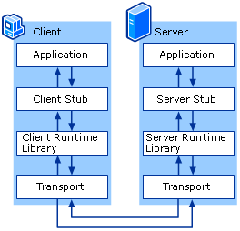

# RPC

## RPC简介

- 远程过程调用（Remote Procedure Call，RPC）是一个计算机通信协议
- 该协议允许运行于一台计算机的程序调用另一台计算机的子程序，而程序员无需额外地为这个交互作用编程
- 如果涉及的软件采用面向对象编程，那么远程过程调用亦可称作远程调用或远程方法调用

## golang中如何实现RPC

- golang中实现RPC非常简单，官方提供了封装好的库，还有一些第三方的库

- golang官方的net/rpc库使用encoding/gob进行编解码，支持tcp和http数据传输方式，由于其他语言不支持gob编解码方式，所以golang的RPC只支持golang开发的服务器与客户端之间的交互

- 官方还提供了net/rpc/jsonrpc库实现RPC方法，jsonrpc采用JSON进行数据编解码，因而支持跨语言调用，目前jsonrpc库是基于tcp协议实现的，暂不支持http传输方式

例题：golang实现RPC程序，实现求矩形面积和周长

*服务端*

```go
package main

import (
    "log"
    "net/http"
    "net/rpc"
)

//    例题：golang实现RPC程序，实现求矩形面积和周长

type Params struct {
    Width, Height int
}

type Rect struct{}

// RPC服务端方法，求矩形面积
func (r *Rect) Area(p Params, ret *int) error {
    *ret = p.Height * p.Width
    return nil
}

// 周长
func (r *Rect) Perimeter(p Params, ret *int) error {
    *ret = (p.Height + p.Width) * 2
    return nil
}

// 主函数
func main() {
    // 1.注册服务
    rect := new(Rect)
    // 注册一个rect的服务
    rpc.Register(rect)
    // 2.服务处理绑定到http协议上
    rpc.HandleHTTP()
    // 3.监听服务
    err := http.ListenAndServe(":8000", nil)
    if err != nil {
        log.Panicln(err)
    }
}
```


*客户端*

```go
package main

import (
    "fmt"
    "log"
    "net/rpc"
)

// 传的参数
type Params struct {
    Width, Height int
}

// 主函数
func main() {
    // 1.连接远程rpc服务
    conn, err := rpc.DialHTTP("tcp", ":8000")
    if err != nil {
        log.Fatal(err)
    }
    // 2.调用方法
    // 面积
    ret := 0
    err2 := conn.Call("Rect.Area", Params{50, 100}, &ret)
    if err2 != nil {
        log.Fatal(err2)
    }
    fmt.Println("面积：", ret)
    // 周长
    err3 := conn.Call("Rect.Perimeter", Params{50, 100}, &ret)
    if err3 != nil {
        log.Fatal(err3)
    }
    fmt.Println("周长：", ret)
}
```

golang写RPC程序，必须符合4个基本条件，不然RPC用不了

- 结构体字段首字母要大写，可以别人调用

- 函数名必须首字母大写

- 函数第一参数是接收参数，第二个参数是返回给客户端的参数，必须是指针类型

- 函数还必须有一个返回值error

练习：模仿前面例题，自己实现RPC程序，服务端接收2个参数，可以做乘法运算，也可以做商和余数的运算，客户端进行传参和访问，得到结果如下：


*服务端*

```go
package main

import (
   "errors"
   "log"
   "net/http"
   "net/rpc"
)

// 结构体，用于注册的
type Arith struct{}

// 声明参数结构体
type ArithRequest struct {
   A, B int
}

// 返回给客户端的结果
type ArithResponse struct {
   // 乘积
   Pro int
   // 商
   Quo int
   // 余数
   Rem int
}

// 乘法
func (this *Arith) Multiply(req ArithRequest, res *ArithResponse) error {
   res.Pro = req.A * req.B
   return nil
}

// 商和余数
func (this *Arith) Divide(req ArithRequest, res *ArithResponse) error {
   if req.B == 0 {
      return errors.New("除数不能为0")
   }
   // 除
   res.Quo = req.A / req.B
   // 取模
   res.Rem = req.A % req.B
   return nil
}

// 主函数
func main() {
   // 1.注册服务
   rect := new(Arith)
   // 注册一个rect的服务
   rpc.Register(rect)
   // 2.服务处理绑定到http协议上
   rpc.HandleHTTP()
   // 3.监听服务
   err := http.ListenAndServe(":8000", nil)
   if err != nil {
      log.Fatal(err)
   }
}
```

*客户端*

```go
package main

import (
   "fmt"
   "log"
   "net/rpc"
)

type ArithRequest struct {
   A, B int
}

// 返回给客户端的结果
type ArithResponse struct {
   // 乘积
   Pro int
   // 商
   Quo int
   // 余数
   Rem int
}

func main() {
   conn, err := rpc.DialHTTP("tcp", ":8000")
   if err != nil {
      log.Fatal(err)
   }
   req := ArithRequest{9, 2}
   var res ArithResponse
   err2 := conn.Call("Arith.Multiply", req, &res)
   if err2 != nil {
      log.Fatal(err2)
   }
   fmt.Printf("%d * %d = %d\n", req.A, req.B, res.Pro)
   err3 := conn.Call("Arith.Divide", req, &res)
   if err3 != nil {
      log.Fatal(err3)
   }
   fmt.Printf("%d / %d 商 %d，余数 = %d\n", req.A, req.B, res.Quo, res.Rem)
}
```

## RPC调用流程

- 微服务架构下数据交互一般是对内 RPC，对外 REST
- 将业务按功能模块拆分到各个微服务，具有提高项目协作效率、降低模块耦合度、提高系统可用性等优点，但是开发门槛比较高，比如 RPC 框架的使用、后期的服务监控等工作
- 一般情况下，我们会将功能代码在本地直接调用，微服务架构下，我们需要将这个函数作为单独的服务运行，客户端通过网络调用

## 网络传输数据格式

- 两端要约定好数据包的格式
- 成熟的RPC框架会有自定义传输协议，这里网络传输格式定义如下，前面是固定长度消息头，后面是变长消息体


自己定义数据格式的读写

```go
package rpc

import (
    "encoding/binary"
    "io"
    "net"
)

// 测试网络中读写数据的情况

// 会话连接的结构体
type Session struct {
    conn net.Conn
}

// 构造方法
func NewSession(conn net.Conn) *Session {
    return &Session{conn: conn}
}

// 向连接中去写数据
func (s *Session) Write(data []byte) error {
    // 定义写数据的格式
    // 4字节头部 + 可变体的长度
    buf := make([]byte, 4+len(data))
    // 写入头部，记录数据长度
    binary.BigEndian.PutUint32(buf[:4], uint32(len(data)))
    // 将整个数据，放到4后边
    copy(buf[4:], data)
    _, err := s.conn.Write(buf)
    if err != nil {
        return err
    }
    return nil
}

// 从连接读数据
func (s *Session) Read() ([]byte, error) {
    // 读取头部记录的长度
    header := make([]byte, 4)
    // 按长度读取消息
    _, err := io.ReadFull(s.conn, header)
    if err != nil {
        return nil, err
    }
    // 读取数据
    dataLen := binary.BigEndian.Uint32(header)
    data := make([]byte, dataLen)
    _, err = io.ReadFull(s.conn, data)
    if err != nil {
        return nil, err
    }
    return data, nil
}
```

这段代码实现了一个基于TCP连接的RPC会话管理模块，主要用于解决网络通信中的"粘包"问题。以下从代码结构、设计原理和实现细节三个维度进行详细解析：

### 一、代码结构解析
1. **Session结构体**  
   `Session`结构体封装了`net.Conn`类型的网络连接。通过面向对象的方式，将网络连接的读写操作与协议封装解耦，这是Go语言网络编程的典型设计模式。

2. **Write方法**  
   实现了带长度头的消息发送逻辑：
   ```go
   binary.BigEndian.PutUint32(buf[:4], uint32(len(data))) // 写入4字节大端序长度头
   copy(buf[4:], data) // 写入实际数据
   ```
   这种"长度前缀"的协议设计可有效解决TCP的粘包问题。

3. **Read方法**  
   采用两阶段读取：
   ```go
   io.ReadFull(s.conn, header) // 先读4字节长度头
   io.ReadFull(s.conn, data)  // 按长度读取完整数据
   ```
   使用`io.ReadFull`确保读取完整数据块，避免半包问题。

### 二、协议设计原理
1. **消息格式规范**  
   采用`4字节长度头 + N字节消息体`的结构，这是二进制协议设计的典型方案。相比文本协议（如HTTP），具有更高的传输效率和更小的协议开销。

2. **字节序处理**  
   使用`binary.BigEndian`进行网络字节序转换，确保不同硬件架构设备间的兼容性。这是RFC标准推荐的网络字节序处理方式。

3. **错误处理机制**  
   每个IO操作都进行错误检查并返回，符合Go语言的显式错误处理哲学。开发时建议通过`errors.Wrap`添加上下文信息。

### 三、关键实现细节
1. **缓冲区管理**  
   Write方法中`make([]byte, 4+len(data))`预分配精确大小的缓冲区，避免动态扩容带来的性能损耗。这种零拷贝设计能显著提升高并发场景下的吞吐量。

2. **可靠读取**  
   `io.ReadFull`的使用是关键，它会持续读取直到填满目标缓冲区。相较于普通的`Read`方法，能正确处理以下情况：
    - 网络延迟导致的多次读取
    - 内核缓冲区数据不完整
    - 连接意外中断

3. **并发安全性**  
   虽然代码中没有显式锁，但通过每个Session绑定独立连接的设计，天然支持并发读写。实际使用时建议配合连接池管理。

### 四、扩展应用场景
该模块可作为以下系统的基础组件：
1. **RPC框架**：配合编码层实现完整的远程调用
2. **消息队列**：实现可靠的消息传输
3. **游戏服务器**：处理高频小数据包
4. **IoT设备通信**：保证数据完整性

### 五、优化建议
1. **增加超时控制**
   ```go
   s.conn.SetDeadline(time.Now().Add(5 * time.Second))
   ```
2. **支持压缩**  
   在长度头后添加1字节的压缩标志位
3. **连接复用**  
   实现`sync.Pool`管理Session对象

该代码展示了Go语言网络编程的核心思想：通过简洁的接口抽象和严谨的错误处理，构建高性能的网络通信基础组件。这种设计模式在云原生基础设施开发中被广泛采用。


*io.ReadFull*

这段代码是Go语言中处理网络数据读取的关键代码片段，其作用是**精确读取指定长度的字节数据**，主要用于解决TCP流式传输中的粘包问题。具体分析如下：

---

### 一、代码功能解析
```go
data := make([]byte, dataLen)
_, err = io.ReadFull(s.conn, data)
```

1. **创建缓冲区**  
   `data := make([]byte, dataLen)` 创建了一个长度为`dataLen`的字节切片。这里的`dataLen`通常是通过协议头部解析得到的（例如前4字节表示数据长度），用于预分配精确的内存空间存储待读取的数据。

2. **精确读取数据**  
   `io.ReadFull(s.conn, data)` 是核心操作，它会：
    - 持续从`s.conn`（网络连接）读取数据，直到`data`缓冲区被完全填满
    - 若读取的字节数不足`dataLen`，返回`io.ErrUnexpectedEOF`错误
    - 若连接中断或超时，返回相应的网络错误

---

### 二、底层实现原理
1. **与普通`Read`的区别**  
   普通`Read`方法可能只读取部分数据（如返回`n < len(data)`但无错误），而`io.ReadFull`通过内部循环调用`Read`，确保读取完整数据：
   ```go
   // 伪代码逻辑
   for len(buf) > 0 {
       n, err := r.Read(buf)
       buf = buf[n:]
       if err != nil {
           return total, err
       }
   }
   ```
   这种设计能避免开发者手动处理不完整读取的情况。

2. **网络协议适配性**
    - 适用于**固定长度协议**（如头部声明数据长度）
    - 兼容**二进制协议**（如Protobuf、Thrift）和**文本协议**（如JSON行分隔格式）
    - 配合`binary.Read`可实现结构化数据的解码

---

### 三、典型应用场景
| 场景 | 说明 | 相关引用 |
|------|------|---------|
| RPC框架 | 读取完整RPC请求/响应体 |  |
| 文件传输 | 分块读取大文件数据 |  |
| 消息队列 | 确保消息完整消费 |  |
| 数据库驱动 | 解析数据库返回的二进制协议 |  |

---

### 四、错误处理建议
```go
if err != nil {
    if err == io.ErrUnexpectedEOF {
        // 处理数据不完整（如网络中断）
    } else if netErr, ok := err.(net.Error); ok && netErr.Timeout() {
        // 处理超时
    } else {
        // 其他错误（如连接关闭）
    }
}
```
需结合具体业务场景处理`io.EOF`（正常结束）和`io.ErrUnexpectedEOF`（异常中断）。

---

### 五、性能优化方案
1. **复用缓冲区**  
   使用`sync.Pool`管理`[]byte`切片，减少GC压力：
   ```go
   var bufPool = sync.Pool{
       New: func() interface{} { return make([]byte, 4096) },
   }
   data := bufPool.Get().([]byte)
   defer bufPool.Put(data)
   ```

2. **结合缓冲读取**  
   对高频小数据包场景，包装`bufio.Reader`：
   ```go
   bufferedConn := bufio.NewReader(s.conn)
   io.ReadFull(bufferedConn, data)
   ```
   可减少系统调用次数。

---

通过这种设计，Go语言能够以简洁的代码实现可靠的网络数据传输，体现了其“通过接口抽象复杂逻辑”的核心哲学。

---


*测试类*

```go
package rpc

import (
    "fmt"
    "net"
    "sync"
    "testing"
)

func TestSession_ReadWriter(t *testing.T) {
    // 定义地址
    addr := "127.0.0.1:8000"
    my_data := "hello"
    // 等待组定义
    wg := sync.WaitGroup{}
    wg.Add(2)
    // 写数据的协程
    go func() {
        defer wg.Done()
        lis, err := net.Listen("tcp", addr)
        if err != nil {
            t.Fatal(err)
        }
        conn, _ := lis.Accept()
        s := Session{conn: conn}
        err = s.Write([]byte(my_data))
        if err != nil {
            t.Fatal(err)
        }
    }()

    // 读数据的协程
    go func() {
        defer wg.Done()
        conn, err := net.Dial("tcp", addr)
        if err != nil {
            t.Fatal(err)
        }
        s := Session{conn: conn}
        data, err := s.Read()
        if err != nil {
            t.Fatal(err)
        }
        // 最后一层校验
        if string(data) != my_data {
            t.Fatal(err)
        }
        fmt.Println(string(data))
    }()
    wg.Wait()
}
```


以下是对这段Go语言测试代码的详细解释，结合网络通信原理和测试设计模式进行多维度分析：

### 一、代码结构总览
这段代码是使用Go语言编写的单元测试，主要验证`Session`类型在网络连接中的读写功能。代码结构可分为三个主体部分：
1. **测试环境初始化**：定义本地回环地址和测试数据
2. **双协程并发模型**：使用`sync.WaitGroup`协调读写协程
3. **功能验证层**：通过数据比对确认功能正确性

### 二、核心组件解析
#### 1. 网络通信架构
```go
addr := "127.0.0.1:8000"  // 本地回环地址
lis, _ := net.Listen("tcp", addr) // 创建TCP监听器
conn, _ := net.Dial("tcp", addr) // 建立TCP连接
```
- 采用`127.0.0.1:8000`实现本机网络通信，避免外部依赖
- 服务端/客户端模式验证网络层与业务层的协同工作

#### 2. 并发控制机制
```go
wg := sync.WaitGroup{}
wg.Add(2)
go func() { /* 写协程 */ }()
go func() { /* 读协程 */ }()
wg.Wait()
```
- 使用WaitGroup实现并发协调，确保两个goroutine都执行完毕
- 读写分离的设计模拟真实网络传输场景

#### 3. 业务功能验证
```go
s.Write([]byte(my_data))  // 写入测试数据
data, _ := s.Read()       // 读取数据
if string(data) != my_data // 数据一致性校验
```
- 通过字符串比对验证数据完整性
- 使用`t.Fatal`实现快速失败机制，符合Go测试最佳实践

### 三、执行流程详解
| 阶段 | 写协程 | 读协程 | 通信过程 |
|------|--------|--------|----------|
| 初始化 | 创建监听端口 | 等待连接 | TCP三次握手完成 |
| 数据传输 | 通过Session.Write发送"hello" | 通过Session.Read接收数据 | 经过网络协议栈封包/解包 |
| 验证 | 关闭连接 | 比对接收数据与原始数据 | 校验数据完整性 |

### 四、测试设计亮点
1. **边界条件覆盖**：通过字符串比对验证精确数据长度和内容
2. **异常处理机制**：所有网络操作都包含错误检查（如`t.Fatal(err)`）
3. **并发安全验证**：验证goroutine间的数据同步正确性
4. **资源管理**：通过`defer wg.Done()`确保资源释放

### 五、潜在优化方向
1. **增加超时控制**：在`Dial`和`Accept`中加入超时参数，避免测试阻塞
2. **压力测试扩展**：可改造为多连接并发测试，验证高负载表现
3. **错误注入测试**：模拟网络丢包、延迟等异常场景
4. **性能指标采集**：添加带宽、延迟等指标的统计输出

### 六、行业应用场景
该测试模式适用于：
1. 网络协议栈开发验证
2. 分布式系统通信层测试
3. RPC框架的核心功能测试
4. 物联网设备通信可靠性验证

该代码通过简洁的实现验证了网络通信的核心要素，体现了Go语言在并发编程和网络开发方面的优势。测试用例设计符合等价类划分和边界值分析原则，可作为网络通信组件测试的基准模板。


*编码解码*

```go
package rpc

import (
    "bytes"
    "encoding/gob"
)

// 定义RPC交互的数据结构
type RPCData struct {
    // 访问的函数
    Name string
    // 访问时的参数
    Args []interface{}
}

// 编码
func encode(data RPCData) ([]byte, error) {
    //得到字节数组的编码器
    var buf bytes.Buffer
    bufEnc := gob.NewEncoder(&buf)
    // 编码器对数据编码
    if err := bufEnc.Encode(data); err != nil {
        return nil, err
    }
    return buf.Bytes(), nil
}

// 解码
func decode(b []byte) (RPCData, error) {
    buf := bytes.NewBuffer(b)
    // 得到字节数组解码器
    bufDec := gob.NewDecoder(buf)
    // 解码器对数据节码
    var data RPCData
    if err := bufDec.Decode(&data); err != nil {
        return data, err
    }
    return data, nil
}
```

以下是对这段Go语言RPC编解码代码的详细解析，结合Gob特性及RPC设计原理进行多维度分析：

### 一、代码结构解析
#### 1. 数据结构定义
```go
type RPCData struct {
    Name string          // 远程方法名称
    Args []interface{}   // 方法参数集合（支持多类型）
}
```
- **设计理念**：采用"命令模式"封装RPC请求，是典型的RPC协议设计范式
- **字段特性**：
   - `Name`字段对应远程方法标识符，需与服务端注册方法一致
   - `Args`使用空接口切片实现多类型参数支持，需注意类型注册问题

#### 2. 编码流程
```go
func encode(data RPCData) ([]byte, error) {
    var buf bytes.Buffer
    bufEnc := gob.NewEncoder(&buf)  // 创建Gob编码器
    if err := bufEnc.Encode(data); err != nil { // 序列化结构体
        return nil, err
    }
    return buf.Bytes(), nil
}
```
- **内存优化**：使用bytes.Buffer作为二进制数据容器，避免频繁内存分配
- **编码过程**：
   1. 创建Gob编码器绑定内存缓冲区
   2. 对结构体进行深度序列化（包含嵌套类型描述）
   3. 输出紧凑二进制格式（平均比JSON小2-5倍）

#### 3. 解码流程
```go
func decode(b []byte) (RPCData, error) {
    buf := bytes.NewBuffer(b)
    bufDec := gob.NewDecoder(buf)  // 创建Gob解码器
    var data RPCData
    if err := bufDec.Decode(&data); err != nil { // 反序列化
        return data, err
    }
    return data, nil
}
```
- **解码特性**：
   - 自动重建类型系统（包含方法接收者的类型信息）
   - 支持渐进式解码，处理大尺寸数据时内存效率高

### 二、核心设计原理
#### 1. Gob协议特性
- **自描述二进制格式**：编码流包含类型描述信息，无需预定义Schema
- **类型兼容规则**：
   - 字段名称和类型需匹配（顺序无关）
   - 接口类型需预先注册具体实现类型
- **高效编码机制**：
   - 使用反射生成编解码器（首次编译后缓存）
   - 对整型采用变长编码（ZigZag压缩）

#### 2. RPC通信层设计
- **网络协议无关性**：编码后的[]byte可通过任意传输层协议发送（TCP/HTTP等）
- **错误处理机制**：
   - 编解码过程严格校验类型一致性
   - 空接口参数需通过`gob.Register()`注册具体类型

### 三、性能优化建议
1. **类型预注册**（提升20-30%性能）：
```go
func init() {
    gob.Register(YourConcreteType{})  // 注册Args可能包含的具体类型
}
```

2. **连接池复用**：
```go
var encoderPool = sync.Pool{
    New: func() interface{} {
        return gob.NewEncoder(new(bytes.Buffer)) 
    },
}  // 减少编码器创建开销
```

3. **批量处理优化**：
```go
// 对多个RPCData使用同一个编码器
enc := gob.NewEncoder(conn)
for _, data := range batchData {
    enc.Encode(data)  // 复用类型描述信息
}
```

### 四、典型应用场景
1. **微服务间通信**：服务网格内部的高效数据传输
2. **分布式计算**：跨节点任务参数传递
3. **游戏服务器**：高频状态同步场景
4. **物联网网关**：设备数据采集与指令下发

### 五、潜在问题与解决方案
| 问题现象 | 原因分析 | 解决方案 |
|---------|---------|---------|
| 解码时panic | 未注册具体类型 | 使用`gob.Register()`预注册 |
| 空字段丢失 | Gob自动忽略零值 | 使用指针类型字段 |
| 版本兼容问题 | 结构体字段变更 | 添加版本号字段控制 |
| 性能瓶颈 | 频繁创建编码器 | 使用对象池技术 |

该代码实现展示了Go语言在RPC通信层的核心设计哲学：通过标准库提供高效基础组件，结合接口抽象实现灵活扩展。开发者在实际使用中需特别注意类型系统的完整性和编解码性能优化。


## 实现RPC服务端


- 服务端接收到的数据需要包括什么？
  - 调用的函数名、参数列表，还有一个返回值error类型
- 服务端需要解决的问题是什么？
  - Map维护客户端传来调用函数，服务端知道去调谁
- 服务端的核心功能有哪些？
  - 维护函数map
  - 客户端传来的东西进行解析
  - 函数的返回值打包，传给客户端


```go
package rpc

import (
    "fmt"
    "net"
    "reflect"
)

// 声明服务端
type Server struct {
    // 地址
    addr string
    // map 用于维护关系的
    funcs map[string]reflect.Value
}

// 构造方法
func NewServer(addr string) *Server {
    return &Server{addr: addr, funcs: make(map[string]reflect.Value)}
}

// 服务端需要一个注册Register
// 第一个参数函数名，第二个传入真正的函数
func (s *Server) Register(rpcName string, f interface{}) {
    // 维护一个map
    // 若map已经有键了
    if _, ok := s.funcs[rpcName]; ok {
        return
    }
    // 若map中没值，则将映射加入map，用于调用
    fVal := reflect.ValueOf(f)
    s.funcs[rpcName] = fVal
}

// 服务端等待调用的方法
func (s *Server) Run() {
    // 监听
    lis, err := net.Listen("tcp", s.addr)
    if err != nil {
        fmt.Printf("监听 %s err :%v", s.addr, err)
        return
    }
    for {
        // 服务端循环等待调用
        conn, err := lis.Accept()
        if err != nil {
            return
        }
        serSession := NewSession(conn)
        // 使用RPC方式读取数据
        b, err := serSession.Read()
        if err != nil {
            return
        }
        // 数据解码
        rpcData, err := decode(b)
        if err != nil {
            return
        }
        // 根据读到的name，得到要调用的函数
        f, ok := s.funcs[rpcData.Name]
        if !ok {
            fmt.Printf("函数 %s 不存在", rpcData.Name)
            return
        }
        // 遍历解析客户端传来的参数,放切片里
        inArgs := make([]reflect.Value, 0, len(rpcData.Args))
        for _, arg := range rpcData.Args {
            inArgs = append(inArgs, reflect.ValueOf(arg))
        }
        // 反射调用方法
        // 返回Value类型，用于给客户端传递返回结果,out是所有的返回结果
        out := f.Call(inArgs)
        // 遍历out ，用于返回给客户端，存到一个切片里
        outArgs := make([]interface{}, 0, len(out))
        for _, o := range out {
            outArgs = append(outArgs, o.Interface())
        }
        // 数据编码，返回给客户端
        respRPCData := RPCData{rpcData.Name, outArgs}
        bytes, err := encode(respRPCData)
        if err != nil {
            return
        }
        // 将服务端编码后的数据，写出到客户端
        err = serSession.Write(bytes)
        if err != nil {
            return
        }
    }
}
```

## 实现RPC客户端

- 客户端只有函数原型，使用reflect.MakeFunc() 可以完成原型到函数的调用

- reflect.MakeFunc()是Client从函数原型到网络调用的关键

```go
package rpc

import (
    "net"
    "reflect"
)

// 声明服务端
type Client struct {
    conn net.Conn
}

// 构造方法
func NewClient(conn net.Conn) *Client {
    return &Client{conn: conn}
}

// 实现通用的RPC客户端
// 传入访问的函数名
// fPtr指向的是函数原型
//var select fun xx(User)
//cli.callRPC("selectUser",&select)
func (c *Client) callRPC(rpcName string, fPtr interface{}) {
    // 通过反射，获取fPtr未初始化的函数原型
    fn := reflect.ValueOf(fPtr).Elem()
    // 需要另一个函数，作用是对第一个函数参数操作
    f := func(args []reflect.Value) []reflect.Value {
        // 处理参数
        inArgs := make([]interface{}, 0, len(args))
        for _, arg := range args {
            inArgs = append(inArgs, arg.Interface())
        }
        // 连接
        cliSession := NewSession(c.conn)
        // 编码数据
        reqRPC := RPCData{Name: rpcName, Args: inArgs}
        b, err := encode(reqRPC)
        if err != nil {
            panic(err)
        }
        // 写数据
        err = cliSession.Write(b)
        if err != nil {
            panic(err)
        }
        // 服务端发过来返回值，此时应该读取和解析
        respBytes, err := cliSession.Read()
        if err != nil {
            panic(err)
        }
        // 解码
        respRPC, err := decode(respBytes)
        if err != nil {
            panic(err)
        }
        // 处理服务端返回的数据
        outArgs := make([]reflect.Value, 0, len(respRPC.Args))
        for i, arg := range respRPC.Args {
            // 必须进行nil转换
            if arg == nil {
                // reflect.Zero()会返回类型的零值的value
                // .out()会返回函数输出的参数类型
                outArgs = append(outArgs, reflect.Zero(fn.Type().Out(i)))
                continue
            }
            outArgs = append(outArgs, reflect.ValueOf(arg))
        }
        return outArgs
    }
    // 完成原型到函数调用的内部转换
    // 参数1是reflect.Type
    // 参数2 f是函数类型，是对于参数1 fn函数的操作
    // fn是定义，f是具体操作
    v := reflect.MakeFunc(fn.Type(), f)
    // 为函数fPtr赋值，过程
    fn.Set(v)
}
```


## 实现RPC通信测试

- 给服务端注册一个查询用户的方法，客户端使用RPC方式调用

```go
package rpc

import (
    "encoding/gob"
    "fmt"
    "net"
    "testing"
)

//    给服务端注册一个查询用户的方法，客户端使用RPC方式调用

// 定义用户对象
type User struct {
    Name string
    Age  int
}

// 用于测试用户查询的方法
func queryUser(uid int) (User, error) {
    user := make(map[int]User)
    // 假数据
    user[0] = User{"zs", 20}
    user[1] = User{"ls", 21}
    user[2] = User{"ww", 22}
    // 模拟查询用户
    if u, ok := user[uid]; ok {
        return u, nil
    }
    return User{}, fmt.Errorf("%d err", uid)
}

func TestRPC(t *testing.T) {
    // 编码中有一个字段是interface{}时，要注册一下
    gob.Register(User{})
    addr := "127.0.0.1:8000"
    // 创建服务端
    srv := NewServer(addr)
    // 将服务端方法，注册一下
    srv.Register("queryUser", queryUser)
    // 服务端等待调用
    go srv.Run()
    // 客户端获取连接
    conn, err := net.Dial("tcp", addr)
    if err != nil {
        fmt.Println("err")
    }
    // 创建客户端对象
    cli := NewClient(conn)
    // 需要声明函数原型
    var query func(int) (User, error)
    cli.callRPC("queryUser", &query)
    // 得到查询结果
    u, err := query(1)
    if err != nil {
        fmt.Println("err")
    }
    fmt.Println(u)
}

```


# Go RPC 开发指南

本书首先介绍了使用Go官方库开发RPC服务的方法，然后介绍流行gRPC库以及其它一些RPC框架如Thrift等，后面重点介绍高性能的分布式全功能的RPC框架 rpcx。读者通过阅读本书，可以快速学习和了解Go生态圈的RPC开发技术，并且应用到产品的开发中。

## RPC介绍

远程过程调用（Remote Procedure Call，缩写为 RPC）是一个计算机通信协议。
该协议允许运行于一台计算机的程序调用另一台计算机的子程序，而程序员无需额外地为这个交互作用编程。
如果涉及的软件采用面向对象编程，那么远程过程调用亦可称作远程调用或远程方法调用，比如 Java RMI。

有关RPC的想法至少可以追溯到1976年以“信使报”（Courier）的名义使用。RPC首次在UNIX平台上普及的执行工具程序是SUN公司的RPC（现在叫ONC RPC）。它被用作SUN的NFC的主要部件。ONC RPC今天仍在服务器上被广泛使用。
另一个早期UNIX平台的工具是“阿波罗”计算机网络计算系统（NCS），它很快就用做OSF的分布计算环境（DCE）中的DCE/RPC的基础，并补充了DCOM。

远程过程调用是一个分布式计算的客户端-服务器（Client/Server）的例子，它简单而又广受欢迎。
远程过程调用总是由客户端对服务器发出一个执行若干过程请求，并用客户端提供的参数。执行结果将返回给客户端。
由于存在各式各样的变体和细节差异，对应地派生了各式远程过程调用协议，而且它们并不互相兼容。

为了允许不同的客户端均能访问服务器，许多标准化的 RPC 系统应运而生了。其中大部分采用接口描述语言（Interface Description Language，IDL），方便跨平台的远程过程调用。



从上图可以看出, RPC 本身是 client-server模型,也是一种 request-response 协议。

有些实现扩展了远程调用的模型，实现了双向的服务调用，但是不管怎样，调用过程还是由一个客户端发起，服务器端提供响应，基本模型没有变化。

服务的调用过程为：

1. client调用client stub，这是一次本地过程调用
2. client stub将参数打包成一个消息，然后发送这个消息。打包过程也叫做 marshalling
3. client所在的系统将消息发送给server
4. server的的系统将收到的包传给server stub
5. server stub解包得到参数。 解包也被称作 unmarshalling
6. 最后server stub调用服务过程. 返回结果按照相反的步骤传给client

## 国内外知名的RPC框架

RPC只是描绘了 Client 与 Server 之间的点对点调用流程，包括 stub、通信、RPC 消息解析等部分，在实际应用中，还需要考虑服务的高可用、负载均衡等问题，所以产品级的 RPC 框架除了点对点的 RPC 协议的具体实现外，还应包括服务的发现与注销、提供服务的多台 Server 的负载均衡、服务的高可用等更多的功能。
目前的 RPC 框架大致有两种不同的侧重方向，一种偏重于服务治理，另一种偏重于跨语言调用。

服务治理型的 RPC 框架有Alibab Dubbo、Motan 等，这类的 RPC 框架的特点是功能丰富，提供高性能的远程调用以及服务发现和治理功能，适用于大型服务的微服务化拆分以及管理，对于特定语言（Java）的项目可以十分友好的透明化接入。但缺点是语言耦合度较高，跨语言支持难度较大。

跨语言调用型的 RPC 框架有 Thrift、gRPC、Hessian、Finagle 等，这一类的 RPC 框架重点关注于服务的跨语言调用，能够支持大部分的语言进行语言无关的调用，非常适合于为不同语言提供通用远程服务的场景。但这类框架没有服务发现相关机制，实际使用时一般需要代理层进行请求转发和负载均衡策略控制。

Dubbo 是阿里巴巴公司开源的一个Java高性能优秀的服务框架，使得应用可通过高性能的 RPC 实现服务的输出和输入功能，可以和 Spring框架无缝集成。
不过，遗憾的是，据说在淘宝内部，dubbo由于跟淘宝另一个类似的框架HSF（非开源）有竞争关系，导致dubbo团队已经解散（参见http://www.oschina.net/news/55059/druid-1-0-9 中的评论）。
不过反倒是墙内开花墙外香，其它的一些知名电商如当当 (dubbox)、京东、国美维护了自己的分支或者在dubbo的基础开发，
但是官方的实现缺乏维护，其它电商虽然维护了自己的版本，但是还是不能做大的架构的改动和提升，相关的依赖类比如Spring，Netty还是很老的版本(Spring 3.2.16.RELEASE, netty 3.2.5.Final)，
而且现在看来，Dubbo的代码结构也过于复杂了。

所以，尽管Dubbo在电商的开发圈比较流行的时候，国内一些的互联网公司也在开发自己的RPC框架，比如Motan。
Motan是新浪微博开源的一个Java 框架。它诞生的比较晚，起于2013年，2016年5月开源。
Motan 在微博平台中已经广泛应用，每天为数百个服务完成近千亿次的调用。Motan的架构相对简单，功能也能满足微博内部架构的要求,
虽然Motan的架构的目的主要不是跨语言，但是目前也在开发支持php client和C server特性。

gRPC是Google开发的高性能、通用的开源RPC框架，其由Google主要面向移动应用开发并基于HTTP/2协议标准而设计，基于ProtoBuf(Protocol Buffers)序列化协议开发，且支持众多开发语言。
它的目标的跨语言开发，支持多种语言， 服务治理方面需要自己去实现，所以要实现一个综合的产品级的分布式RPC平台还需要扩展开发。Google内部使用的也不是gRPC,而是Stubby。

thrift是Apache的一个跨语言的高性能的服务框架，也得到了广泛的应用。它的功能类似 gRPC, 支持跨语言，不支持服务治理。

rpcx 是一个分布式的Go语言的 RPC 框架，支持Zookepper、etcd、consul多种服务发现方式，多种服务路由方式， 是目前性能最好的 RPC 框架之一。


## RPC vs RESTful

RPC 的消息传输可以通过 TCP、UDP 或者 HTTP等，所以有时候我们称之为 RPC over TCP、 RPC over HTTP。RPC 通过 HTTP 传输消息的时候和 RESTful的架构是类似的，但是也有不同。

首先我们比较 RPC over HTTP 和 RESTful。

首先 RPC 的客户端和服务器端是紧耦合的，客户端需要知道调用的过程的名字，过程的参数以及它们的类型、顺序等。一旦服务器更改了过程的实现，
客户端的实现很容易出问题。RESTful基于 http的语义操作资源，参数的顺序一般没有关系，也很容易的通过代理转换链接和资源位置，从这一点上来说，RESTful 更灵活。

其次，它们操作的对象不一样。 RPC 操作的是方法和过程，它要操作的是方法对象。 RESTful 操作的是资源(resource)，而不是方法。

第三，RESTful执行的是对资源的操作，增加、查找、修改和删除等,主要是CURD，所以如果你要实现一个特定目的的操作，比如为名字姓张的学生的数学成绩都加上10这样的操作，
RESTful的API设计起来就不是那么直观或者有意义。在这种情况下, RPC的实现更有意义，它可以实现一个 `Student.Increment(Name, Score)` 的方法供客户端调用。


我们再来比较一下 RPC over TCP 和 RESTful。
如果我们直接使用socket实现 RPC，除了上面的不同外，我们可以获得性能上的优势。

RPC over TCP可以通过长连接减少连接的建立所产生的花费，在调用次数非常巨大的时候(这是目前互联网公司经常遇到的情况,大并发的情况下)，这个花费影响是非常巨大的。
当然 RESTful 也可以通过 keep-alive 实现长连接， 但是它最大的一个问题是它的request-response模型是阻塞的 (http1.0和 http1.1, http 2.0没这个问题)，
发送一个请求后只有等到response返回才能发送第二个请求 (有些http server实现了pipeling的功能，但不是标配)， RPC的实现没有这个限制。

在当今用户和资源都是大数据大并发的趋势下，一个大规模的公司不可能使用一个单体程序提供所有的功能，微服务的架构模式越来越多的被应用到产品的设计和开发中，
服务和服务之间的通讯也越发的重要， 所以 RPC 不失是一个解决服务之间通讯的好办法， 本书给大家介绍 Go 语言的 RPC的开发实践。


# 开发起步

## 快速起步

### 安装

首先，你需要安装 rpcx:

```bash
go get -u -v github.com/smallnest/rpcx/...
```

这一步只会安装 rpcx 的基础功能。如果你想要使用 etcd 作为注册中心，你需要加上`etcd`这个标签。

```go
go get -u -v -tags "etcd" github.com/smallnest/rpcx/...
```

如果你想要使用 quic ，你也需要加上`quic`这个标签。


```go
go get -u -v -tags "quic etcd" github.com/smallnest/rpcx/...

```

方便起见，我推荐你安装所有的tags，即使你现在并不需要他们：

```go
go get -u -v -tags "reuseport quic kcp zookeeper etcd consul ping" github.com/smallnest/rpcx/...

```


*tags* 对应:

- *quic*: 支持 quic 协议
- *kcp*: 支持 kcp 协议
- *zookeeper*: 支持 zookeeper 注册中心
- *etcd*: 支持 etcd 注册中心
- *consul*: 支持 consul 注册中心
- *ping*: 支持 网络质量负载均衡
- *reuseport*: 支持 reuseport

### 实现Service

实现一个 Sevice 就像写一个单纯的 Go 结构体:

```go
import "context"

type Args struct {
    A int
    B int
}

type Reply struct {
    C int
}

type Arith int

func (t *Arith) Mul(ctx context.Context, args *Args, reply *Reply) error {
    reply.C = args.A * args.B
    return nil
}
```

`Arith` 是一个 Go 类型，并且它有一个方法 `Mul`。
方法 `Mul` 的 第 1 个参数是 `context.Context`。
方法 `Mul` 的 第 2 个参数是 `args`， `args` 包含了请求的数据 `A`和`B`。
方法 `Mul` 的 第 3 个参数是 `reply`， `reply` 是一个指向了 `Reply` 结构体的指针。
方法 `Mul` 的 返回类型是 error (可以为 nil)。
方法 `Mul` 把 `A * B` 的结果 赋值到 `Reply.C`

现在你已经定义了一个叫做 `Arith` 的 service， 并且为它实现了 `Mul` 方法。 下一步骤中， 我们将会继续介绍如何把这个服务注册给服务器，并且如何用 client 调用它。

### 实现Server

三行代码就可以注册一个服务：

```go
    s := server.NewServer()
    s.RegisterName("Arith", new(Arith), "")
    s.Serve("tcp", ":8972")
```
这里你把你的服务命名 `Arith`。

你可以按照如下的代码注册服务。

```go
s.Register(new(example.Arith), "")
```

这里简单使用了服务的 类型名称 作为 服务名。


### 实现Client

```go
    // #1
    d := client.NewPeer2PeerDiscovery("tcp@"+*addr, "")
    // #2
    xclient := client.NewXClient("Arith", client.Failtry, client.RandomSelect, d, client.DefaultOption)
    defer xclient.Close()

    // #3
    args := &example.Args{
        A: 10,
        B: 20,
    }

    // #4
    reply := &example.Reply{}

    // #5
    err := xclient.Call(context.Background(), "Mul", args, reply)
    if err != nil {
        log.Fatalf("failed to call: %v", err)
    }

    log.Printf("%d * %d = %d", args.A, args.B, reply.C)
```

`#1` 定义了使用什么方式来实现服务发现。 在这里我们使用最简单的 `Peer2PeerDiscovery`（点对点）。客户端直连服务器来获取服务地址。

`#2` 创建了 `XClient`， 并且传进去了 `FailMode`、 `SelectMode` 和默认选项。
FailMode 告诉客户端如何处理调用失败：重试、快速返回，或者 尝试另一台服务器。
SelectMode 告诉客户端如何在有多台服务器提供了同一服务的情况下选择服务器。

`#3` 定义了请求：这里我们想获得 `10 * 20` 的结果。 当然我们可以自己算出结果是 `200`，但是我们仍然想确认这与服务器的返回结果是否一致。

`#4` 定义了响应对象， 默认值是0值， 事实上 rpcx 会通过它来知晓返回结果的类型，然后把结果反序列化到这个对象。

`#5` 调用了远程服务并且同步获取结果。


### 异步调用Service

以下的代码可以异步调用服务：

```go
d := client.NewPeer2PeerDiscovery("tcp@"+*addr2, "")
    xclient := client.NewXClient("Arith", client.Failtry, client.RandomSelect, d, client.DefaultOption)
    defer xclient.Close()

    args := &example.Args{
        A: 10,
        B: 20,
    }

    reply := &example.Reply{}
    call, err := xclient.Go(context.Background(), "Mul", args, reply, nil)
    if err != nil {
        log.Fatalf("failed to call: %v", err)
    }

    replyCall := <-call.Done
    if replyCall.Error != nil {
        log.Fatalf("failed to call: %v", replyCall.Error)
    } else {
        log.Printf("%d * %d = %d", args.A, args.B, reply.C)
    }
```

你必须使用 `xclient.Go` 来替换 `xclient.Call`， 然后把结果返回到一个channel里。你可以从chnanel里监听调用结果。


## 服务端开发示例

### Server

你可以在服务端实现Service。

Service的类型并不重要。你可以使用自定义类型来保持状态，或者直接使用 `struct{}`、 `int`。

你需要启动一个TCP或UDP服务器来暴露Service。

你也可以添加一些plugin来为服务器增加新特性。


#### Service

作为服务提供者，首先你需要定义服务。
当前rpcx仅支持 可导出的 `methods` （方法） 作为服务的函数。 
并且这个可导出的方法必须满足以下的要求：

- 必须是可导出类型的方法
- 接受3个参数，第一个是 `context.Context`类型，其他2个都是可导出（或内置）的类型。
- 第3个参数是一个指针
- 有一个 error 类型的返回值

这段话描述了在rpcx框架中作为服务提供者定义RPC方法时需要遵守的规范，具体可分为以下四个核心要求，其技术背景和实现逻辑如下：

---

### 一、方法必须是可导出类型的方法
- **实现要求**：方法所属的类型（结构体）和方法名本身都需首字母大写（Go语言的可导出规则）。
- **技术背景**：rpcx通过反射机制构建服务映射表（serviceMap），只有可导出方法才能被框架识别并注册到服务发现中心。例如网页1中的`Hello`结构体的`Test1`和`Test2`方法均以大写字母开头。

---

### 二、方法参数的三段式结构
1. **第一个参数：`context.Context`**
    - **作用**：传递请求上下文信息（如超时控制、元数据等），实现链路追踪或跨服务参数传递。
    - **示例**：如网页1中的`func (this *Hello) Test1(ctx context.Context, in *CmdIn, out *CmdOut)`，第一个参数固定为`context.Context`。

2. **第二、三个参数类型要求**
    - **第二个参数**：需为可导出（自定义结构体需首字母大写）或内置类型（如`string`、`int`等），用于接收客户端传入的请求数据。例如网页4中`args *Args`是自定义的可导出结构体。
    - **第三个参数**：必须为指针类型（如`*CmdOut`），用于服务端向客户端返回处理结果。指针允许直接修改内存数据，避免值拷贝，提升性能。

---

### 三、返回值必须为`error`类型
- **功能目的**：通过错误返回值明确反馈方法执行状态（如参数校验失败、业务逻辑异常等），例如网页4中的除零错误`errors.New("divide by 0")`。
- **框架处理**：rpcx会将非`nil`的`error`封装为RPC响应错误，客户端可通过判断错误进行重试或熔断。

---

### 四、规范背后的设计逻辑
1. **服务发现与反射**  
   rpcx通过反射动态构建服务方法表（如网页1的`serviceMap`），只有符合签名的方法才能被正确注册到注册中心（如ZooKeeper），供消费方查询调用。

2. **参数设计的合理性**
    - **上下文隔离**：`context.Context`实现请求级数据隔离，避免并发问题。
    - **输入输出分离**：第二个参数为纯输入，第三个指针参数专用于输出结果，符合RPC的请求-响应模型。

3. **错误处理标准化**  
   强制`error`返回确保服务端异常能透传到客户端，结合rpcx的失败重试（Failover）、熔断等治理策略，提升系统可靠性。

---

### 五、实际代码示例（结合规范）
```go
// 定义可导出结构体（服务提供者）
type MathService struct{}

// 可导出方法：参数1为context.Context，参数2为内置类型，参数3为指针，返回error
func (s *MathService) Add(ctx context.Context, a int, b int, result *int) error {
    *result = a + b // 通过指针修改返回值
    return nil      // 成功返回nil
}
```

通过遵循上述规范，rpcx能自动将服务注册到注册中心，并实现高效的远程调用

---

你可以使用 `RegisterName` 来注册 `rcvr` 的方法，这里这个服务的名字叫做 `name`。
如果你使用 `Register`， 生成的服务的名字就是 `rcvr`的类型名。
你可以在注册中心添加一些元数据供客户端或者服务管理者使用。例如 `weight`、`geolocation`、`metrics`。


```go
func (s *Server) Register(rcvr interface{}, metadata string) error
func (s *Server) RegisterName(name string, rcvr interface{}, metadata string) error
```

这里是一个实现了 `Mul` 方法的例子：

```go
import "context"

type Args struct {
    A int
    B int
}

type Reply struct {
    C int
}

type Arith int

func (t *Arith) Mul(ctx context.Context, args *Args, reply *Reply) error {
    reply.C = args.A * args.B
    return nil
}
```

在这个例子中，你可以定义 `Arith` 为 `struct{}` 类型， 它不会影响到这个服务。
你也可以定义 `args` 为 `Args`， 也不会产生影响。

#### Server

在你定义完服务后，你会想将它暴露出去来使用。你应该通过启动一个TCP或UDP服务器来监听请求。

服务器支持以如下这些方式启动，监听请求和关闭：


